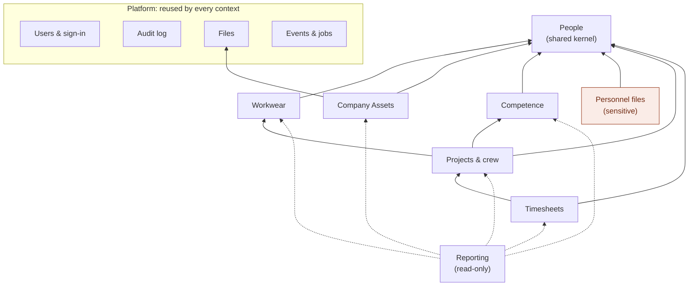

# Context map

The bounded contexts PPE-next2 is divided into, what each one owns, and how they depend on
each other. The decision to build them as modules of one API and one staff app, rather than
as separate services, is [ADR 0001](adr/0001-modular-monolith-with-bounded-contexts.md).

Status: **proposed**. Workwear and the platform modules exist today (as flat
`internal/domain/<name>` packages); Company Assets is specified
([ADR 0004](adr/0004-company-assets.md)); People, Competence, Personnel files, Projects & crew,
Timesheets and Reporting are planned. Each new context gets its product contract and
`docs/specs/<name>-service.md` before code, and its terms in
[ubiquitous-language.md](../ubiquitous-language.md) before they are used.

## Map

An arrow points from a context to one it depends on (reads from). Every context also
depends on the platform. Dotted arrows are Reporting's read-only access. **Nothing depends
on Personnel files**: no other context reads it, so it can be locked down, and later
extracted, on its own.

## Contexts

| Context | Owns | Package (target) | Schema (target) | Sensitivity | State |
| --- | --- | --- | --- | --- | --- |
| Users & sign-in | users, roles and permissions, sessions | `internal/platform/iam` | `iam` | credentials | exists (`user`, `session`) |
| Audit log | append-only change (and, for Personnel files, read) events | `internal/platform/audit` | `audit` | metadata only | exists (`internal/audit`) |
| Files | encrypted blobs in object storage, their metadata and keys | `internal/platform/files` (the first part, a store and upload checks, is `internal/files`) | `files` | inherits the owner's | started: signed copies (ADR 0004) |
| Events & jobs | transactional outbox, worker, reminders, purges | `internal/platform/outbox` | `outbox` | none | planned |
| Settings, Backups | organisation settings; dbbackup runs (read-only) | `internal/platform/{settings,backup}` | `public` | none | exists |
| People | a person's identity and employment: name, code, language, employment status and dates, link to a user | `internal/people` | `people` | personal | planned (split from `employee`) |
| Workwear | catalogue, item sets, orders and snapshot lines, confirmations, receipts, a person's size defaults (wearer profile) | `internal/workwear` | `workwear` | low | exists |
| Company Assets | SIM cards, equipment and furniture as individual assets; their assignments, connection status, assignment forms and signed copies | `internal/domain/asset` (target `internal/assets`) | `assets` | low (names, signed forms) | built ([spec](../specs/asset-service.md)); go-live tools to come |
| Competence | certificate and qualification types, certificates held, validity and expiry, the evidence file | `internal/competence` | `competence` | personal | planned |
| Personnel files | identity documents and ID numbers, contracts, other personal documents, retention | `internal/personnel` | `personnel` | **special care** | planned |
| Projects & crew | clients, sites, projects and their requirements (qualifications, item sets), teams, crew assignments, eligibility | `internal/projects` | `projects` | low | planned |
| Timesheets | entries, periods, approval, locking, corrections, export | `internal/time` | `time` | personal | planned |
| Reporting | dashboards and read models across contexts; writes nothing | `internal/reporting` | none (views) | as read | exists as `dashboard` |

## Relationships

| Downstream | Upstream | Kind | What crosses |
| --- | --- | --- | --- |
| every context | People | shared kernel | `employee_id` (UUID, foreign key allowed); name, code and language through `people` reads; events `EmployeeJoined`, `EmployeeLeft`, `EmployeeChanged` |
| every context | Users & sign-in | conformist | the actor (`Actor{ID, Permissions, Scopes}`) passed into every service call; actor foreign keys to `iam.users` |
| Workwear | People | customer–supplier | the person an order is for; Workwear snapshots name and code on the order as it does today |
| Company Assets | People | customer–supplier | the employee an asset is assigned to (`employee_id` foreign key); an employee leaving never ends an assignment |
| Company Assets | Files | customer–supplier | the signed copy of an assignment form |
| Competence | Files | customer–supplier | the evidence file of a certificate |
| Personnel files | Files | customer–supplier | document scans, encrypted with keys Personnel files can destroy |
| Projects & crew | Competence | customer–supplier | "valid certificates of type T for person P over period D", for eligibility |
| Projects & crew | Workwear | customer–supplier | "item set S given to person P and within its service period on date D", for readiness |
| Timesheets | Projects & crew | customer–supplier | assignments a person may book hours on; project and client names snapshotted on approval |
| Reporting | all except Personnel files | read-only | SQL views over the other schemas, through a role with `SELECT` grants only |
| data-sync-ui | People | anti-corruption layer (planned) | imports through an API that validates and audits, instead of writing tables directly |

Rules that follow from the map:

- **Foreign keys** may cross a context boundary only into the shared kernel (`people.employees`)
  and the platform (`iam.users` for actors). Every other cross-context reference is a UUID
  without a foreign key, checked through the upstream's interface, and snapshotted where a
  record must not change (orders, approved timesheets). Soft delete keeps kernel keys valid.
- **Synchronous reads** go through interfaces declared by the consumer and answered by an
  adapter in the composition root (today `cmd/api/checkers.go`; one `wire_<context>.go`
  per context once there are more).
- **Reactions** to another context's change go through the outbox: the upstream writes the
  event in the same transaction as the change; the worker delivers it at least once, so
  handlers are idempotent. Example: `EmployeeLeft` ends open crew assignments, closes the
  person's open timesheet period, and starts the Personnel files retention clock.
- **No context imports another's package.** An architecture test fails the build when one
  does; the same rule holds for frontend modules.
- **Personnel files is read only by itself.** Other contexts may learn *that* a document
  exists and is valid ("ID document valid until 2029-04") through an event, never its
  number or file.

## One person, several models

The word *employee* means different things in each context, and each keeps only what it
needs:

| Context | Model | Holds |
| --- | --- | --- |
| People | Employee | identity, employment status and dates, language, linked user |
| Workwear | Wearer profile | height, clothing and shoe size defaults |
| Company Assets | Holder | the assets assigned to them, open and past |
| Competence | Certificate holder | certificates held and their validity |
| Personnel files | Personnel file | documents, ID numbers, retention dates |
| Projects & crew | Crew member | assignments to projects and teams |
| Timesheets | Timesheet owner | entries and periods |

Today's `employees` table is People plus the Workwear wearer profile; the sizes move to
`workwear` when People is introduced. A person who signs in (the employee role, for
self-service) is a user linked to an employee, not an employee with a password.

## Frontend modules

The staff app is one shell with one module per context
(`web/apps/workwear/src/modules/<context>/`, the app renamed when it holds more than
Workwear). A module declares its routes, Main nav entries, ⌘K commands, i18n namespaces and
Help sections in a manifest, each gated by permission; the shell builds navigation from
the manifests. Shared code lives in `web/packages/` (`ui`, `i18n`, `app-shell`, one
`api-client` per context). Separate apps exist only for a different audience: the public
confirmation page today, a crew self-service PWA (hours, own certificates, own workwear)
later. See [ADR 0001](adr/0001-modular-monolith-with-bounded-contexts.md#frontend).
