# Darbo drabužiai ir įranga: Naudotojo vadovas

[English](user-guide.md) · Lietuvių · [Русский](user-guide.ru.md)

Programa registruoja darbuotojams išduotus darbo drabužius ir apsaugos priemones. Paruošiate užsakymą ir pažymite jį kaip užsakytą. Gavęs prekes, darbuotojas patvirtina gavimą, o programa išsaugo užrakintą įrašą anglų ir rusų kalbomis.

## 1. Prisijungimas

1. Atidarykite **workwear.gavort.nl** ir prisijunkite savo el. paštu ir slaptažodžiu.
2. Pirmasis ekranas priklauso nuo jūsų rolės:
   - administratoriai pradeda ekrane **Suvestinė**;
   - vadovai – ekrane **Vadovo suvestinė**;
   - darbuotojo rolė – ekrane **Darbuotojo suvestinė**.

Šoninėje juostoje yra visi skyriai ir **Ieškoti…** (`⌘K`). **Pagalba**, **Spartieji klavišai**, jūsų paskyra ir **Atsijungti** yra jos apačioje.

Pažymėjus **Likti prisijungus**, šiame įrenginyje liekate prisijungę ir uždarę programėlę ar perkrovę įrenginį – iki 30 dienų arba kol jo nenaudojate 14 dienų. Bendrame kompiuteryje varnelę nuimkite: būsite atjungti uždarius naršyklę ir ne vėliau kaip po 12 valandų.

**Atsijungti** užbaigia prisijungimą šiame įrenginyje. Pakeitus slaptažodį, kiti jūsų įrenginiai atjungiami. Jei administratorius atkuria jūsų slaptažodį ar išjungia paskyrą, esate atjungiami visur.

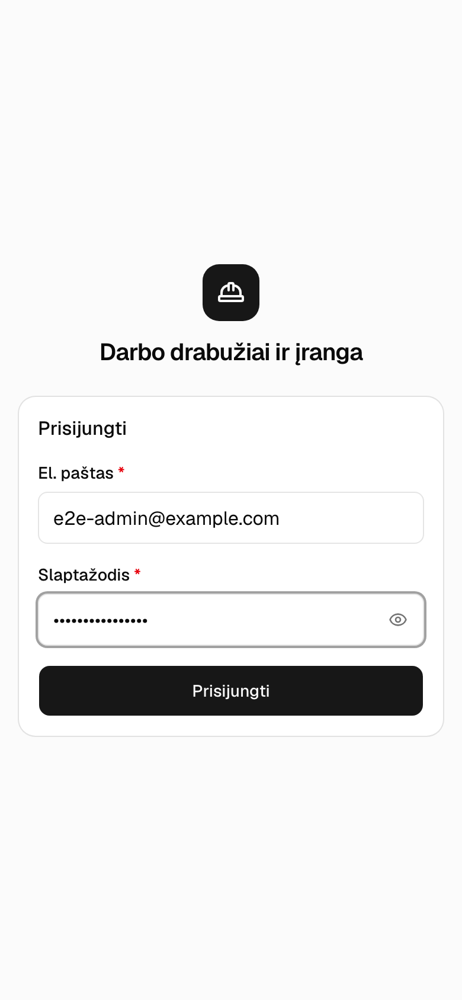

## 2. Suvestinė

*Tik administratoriams:*

Viršuje rodomi patvirtinimo laukiantys užsakymai, šio mėnesio išlaidos ir artėjantys pakeitimai.

**Reikia jūsų dėmesio** rodo, ką daryti toliau, pradedant skubiausiais darbais. Kiekvienoje eilutėje yra jos užduoties mygtukas:

- pavėluota prekė – **Užsakyti vėl**;
- nepatvirtintas užsakymas – **Siųsti nuorodą**;
- trūkstamas dydis – **Pridėti dydžius**;
- prekė be kainos – **Taisyti**.

Kortelė **Atsarginės kopijos** rodo, ar duomenų bazė kopijuojama. Pasirinkite ją, kad **Administravime** atidarytumėte **Atsarginės kopijos**.

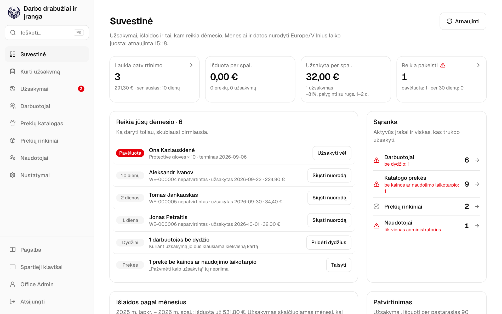

*Tik vadovams:*

**Vadovo suvestinė** skirta prekėms, kainoms ir pirkimams: kas užsakyta, išlaidos pagal prekes, kokius pakeitimus teks pirkti, naujausi kainų pokyčiai, kas kataloge ir rinkiniuose trukdo užsakyti, ir kokių dydžių laikyti atsargų.

*Tik darbuotojo rolei:*

**Darbuotojo suvestinė** prasideda nuo to, ką reikia padaryti: jūsų užsakymai, dar laukiantys darbuotojo patvirtinimo (**Siųsti nuorodą**), keistinos prekės ir darbuotojai, kuriems trūksta dydžio. Žemiau – jūsų užsakymai pagal mėnesius ir neseniai išduoti.

## 3. Užsakymo kūrimas

1. Skyriuje **Užsakymai** viršuje pasirinkite **Kurti užsakymą**.
2. Lauke **Kam skirta** įveskite darbuotojo vardo dalį. Naujam darbuotojui pasirinkite **+ Naujas darbuotojas**.
3. Pridėkite prekes:
   - **Prekių rinkinys** vienu paspaudimu prideda visą komplektą.
   - **Pridėti prekę** prideda vieną prekę. Paspaudę `/`, pereisite į šį lauką.
4. Patikrinkite kiekvienos eilutės dydį ir kiekį:
   - Dydžiai imami iš darbuotojo išsaugotų dydžių. Drabužių dydis renkamas raide, pvz., `S (44–46)`.
   - Kol nepasirinkti visi trūkstami dydžiai, užsakyti negalima.
   - Jei pasirinksite kitą dydį nei išsaugotas darbuotojo, programa paklaus **Pasirinktas kitas dydis. Išsaugoti jį darbuotojo profilyje?** **Išsaugoti** – dydis bus naudojamas ir būsimiems užsakymams; **Praleisti dydžio atnaujinimą** – tik šiam užsakymui.
5. Dešinėje esančiame skydelyje pasirinkite **Peržiūrėti ir pažymėti kaip užsakytą** arba paspauskite `⌘/Ctrl` `Enter`.

Kol dirbate, šis įrenginys saugo užsakymo juodraštį. **Kopijuoti į WhatsApp** (žinutė tiekėjui) yra peržiūroje.

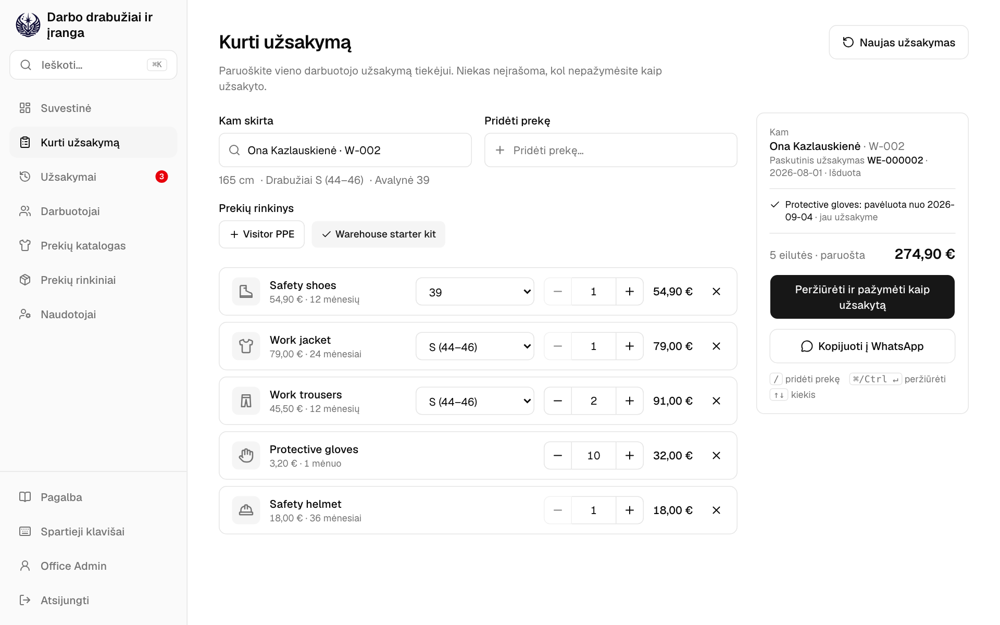

## 4. Peržiūra ir „Pažymėti kaip užsakytą“

1. Patikrinkite eilutes ir bendrą sumą.
2. Pasirinkite **Pažymėti kaip užsakytą**. Užsakymo būsena tampa **Užsakyta**, ir jo nebegalima keisti. Programa kartu sukuria darbuotojo patvirtinimo nuorodą.
3. Nusiųskite darbuotojui nuorodą: **Siųsti nuorodą per WhatsApp** arba **Kopijuoti nuorodą**. Nuoroda galioja 7 dienas ir rodoma tik vieną kartą.

Jei darbuotojas pasirašys popieriuje, vietoj to pasirinkite **Spausdinti įrašą**.

**Kopijuoti į WhatsApp** peržiūroje nukopijuoja žinutę tiekėjui. Kai administratorius **Administravime**, ekrane **Nustatymai**, yra nurodęs tiekėjo WhatsApp grupę, programa pasiūlo ją atidaryti: įklijuokite žinutę ten.

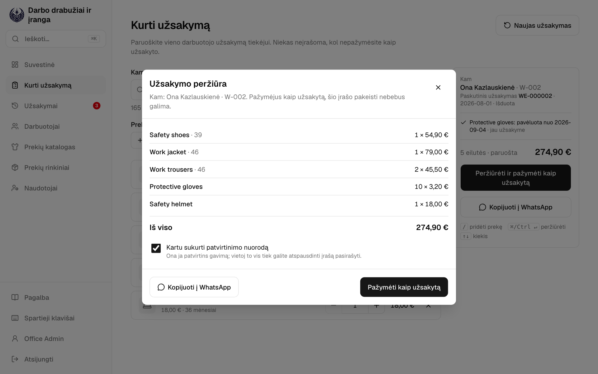
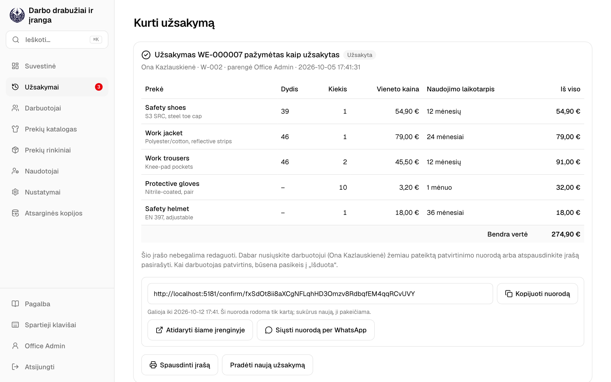

## 5. Darbuotojas patvirtina

1. Darbuotojas atidaro nuorodą. Paskyros jam nereikia.
2. Jis peržiūri prekes, jų kainas ir bendrą sumą anglų arba rusų kalba (**EN / RU**). Puslapis atsidaro darbuotojo pageidaujama kalba, jei tai anglų ar rusų; lietuviškai jis nerodomas.
3. Jis pažymi sutikimą ir paspaudžia **Confirm receipt** (**Подтвердить получение**). Užsakymo būsena tampa **Išduota**.

## 6. Užsakymai

**Užsakymuose** – visi pateikti užsakymai. **Kurti užsakymą** viršuje pradeda naują.

**Laukia**, **Išduota** ir **Visi** filtruoja užsakymus pagal būseną. Taip pat galima filtruoti pagal darbuotoją ir datą. Spustelėjus įrašo numerį, užsakymas atsidaro šalia sąrašo. `J` ir `K` pereina tarp užsakymų, o `Esc` užsakymą uždaro.

Užsakymas, kurio būsena **Užsakyta**, turi šiuos veiksmus:

- **Atidaryti darbuotojo patvirtinimą** sukuria naują nuorodą. Ten pat galima pažymėti pasirašytą popierinį egzempliorių (**Pažymėti pasirašytą popierinį patvirtinimą**).
- **Išduoti dabar** perduoda šį įrenginį darbuotojui, ir jis patvirtina gavimą vietoje.
- **Spausdinti įrašą** atspausdina įrašą pasirašyti.

*Tik vadovams:*

**⋯ → Ištrinti užsakymą…** pašalina užsakymą, pvz., bandomąjį. Prieš tai programa paklausia.

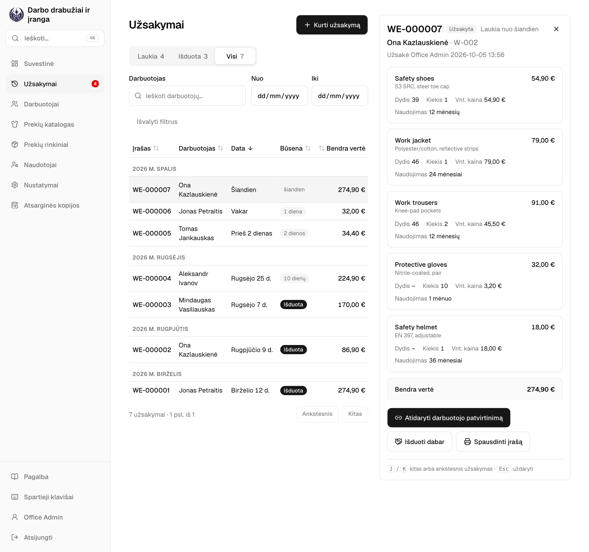

## 7. Išdavimo įrašas

Užsakymas, kurio būsena **Išduota**, turi užrakintą įrašą anglų ir rusų kalbomis (Items Given Record / Акт выдачи). Atidarykite jį mygtuku **Peržiūrėti įrašą**.

- **Spausdinti įrašą** atspausdina jį viename A4 lape.
- **Siųsti per WhatsApp** jį išsiunčia.

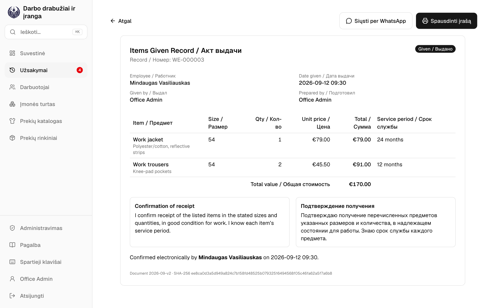

## 8. Darbuotojai

Sąraše matyti kiekvieno darbuotojo dydžiai ir pastabos. Darbuotojai, kuriems trūksta dydžio, pažymėti. Ilga pastaba sutrumpinama iki vienos eilutės; visą ją matysite užvedę žymeklį arba atidarę darbuotoją.

Darbuotojo puslapyje rodoma:

- jo dydžiai ir pageidaujama kalba;
- visos išduotos prekės su naudojimo trukme ir pakeitimo data;
- dar neišduoti užsakymai.

Šiame puslapyje **Naujas užsakymas** pradeda užsakymą šiam darbuotojui, o **Keisti dydžius** pakeičia jo dydžius.

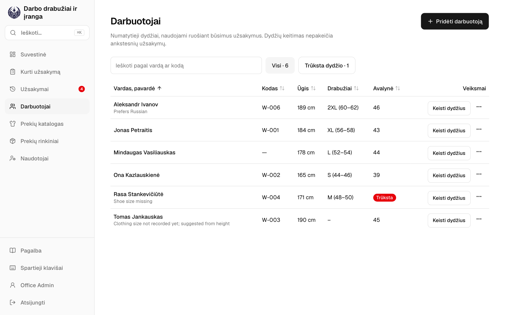
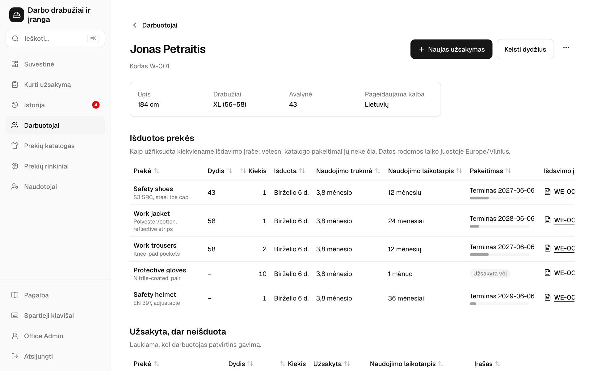

## 9. Prekių katalogas ir prekių rinkiniai

Kiekviena katalogo prekė turi kainą, naudojimo laikotarpį ir dydžių grupę. Užsakymuose rodoma ir sumuojama ši kaina. Prekės be kainos ar naudojimo laikotarpio užsakyti negalima. Pakeitus kainą, esami užsakymai nesikeičia.

Prekė gali turėti ir **Pirkimo kainą** – kiek mokame tiekėjui. Ji neprivaloma, užsakyti jos nereikia, o užsakymuose ji nerodoma. Prekės puslapyje matyti abi kainos ir kaip jos keitėsi.

Prekių rinkinys – tai prekių komplektas su numatytais kiekiais. Ekrane „Kurti užsakymą“ jį pritaikote vienu paspaudimu.

*Tik administratoriams ir vadovams:*

Prekes kuriate ir keičiate ekrane **Prekių katalogas**, o komplektus – ekrane **Prekių rinkiniai**.

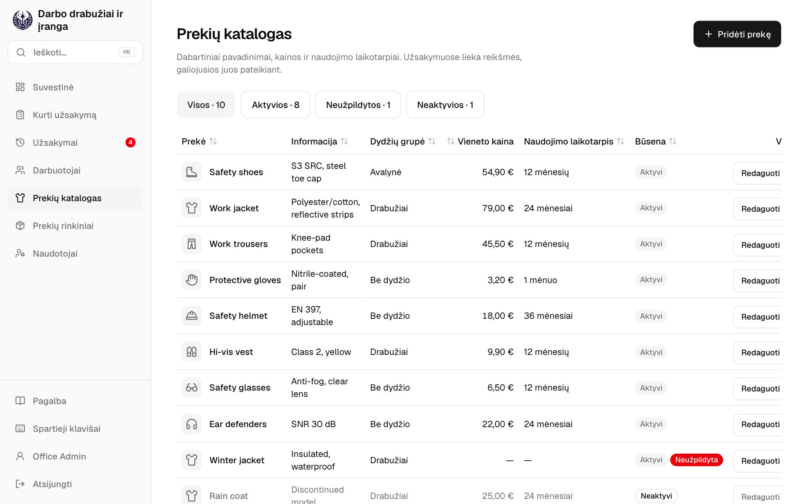
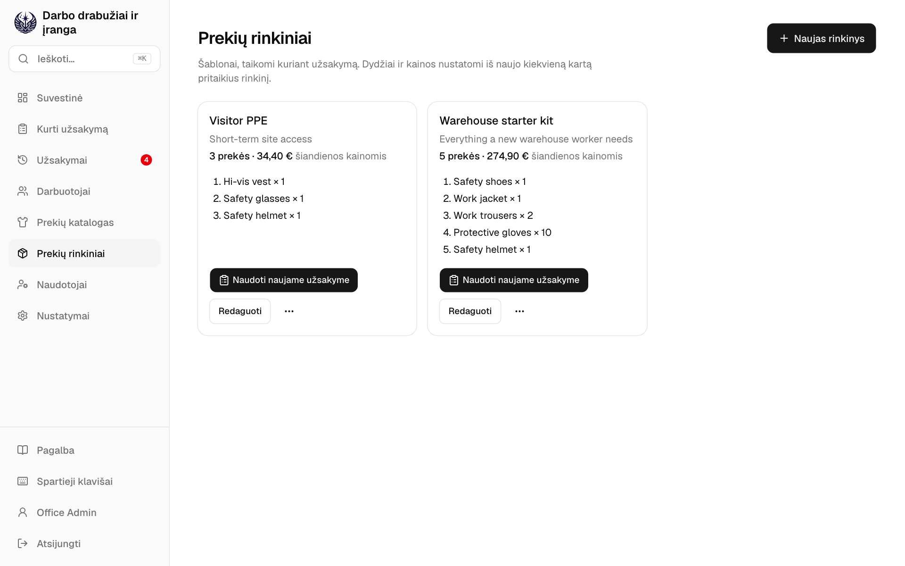

## 10. Administravimas

*Tik administratoriams.*

**Administravime** tvarkote, kas gali naudotis programėle ir ką gali daryti, bei organizacijos nustatymus. Jame keturi ekranai: **Naudotojai**, **Rolės ir teisės**, **Nustatymai** ir **Atsarginės kopijos**.

Atidarykite jį mygtuku **Administravimas** šoninės juostos apačioje. Jis turi savo šoninę juostą; **Darbo drabužiai ir įranga** jos apačioje grąžina atgal.

Prisijungiate prie abiejų iš karto, o **Atsijungti** bet kuriame atjungia nuo abiejų. **Administravimą** mato visi, kurių rolės leidžia tvarkyti naudotojus, roles, nustatymus ar atsargines kopijas, su tik tais ekranais, kuriuos atveria jų rolės.

## 11. Naudotojai

*Tik administratoriams.*

- Kurkite, redaguokite ar deaktyvuokite paskyras. Kiekvienai paskyrai priskirkite vieną ar kelias roles: naudotojas gali tai, ką leidžia bet kuri jo rolė. Ką leidžia kiekviena rolė, rodo **Rolės ir teisės**.
- Rolės pakeitimas naudotoją pasiekia per kelias minutes, nereikia jungtis iš naujo. Deaktyvuotas naudotojas atjungiamas visuose įrenginiuose.
- Slaptažodžiui atkurti naudokite **⋯ → Nustatyti naują slaptažodį…**.
- Negalite deaktyvuoti savo paskyros ar atimti iš savęs rolės, kuri leidžia tvarkyti naudotojus ar roles. Rolę **Administratorius** visada turi bent vienas aktyvus naudotojas.
- Jei prisijungėte daugiau nei prieš 12 valandų, prieš išsaugant pakeitimą programėlė paprašys patvirtinti slaptažodį (**Patvirtinkite slaptažodį**).

## 12. Rolės ir teisės

*Tik administratoriams.*

**Rolės ir teisės** rodo kiekvieną rolę, ką ji leidžia ir kiek naudotojų ją turi. Rolė – tai teisių rinkinys, pavyzdžiui, **Tvarkyti prekių katalogą** ar **Trinti darbuotojus**. Roles naudotojams skiriate skiltyje **Naudotojai**.

- **Administratorius**, **Vadovas** ir **Darbuotojas** yra įtaisytos rolės. **Administratorius** gali viską ir jo pakeisti negalima: **Peržiūrėti** parodo, ką jis leidžia. Ką leidžia **Vadovas** ir **Darbuotojas**, galite keisti, bet ne jų pavadinimus ar aprašymus, o ištrinti jų negalima.
- **Pridėti rolę** sukuria naują: pavadinimas, kam ji skirta, ir jos teisės. Kai kurioms teisėms reikia kitos, kuri pažymima kartu: teisei **Tvarkyti naudotojus** reikia teisės **Matyti naudotojus**.
- Pakeitimas rolę turinčius naudotojus pasiekia per kelias minutes.
- **⋯ → Ištrinti rolę…** ištrina rolę, kurios neturi nė vienas naudotojas. Pirmiausia atimkite ją iš naudotojų skiltyje **Naudotojai**.
- Jei prisijungėte daugiau nei prieš 12 valandų, prieš išsaugant pakeitimą programėlė paprašys patvirtinti slaptažodį (**Patvirtinkite slaptažodį**).

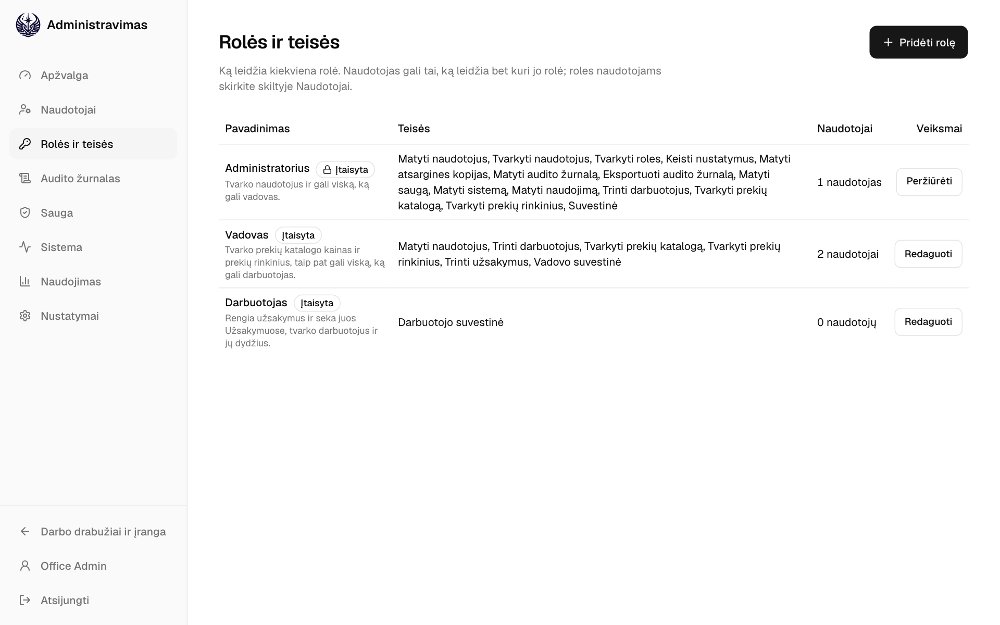
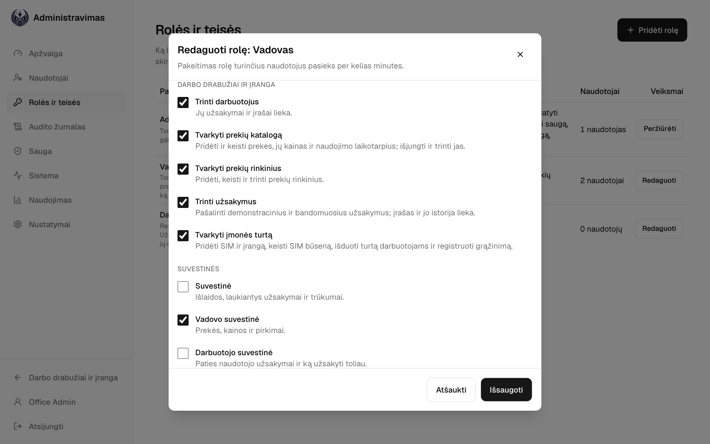

## 13. Nustatymai

*Tik administratoriams.*

**Tiekėjo WhatsApp grupė**: įrašykite grupės pavadinimą ir pakvietimo nuorodą. WhatsApp programėlėje atidarykite grupę, palieskite jos pavadinimą, tada **Pakviesti per nuorodą** ir **Kopijuoti nuorodą**.

**Kopijuoti į WhatsApp** tada pasiūlo atidaryti šią grupę, kur įklijuojate užsakymo žinutę. WhatsApp negali atidaryti grupės su jau įrašyta žinute. **Pašalinti grupę** grąžina WhatsApp atidarymą nepasirinkus pokalbio.

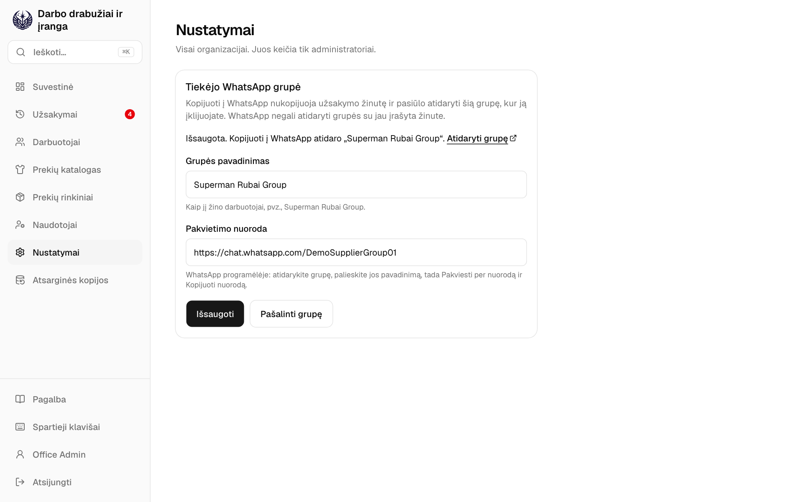

## 14. Atsarginės kopijos

*Tik administratoriams.*

**Atsarginės kopijos** rodo, ar duomenų bazė kopijuojama. Atsarginių kopijų tarnyba serveryje pagal tvarkaraštį kopijuoja visą duomenų bazę, jei nenustatyta kitaip, kiekvieną naktį, ir ištrina senas kopijas pasibaigus laikymo laikui.

Viršutinė eilutė sako, ar viskas gerai. Ji tampa raudona, kai paskutinė kopija nepavyko, kai suplanuota kopija vėluoja arba kai tarnyba nustojo pranešti. Praneškite serverį prižiūrinčiam žmogui.

Antras įspėjimas rodomas, kol kopijos laikomos tik pačiame serveryje, nes jos dingtų kartu su juo.

- **Paskutinė kopija** ir **Kita kopija**: kada, paskutinės dydis ir kiek ji užtruko.
- **Laikoma** ir **Bendras dydis**: dabar laikomos kopijos.
- **Naujausios kopijos**: kiekvienas bandymas, naujausi pirmi, nepavykusio – su klaida.
- **Nustatymai**: tvarkaraštis, kur kopijos saugomos, kiek laiko laikomos ir ar užšifruotos.

Nustatymai keičiami serveryje, ten ir atkuriama kopija: programėlė juos tik rodo.

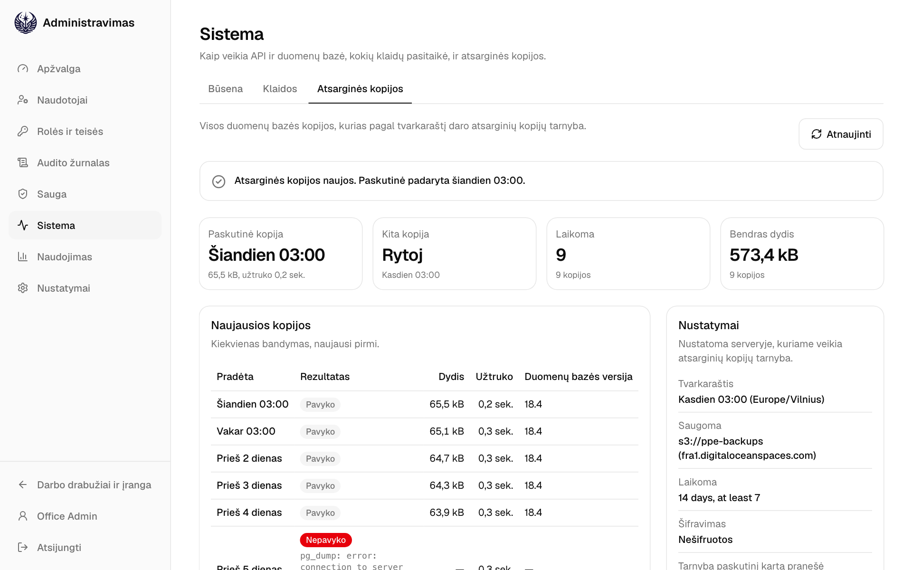

## 15. Jūsų paskyra

- **Kalba**: English, Lietuvių arba Русский. Pasirinkimas išsaugomas jūsų paskyroje, todėl galioja kiekviename įrenginyje, kuriame prisijungiate. Darbuotojo patvirtinimo puslapis ir įrašas lieka anglų ir rusų kalbomis.
- **Tema**: **Šviesi**, **Tamsi** arba **Kaip įrenginyje**. Ji išsaugoma šiame įrenginyje ir galioja ir prisijungimo puslapyje.
- **Keisti slaptažodį**: kiti jūsų įrenginiai atjungiami, o šis lieka prisijungęs.
- **Prisijungę įrenginiai**: visos naršyklės, kuriose esate prisijungę, ir kada jos naudotos paskutinį kartą. **Šis įrenginys** – pirmas. Atjunkite įrenginį, kurio nebenaudojate ar neatpažįstate, arba pasirinkite **Atjungti visus kitus įrenginius**.
- **Lentelės eilutės**: **Kompaktiškos** ekrane sutalpina daugiau eilučių.

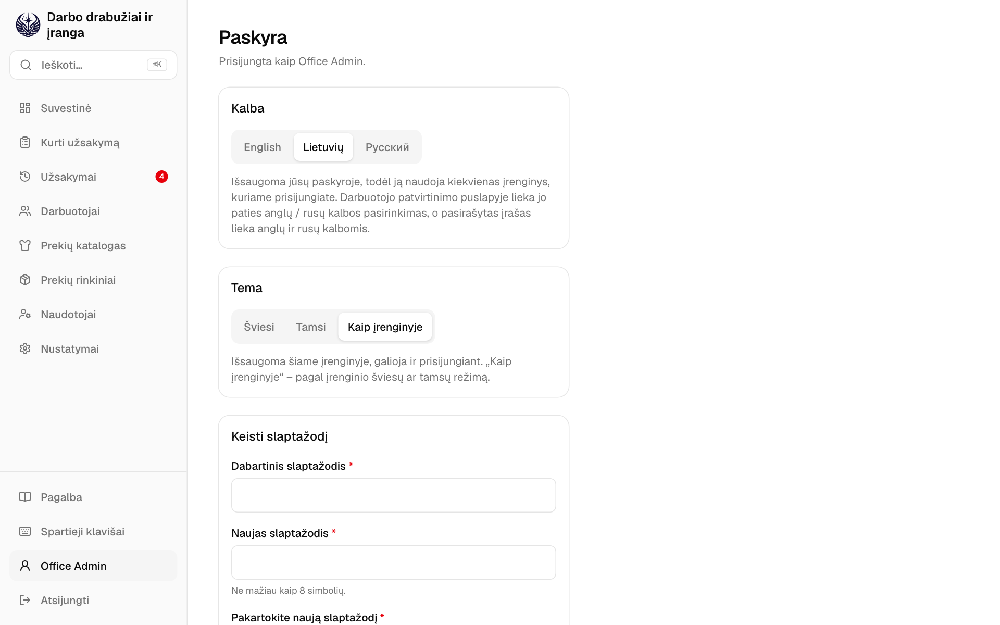
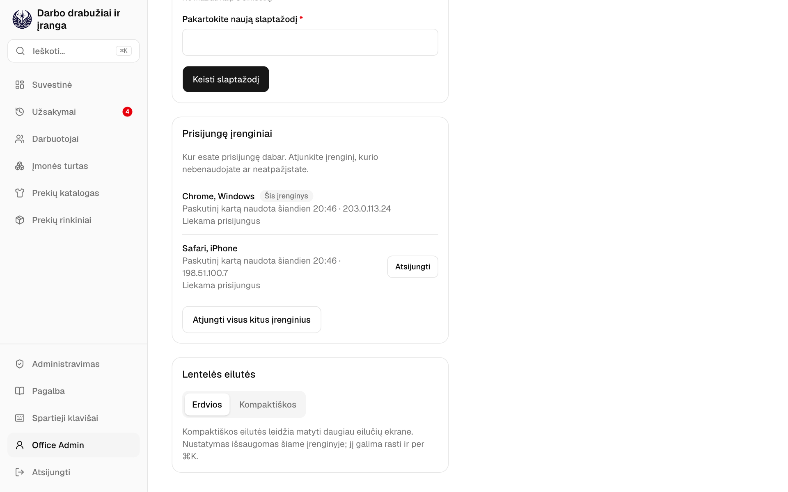

## 16. Paieška ir spartieji klavišai

| Klavišas | Ką daro |
| --- | --- |
| `⌘K` / `Ctrl K` | Ieško įrašų numerių, darbuotojų, prekių ir ekranų. Pavyzdžiui, įveskite vardą ir pasirinkite **Naujas užsakymas: …**. |
| `/` | Pereina į paieškos arba „Pridėti prekę“ lauką. |
| `G`, tada `D` `O` `H` `E` `C` `S` `U` | Pereina į Suvestinę, Kurti užsakymą, Užsakymus, Darbuotojus, Katalogą, Prekių rinkinius arba Naudotojus (Administravime). |
| `J` / `K`, `Esc` | Pereina per Užsakymus arba uždaro atidarytą užsakymą. |
| `⌘/Ctrl` `Enter` | Ekrane „Kurti užsakymą“ atidaro užsakymo peržiūrą. |
| `?` | Rodo visus sparčiuosius klavišus. |

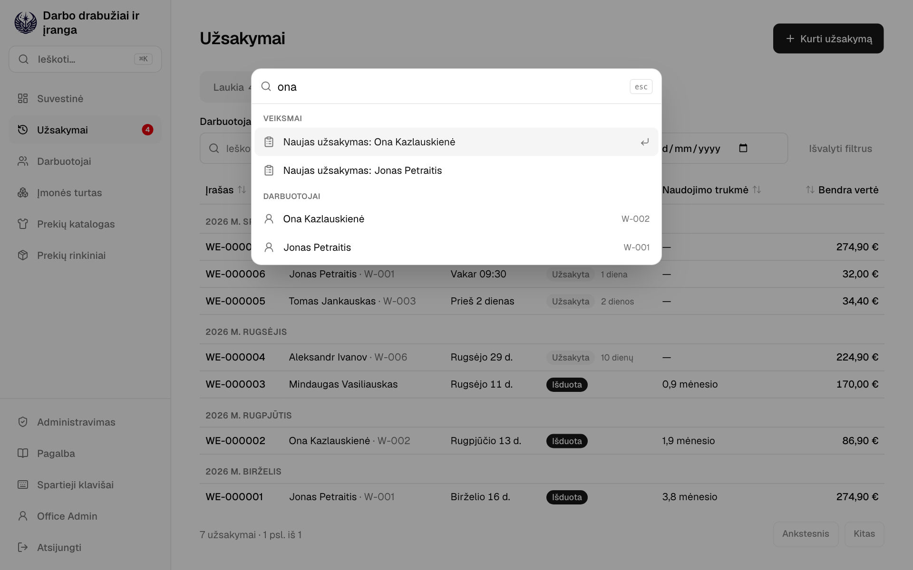

Ekrano nuotraukose rodomi demonstraciniai duomenys. Prekių pavadinimai yra duomenys, todėl rodomi taip, kaip įvesti.
