# Darbo drabužiai ir įranga: Naudotojo vadovas

[English](user-guide.md) · Lietuvių · [Русский](user-guide.ru.md)

Programa registruoja darbuotojams išduotus darbo drabužius ir apsaugos priemones. Paruošiate užsakymą ir pažymite jį kaip užsakytą. Gavęs prekes, darbuotojas patvirtina gavimą, o programa išsaugo užrakintą įrašą anglų ir rusų kalbomis. Ji taip pat registruoja įmonės SIM korteles, įrangą ir baldus bei tai, pas ką yra kiekvienas daiktas.

## 1. Prisijungimas

1. Atidarykite **workwear.gavort.nl** ir prisijunkite savo el. paštu ir slaptažodžiu.
2. Pirmasis ekranas priklauso nuo jūsų rolės:
   - administratoriai pradeda ekrane **Suvestinė**;
   - vadovai – ekrane **Vadovo suvestinė**;
   - darbuotojo rolė – ekrane **Darbuotojo suvestinė**.

Šoninėje juostoje yra visi skyriai ir **Ieškoti…** (`⌘K`). **Pagalba**, **Spartieji klavišai**, jūsų paskyra ir **Atsijungti** yra jos apačioje.

Pažymėjus **Likti prisijungus**, šiame įrenginyje liekate prisijungę ir uždarę programėlę ar perkrovę įrenginį – iki 30 dienų arba kol jo nenaudojate 14 dienų. Bendrame kompiuteryje varnelę nuimkite: būsite atjungti uždarius naršyklę ir ne vėliau kaip po 12 valandų.

**Atsijungti** užbaigia prisijungimą šiame įrenginyje. Pakeitus slaptažodį, kiti jūsų įrenginiai atjungiami. Jei administratorius atkuria jūsų slaptažodį ar išjungia paskyrą, esate atjungiami visur.

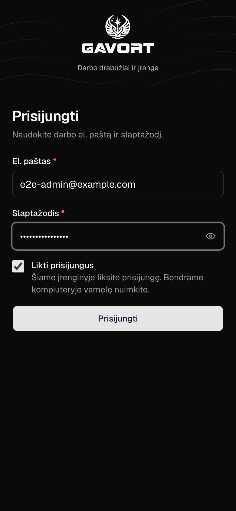

## 2. Suvestinė

*Tik administratoriams:*

Viršuje rodomi patvirtinimo laukiantys užsakymai, šio mėnesio išlaidos ir artėjantys pakeitimai.

**Reikia jūsų dėmesio** rodo, ką daryti toliau, pradedant skubiausiais darbais. Kiekvienoje eilutėje yra jos užduoties mygtukas:

- pavėluota prekė – **Užsakyti vėl**;
- nepatvirtintas užsakymas – **Siųsti nuorodą**;
- trūkstamas dydis – **Pridėti dydžius**;
- prekė be kainos – **Taisyti**.

Kortelė **Atsarginės kopijos** rodo, ar duomenų bazė kopijuojama. Pasirinkite ją, kad **Administravime** atidarytumėte **Atsarginės kopijos**.

*Tik vadovams:*

**Vadovo suvestinė** skirta prekėms, kainoms ir pirkimams: kas užsakyta, išlaidos pagal prekes, kokius pakeitimus teks pirkti, naujausi kainų pokyčiai, kas kataloge ir rinkiniuose trukdo užsakyti, ir kokių dydžių laikyti atsargų.

*Tik darbuotojo rolei:*

**Darbuotojo suvestinė** prasideda nuo to, ką reikia padaryti: jūsų užsakymai, dar laukiantys darbuotojo patvirtinimo (**Siųsti nuorodą**), keistinos prekės ir darbuotojai, kuriems trūksta dydžio. Žemiau – jūsų užsakymai pagal mėnesius ir neseniai išduoti.

## 3. Užsakymo kūrimas

1. Skyriuje **Užsakymai** viršuje pasirinkite **Kurti užsakymą**.
2. Lauke **Kam skirta** įveskite darbuotojo vardo dalį. Naujam darbuotojui pasirinkite **+ Naujas darbuotojas**.
3. Pridėkite prekes:
   - **Prekių rinkinys** vienu paspaudimu prideda visą komplektą.
   - **Pridėti prekę** prideda vieną prekę. Paspaudę `/`, pereisite į šį lauką.
4. Patikrinkite kiekvienos eilutės dydį ir kiekį:
   - Dydžiai imami iš darbuotojo išsaugotų dydžių. Drabužių dydis renkamas raide, pvz., `S (44–46)`.
   - Kol nepasirinkti visi trūkstami dydžiai, užsakyti negalima.
   - Jei pasirinksite kitą dydį nei išsaugotas darbuotojo, programa paklaus **Pasirinktas kitas dydis. Išsaugoti jį darbuotojo profilyje?** **Išsaugoti** – dydis bus naudojamas ir būsimiems užsakymams; **Praleisti dydžio atnaujinimą** – tik šiam užsakymui.
5. Dešinėje esančiame skydelyje pasirinkite **Peržiūrėti ir pažymėti kaip užsakytą** arba paspauskite `⌘/Ctrl` `Enter`.

Kol dirbate, šis įrenginys saugo užsakymo juodraštį. **Kopijuoti į WhatsApp** (žinutė tiekėjui) yra peržiūroje.

## 4. Peržiūra ir „Pažymėti kaip užsakytą“

1. Patikrinkite eilutes ir bendrą sumą.
2. Pasirinkite **Pažymėti kaip užsakytą**. Užsakymo būsena tampa **Užsakyta**, ir jo nebegalima keisti. Programa kartu sukuria darbuotojo patvirtinimo nuorodą.
3. Nusiųskite darbuotojui nuorodą: **Siųsti nuorodą per WhatsApp** arba **Kopijuoti nuorodą**. Nuoroda galioja 7 dienas ir rodoma tik vieną kartą.

Jei darbuotojas pasirašys popieriuje, vietoj to pasirinkite **Spausdinti įrašą**.

**Kopijuoti į WhatsApp** peržiūroje nukopijuoja žinutę tiekėjui. Kai administratorius **Administravime**, ekrane **Nustatymai**, yra nurodęs tiekėjo WhatsApp grupę, programa pasiūlo ją atidaryti: įklijuokite žinutę ten.

## 5. Darbuotojas patvirtina

1. Darbuotojas atidaro nuorodą. Paskyros jam nereikia.
2. Jis peržiūri prekes, jų kainas ir bendrą sumą anglų arba rusų kalba (**EN / RU**). Puslapis atsidaro darbuotojo pageidaujama kalba, jei tai anglų ar rusų; lietuviškai jis nerodomas.
3. Jis pažymi sutikimą ir paspaudžia **Confirm receipt** (**Подтвердить получение**). Užsakymo būsena tampa **Išduota**.

## 6. Užsakymai

**Užsakymuose** – visi pateikti užsakymai. **Kurti užsakymą** viršuje pradeda naują.

**Laukia**, **Išduota** ir **Visi** filtruoja užsakymus pagal būseną. Taip pat galima filtruoti pagal darbuotoją ir datą. Spustelėjus įrašo numerį, užsakymas atsidaro šalia sąrašo. `J` ir `K` pereina tarp užsakymų, o `Esc` užsakymą uždaro.

Užsakymas, kurio būsena **Užsakyta**, turi šiuos veiksmus:

- **Atidaryti darbuotojo patvirtinimą** sukuria naują nuorodą. Ten pat galima pažymėti pasirašytą popierinį egzempliorių (**Pažymėti pasirašytą popierinį patvirtinimą**).
- **Išduoti dabar** perduoda šį įrenginį darbuotojui, ir jis patvirtina gavimą vietoje.
- **Spausdinti įrašą** atspausdina įrašą pasirašyti.

*Tik vadovams:*

**⋯ → Ištrinti užsakymą…** pašalina užsakymą, pvz., bandomąjį. Prieš tai programa paklausia.

Užsakymo **Pakeitimai** rodo, kas jam nutiko ir kas tai padarė: užsakyta, sukurta ar atidaryta nuoroda, išduota.

## 7. Išdavimo įrašas

Užsakymas, kurio būsena **Išduota**, turi užrakintą įrašą anglų ir rusų kalbomis (Items Given Record / Акт выдачи). Atidarykite jį mygtuku **Peržiūrėti įrašą**.

- **Spausdinti įrašą** atspausdina jį viename A4 lape.
- **Siųsti per WhatsApp** jį išsiunčia.

## 8. Darbuotojai

Sąraše matyti kiekvieno darbuotojo dydžiai ir pastabos. Darbuotojai, kuriems trūksta dydžio, pažymėti. Ilga pastaba sutrumpinama iki vienos eilutės; visą ją matysite užvedę žymeklį arba atidarę darbuotoją.

Darbuotojo puslapyje rodoma:

- jo dydžiai ir pageidaujama kalba;
- visos išduotos prekės su naudojimo trukme ir pakeitimo data;
- dar neišduoti užsakymai;
- įmonės turtas, kurį jis turi ir turėjo: **Išduotos SIM** ir **Įranga**;
- **Pakeitimai**: kas ir kada keitė jo duomenis ar dydžius.

Šiame puslapyje **Naujas užsakymas** pradeda užsakymą šiam darbuotojui, o **Keisti dydžius** pakeičia jo dydžius.

*Tik administratoriams ir vadovams:*

Darbuotojo, kuris dar turi įmonės turto, ištrinti negalima: išėjus iš darbo, niekas negrąžinama savaime. Pirmiausia užregistruokite grąžinimą.

## 9. Prekių katalogas ir prekių rinkiniai

Kiekviena katalogo prekė turi kainą, naudojimo laikotarpį ir dydžių grupę. Užsakymuose rodoma ir sumuojama ši kaina. Prekės be kainos ar naudojimo laikotarpio užsakyti negalima. Pakeitus kainą, esami užsakymai nesikeičia.

Prekė gali turėti ir **Pirkimo kainą** – kiek mokame tiekėjui. Ji neprivaloma, užsakyti jos nereikia, o užsakymuose ji nerodoma. Prekės puslapyje matyti abi kainos ir kaip jos keitėsi, o jos **Pakeitimai** rodo, kas ir kada keitė prekę.

Prekių rinkinys – tai prekių komplektas su numatytais kiekiais. Ekrane „Kurti užsakymą“ jį pritaikote vienu paspaudimu.

*Tik administratoriams ir vadovams:*

Prekes kuriate ir keičiate ekrane **Prekių katalogas**, o komplektus – ekrane **Prekių rinkiniai**.

## 10. Įmonės turtas

Skyriuje **Įmonės turtas** registruojamos darbuotojams išduodamos įmonės SIM kortelės, įranga ir baldai: kur kiekvienas daiktas yra, pas ką jis ir koks aktas pasirašytas jį išduodant. Jame yra du skirtukai: **SIM kortelės** ir **Įranga ir baldai**. Kiekvienas daiktas – atskiras įrašas su savo inventoriaus numeriu, todėl trys vienodi nešiojamieji kompiuteriai yra trys turto vienetai.

Jį atidarysite šoninėje juostoje arba paspaudę `G`, tada `A`.

*Tik administratoriams ir vadovams:*

Kortelėje **Įmonės turtas** suvestinėje rodomi tie patys skaičiai. Pasirinkite vieną, kad atidarytumėte sąrašą pagal jį.

Plytelės viršuje skaičiuoja, kas yra **Biure**, **Pas darbuotojus** ir **Negrąžinta**. Pasirinkite plytelę, kad matytumėte tik juos; skaičiai persidengia, nes negrąžinta kortelė vis dar yra pas darbuotoją. Ieškokite pagal numerį ar darbuotoją, filtruokite pagal būseną, vietą ir tiekėją, o įrangą – pagal kategoriją.

SIM kortelės **Būsena** – tai, ką patvirtina tiekėjas: **Neaktyvuota**, **Aktyvi** arba **Užblokuota**. Ji nepriklauso nuo to, kur kortelė yra ir pas ką ji: užblokuota kortelė negrąžinama, o grąžinus kortelę jos būsena nesikeičia.

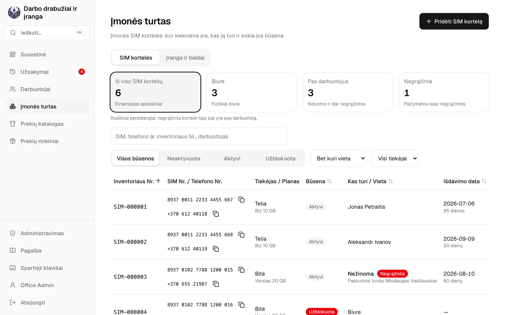

*Tik administratoriams ir vadovams:*

**Pridėti SIM kortelę** užregistruoja kortelę, kai ją atsiunčia tiekėjas. Jos SIM Nr., tiekėjas ir inventoriaus numeris (pasiūlomas kitas) reikalingi iš karto; telefono numeris, planas ir negrąžinimo vertė gali palaukti, kol kortelė bus išduodama. Skirtuke **Įranga ir baldai** mygtukas **Pridėti turtą** užregistruoja vieną daiktą: jo pavadinimą ir kategoriją, pagal kurią pasiūlomas numeris, pavyzdžiui, `PC-000003`.

**Keisti būseną** įrašo tiekėjo patvirtintą būseną. Kortelės ji neaktyvuoja ir neužblokuoja: dėl to rašykite tiekėjui.

Kaip išduoti SIM kortelę ar daiktą:

1. Atidarykite jį ir pasirinkite **Išduoti SIM kortelę** arba **Išduoti turtą**. Darbuotojo puslapyje tas pats mygtukas skiltyje **Išduotos SIM** arba **Įranga** pradeda nuo darbuotojo ir parodo, kas yra biure.
2. Pasirinkite darbuotoją ir išdavimo datą: šiandien arba anksčiau.
3. **Spausdinti aktą** atidaro išdavimo aktą naujame skirtuke. Išspausdinkite jį ir duokite darbuotojui pasirašyti.
4. Pažymėkite **Aktas pasirašytas**, tada pasirinkite **Išduoti SIM kortelę** arba **Išduoti turtą**.

Išduoti galima tik **Aktyvią** kortelę, esančią biure ir turinčią telefono numerį; kol to nėra, mygtukas nurodo, ko trūksta. Jei po spausdinimo aktas pasikeičia, žymė **Aktas pasirašytas** nuimama: išspausdinkite jį dar kartą. Baldai ir kiti daiktai išduodami be akto.

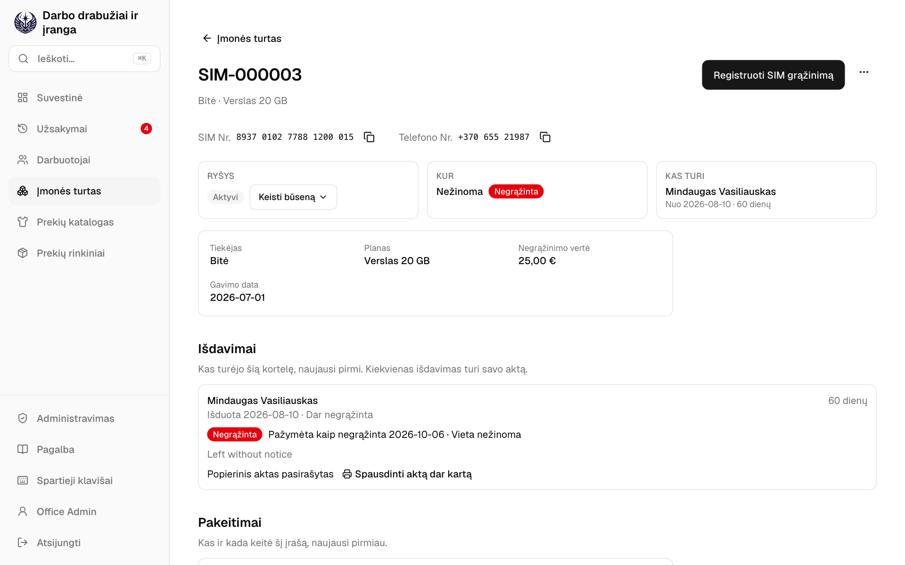
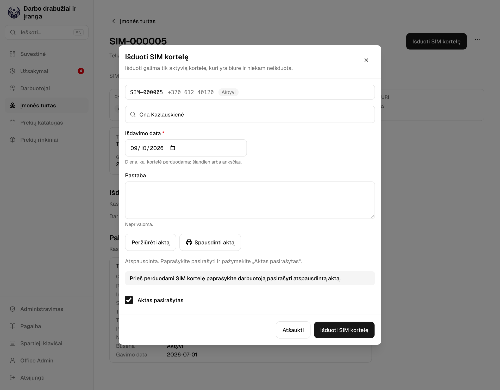

*Tik darbuotojo rolei:*

*Tik administratoriams ir vadovams:*

Kai daiktas fiziškai grįžta į biurą, **Registruoti SIM grąžinimą** arba **Registruoti turto grąžinimą** jį ten įrašo. Kiekvienas išdavimas ir grąžinimas lieka jo puslapyje skiltyje **Išdavimai**, o **Spausdinti aktą dar kartą** išspausdina jo aktą.

Išėjus iš darbo, niekas negrąžinama savaime. Kai darbuotojas negrąžina kortelės, **Pažymėti kaip negrąžintą** įrašo, kur ji yra: vis dar pas jį ar nežinoma. Kortelė lieka jo, kol grįš. Tada **Paruošti blokavimo laišką** pateikia tekstą, kurį nukopijuosite į savo laišką tiekėjui; kai jis patvirtins, ekrane **Keisti būseną** pasirinkite **Užblokuota**.

Paieška randa SIM kortelę pagal SIM, telefono ar inventoriaus numerį, o daiktą – pagal inventoriaus numerį.

## 11. Administravimas

*Tik administratoriams.*

**Administravime** tvarkote, kas gali naudotis programėle ir ką gali daryti, prižiūrite, kaip ji veikia, ir tvarkote organizacijos nustatymus. Jis atsidaro **Apžvalgoje**. Kiti jo ekranai: **Naudotojai**, **Rolės ir teisės**, **Audito žurnalas**, **Sauga**, **Sistema**, **Naudojimas** ir **Nustatymai**.

Atidarykite jį mygtuku **Administravimas** šoninės juostos apačioje. Jis turi savo šoninę juostą; **Darbo drabužiai ir įranga** jos apačioje grąžina atgal.

Prisijungiate prie abiejų iš karto, o **Atsijungti** bet kuriame atjungia nuo abiejų. **Administravimą** mato visi, kurių rolės leidžia tvarkyti naudotojus, roles ar nustatymus arba skaityti audito žurnalą, saugą, sistemą, naudojimą ar atsargines kopijas, su tik tais ekranais, kuriuos atveria jų rolės.

## 12. Apžvalga

*Tik administratoriams.*

**Apžvalga** atsako į klausimą: ar kas nors negerai? **Reikia dėmesio** išvardija, į ką pažiūrėti, svarbiausia pirmiau, su nuoroda, kur tai sutvarkyti. Kai viskas gerai, rodoma **Niekam nereikia jūsų dėmesio.**

- Atsarginė kopija nepavyko arba kopijos nebedaromos.
- Buvo panaudotas nukopijuotas prisijungimas arba daug prisijungimų nepavyko.
- Užklausos nepavyksta arba atsirado nauja klaidos rūšis.
- Laikas peržiūrėti prieigą. Peržiūrėkite ją kas 90 dienų.
- Audito žurnalas nesutampa su savo antspaudais: kažkas jį pakeitė apeidamas programėlę.
- Antspaudams nesuteikiamos laiko žymos: laiko žymų tarnyba neatsako jau parą.

Žemiau esantys **Rodikliai** rodo aktyvius naudotojus, kas prisijungę dabar, šiandienos prisijungimus, paskutinių 24 valandų užklausas, duomenų bazę ir paskutinę atsarginę kopiją.

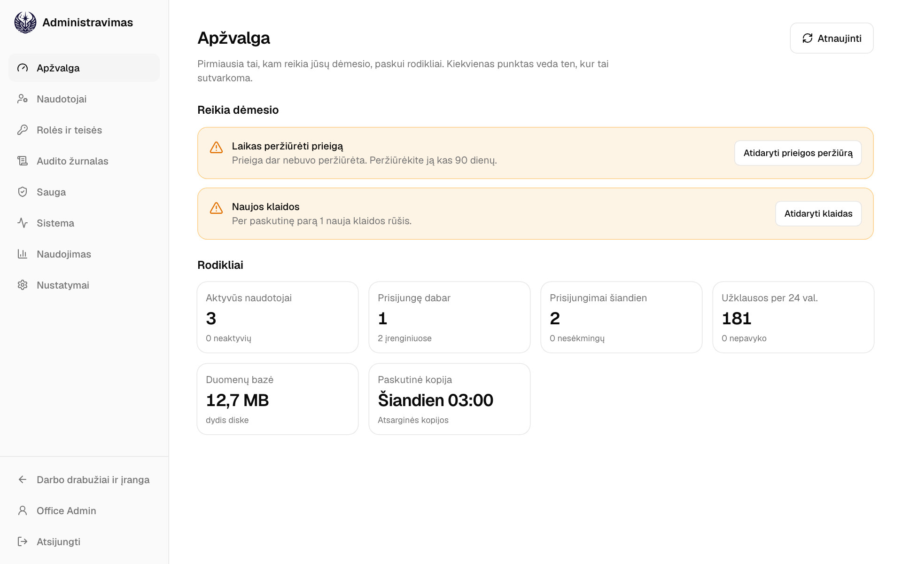

## 13. Naudotojai

*Tik administratoriams.*

- Kurkite, redaguokite ar deaktyvuokite paskyras. Kiekvienai paskyrai priskirkite vieną ar kelias roles: naudotojas gali tai, ką leidžia bet kuri jo rolė. Ką leidžia kiekviena rolė, rodo **Rolės ir teisės**.
- Rolės pakeitimas naudotoją pasiekia per kelias minutes, nereikia jungtis iš naujo. Deaktyvuotas naudotojas atjungiamas visuose įrenginiuose.
- Slaptažodžiui atkurti naudokite **⋯ → Nustatyti naują slaptažodį…**.
- Negalite deaktyvuoti savo paskyros ar atimti iš savęs rolės, kuri leidžia tvarkyti naudotojus ar roles. Rolę **Administratorius** visada turi bent vienas aktyvus naudotojas.
- Jei prisijungėte daugiau nei prieš 12 valandų, prieš išsaugant pakeitimą programėlė paprašys patvirtinti slaptažodį (**Patvirtinkite slaptažodį**).

## 14. Rolės ir teisės

*Tik administratoriams.*

**Rolės ir teisės** rodo kiekvieną rolę, ką ji leidžia ir kiek naudotojų ją turi. Rolė – tai teisių rinkinys, pavyzdžiui, **Tvarkyti prekių katalogą** ar **Trinti darbuotojus**. Roles naudotojams skiriate skiltyje **Naudotojai**.

- **Administratorius**, **Vadovas** ir **Darbuotojas** yra įtaisytos rolės. **Administratorius** gali viską ir jo pakeisti negalima: **Peržiūrėti** parodo, ką jis leidžia. Ką leidžia **Vadovas** ir **Darbuotojas**, galite keisti, bet ne jų pavadinimus ar aprašymus, o ištrinti jų negalima.
- **Pridėti rolę** sukuria naują: pavadinimas, kam ji skirta, ir jos teisės. Kai kurioms teisėms reikia kitos, kuri pažymima kartu: teisei **Tvarkyti naudotojus** reikia teisės **Matyti naudotojus**.
- Pakeitimas rolę turinčius naudotojus pasiekia per kelias minutes.
- **⋯ → Ištrinti rolę…** ištrina rolę, kurios neturi nė vienas naudotojas. Pirmiausia atimkite ją iš naudotojų skiltyje **Naudotojai**.
- Jei prisijungėte daugiau nei prieš 12 valandų, prieš išsaugant pakeitimą programėlė paprašys patvirtinti slaptažodį (**Patvirtinkite slaptažodį**).

## 15. Audito žurnalas

*Tik administratoriams.*

**Audito žurnalas** rodo kiekvieną užfiksuotą pakeitimą: kas pakeista, kas pakeitė, kada ir kur. Pakeitimas daromas programoje **Darbo drabužiai ir įranga**, **Administravime**, per darbuotojo **Patvirtinimo nuorodą** arba pačios **Sistemos**.

Filtruokite pagal **Sritis**, **Pakeitimas**, **Naudotojas** ir datas. Spustelėkite pakeitimą, kad jis atsivertų šalia sąrašo. Jame matyti kiekvienas laukas prieš ir po, o **Atidaryti programoje „Darbo drabužiai ir įranga“** atidaro įrašą. **Visi šio įrašo pakeitimai** susiaurina sąrašą iki jo.

- **Antspaudai**, viršuje: kiekvienos dienos pakeitimai užantspauduojami praėjus valandai po dienos pabaigos maiša, kuri apima ir ankstesnę dieną, todėl vėliau pakeistas, pridėtas ar pašalintas pakeitimas išryškėja. **Patikrinti** iš naujo patikrina visus antspaudus; programėlė juos tikrina ir kas valandą.
- Kiekvienam antspaudui suteikiama ir laiko žyma: viešoji laiko žymų tarnyba pasirašo antspaudą kartu su laiku. Vėliau iš naujo sudarytas antspaudas negali gauti pradinio laiko, todėl net turintis prieigą prie serverio negali nepastebimai perrašyti žurnalo. Skydelis rodo, iki kurios dienos antspaudams suteiktos laiko žymos.
- Jei užantspauduota diena nesutampa arba jos laiko žyma netinkama, pavėluota ar jos nėra, tai parodo Apžvalga. Praneškite serverį prižiūrinčiam asmeniui ir išsaugokite atsargines kopijas iš laiko prieš tą dieną.
- **Eksportuoti** atsisiunčia filtrų atrinktus pakeitimus tarp dviejų dienų, ne ilgiau kaip per metus, kaip **CSV, skaičiuoklei** arba **JSON eilutės, archyvui**. Pats eksportas taip pat užfiksuojamas audito žurnale.
- Pakeitimai laikomi metų metus (10 metų, jei serveryje nenustatyta kitaip), paskui ištrinami po dieną.

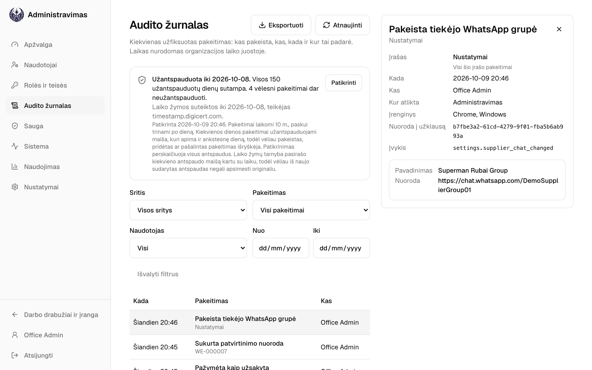

## 16. Sauga

*Tik administratoriams.*

**Sauga** turi tris skirtukus:

- **Prisijungimai**: kiekvienas prisijungimas, nepavykęs bandymas, patvirtintas slaptažodis ir atsijungimas su paskyra, adresu, iš kurio jungtasi, ir įrenginiu. Filtruokite pagal įvykį, naudotoją ir datas. Prie nepavykusio bandymo nurodyta priežastis, pvz., **Neteisingas slaptažodis**. Prisijungimų įrašai laikomi 180 dienų.
- **Prisijungę įrenginiai**: kiekviena naršyklė, kurioje kas nors šiuo metu prisijungęs. Mygtuku **Atjungti** atjunkite pamestą ar neatpažintą įrenginį: tas asmuo ten turės vėl prisijungti savo slaptažodžiu.
- **Prieigos peržiūra**: kiekvienas naudotojas su rolėmis, tuo, ką jos leidžia, ir paskutiniu prisijungimu. Administratoriai ir paskyros, nenaudotos 90 dienų, pažymėti. Patikrinkite, ar kiekvienam vis dar reikia jo prieigos, pakeiskite ją ekrane **Naudotojai**, tada pasirinkite **Pažymėti kaip peržiūrėtą**. Darykite tai kas 90 dienų: Apžvalga primins.

**Nukopijuotas prisijungimas sustabdytas** reiškia, kad kažkas panaudojo seną prisijungimo kopiją, todėl jis buvo nutrauktas visuose jį turėjusiuose įrenginiuose. Paklauskite naudotojo, ar tai buvo jis. Jei ne, tegul pasikeičia slaptažodį.

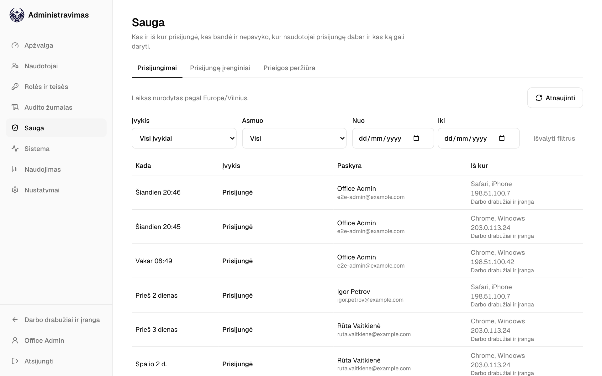
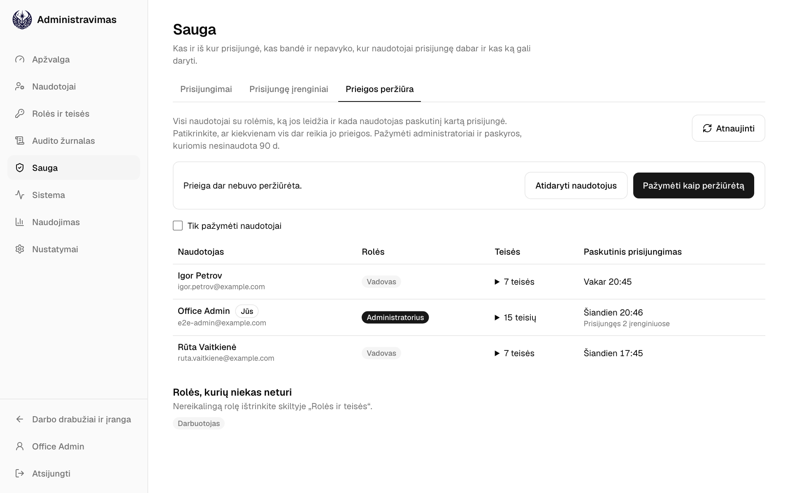

## 17. Sistema

*Tik administratoriams.*

**Sistema** rodo, kaip veikia programėlė. Ji turi tris skirtukus: **Būsena**, **Klaidos** ir **Atsarginės kopijos**.

- **Būsena**: ar programėlė **Veikia**, jos versija ir kada ji paleista; paskutinių 24 valandų užklausos, kiek jų nepavyko ir kiek jos truko; duomenų bazės dydis ir paskutinė migracija; kiek laikomi prisijungimai, klaidos ir pakeitimai.
- **Klaidos**: kas nepavyko serveryje ar kieno nors naršyklėje, kiek kartų ir kada paskutinį kartą. Atidarykite klaidą, kad matytumėte, kas su ja susidūrė, kur ir kokiu įrenginiu. Klaidos laikomos 30 dienų.
- **Atsarginės kopijos**: žr. toliau.

Kai kas nors nepavyksta, programėlė parodo **Nuoroda į užklausą**, pvz., `9f2c1a7e`. Klaida ekrane **Klaidos** rodo tą pačią nuorodą. Perduokite ją serverį prižiūrinčiam asmeniui: pagal ją jis randa klaidą serverio žurnale.

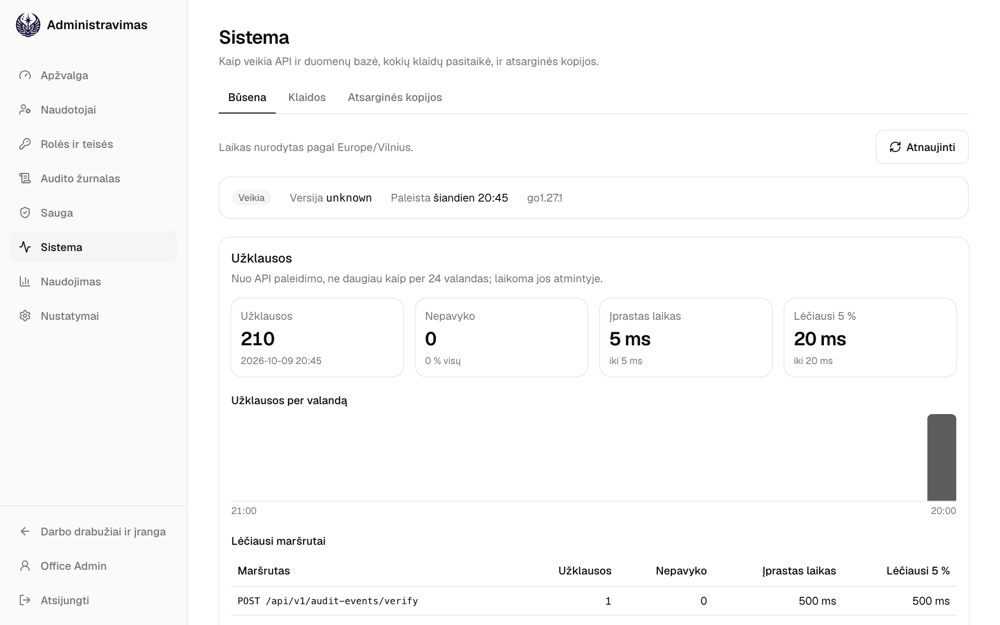
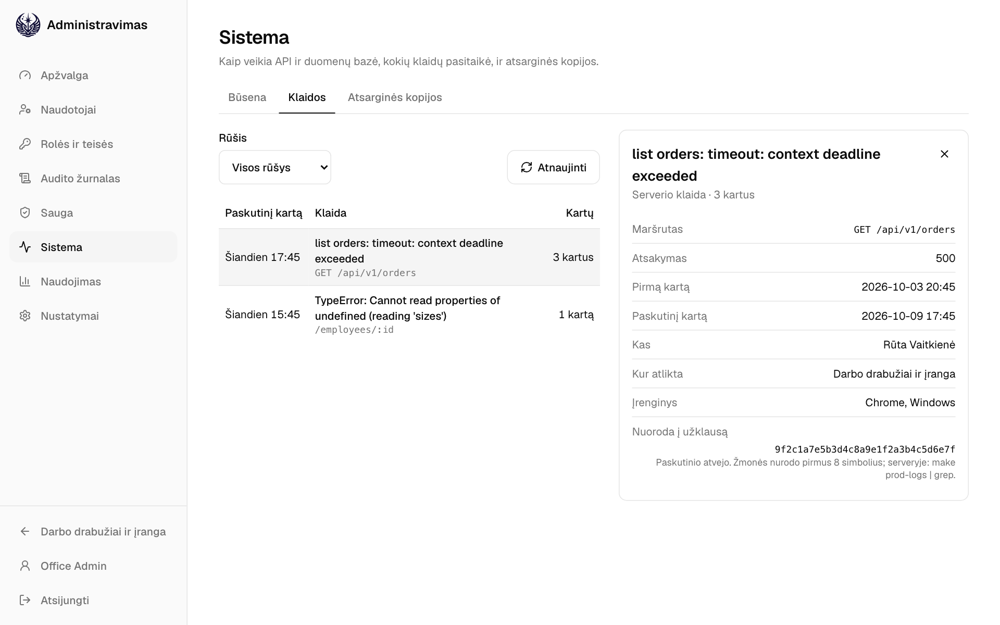

## 18. Atsarginės kopijos

*Tik administratoriams.*

**Sistema → Atsarginės kopijos** rodo, ar duomenų bazė kopijuojama. Atsarginių kopijų tarnyba serveryje pagal tvarkaraštį kopijuoja visą duomenų bazę, jei nenustatyta kitaip, kiekvieną naktį, ir ištrina senas kopijas pasibaigus laikymo laikui.

Viršutinė eilutė sako, ar viskas gerai. Ji tampa raudona, kai paskutinė kopija nepavyko, kai suplanuota kopija vėluoja arba kai tarnyba nustojo pranešti. Praneškite serverį prižiūrinčiam žmogui.

Antras įspėjimas rodomas, kol kopijos laikomos tik pačiame serveryje, nes jos dingtų kartu su juo.

- **Paskutinė kopija** ir **Kita kopija**: kada, paskutinės dydis ir kiek ji užtruko.
- **Laikoma** ir **Bendras dydis**: dabar laikomos kopijos.
- **Naujausios kopijos**: kiekvienas bandymas, naujausi pirmi, nepavykusio – su klaida.
- **Nustatymai**: tvarkaraštis, kur kopijos saugomos, kiek laiko laikomos ir ar užšifruotos.

Nustatymai keičiami serveryje, ten ir atkuriama kopija: programėlė juos tik rodo.

## 19. Naudojimas

*Tik administratoriams.*

**Naudojimas** rodo, kaip naudojamasi programėlėmis. Jokie puslapiai nesekami: viskas gaunama iš to, ką programėlė ir taip užfiksuoja.

- Viršuje: šiandien, per paskutines 7 ir per 30 dienų aktyvūs asmenys iš visų aktyvių paskyrų ir šiandienos prisijungimai.
- **Aktyvūs asmenys per dieną** pagal programėlę, su linija kiekvienai rolei. **Prisijungimai per dieną**, su nepavykusiais.
- **Patvirtinimo nuorodos per 90 dienų**: kiek nuorodų darbuotojams išsiųsta, atidaryta ir patvirtinta, kiek dar laukia, nebegalioja ar buvo pakeistos.
- **Pakeitimai per savaitę** pagal sritį (kuo tamsiau, tuo daugiau) ir daugiausia pakeitimų atlikę asmenys.
- **Įrenginiai per 30 dienų** ir **Kalbos**: telefonai, planšetės ir kompiuteriai su jų sistemomis ir naršyklėmis, naudotojų ir darbuotojų kalbos.
- **Duomenų kokybė per 90 dienų**: darbuotojai be dydžių ir prekės be kainos ar naudojimo laikotarpio. Kuo mažiau, tuo geriau.

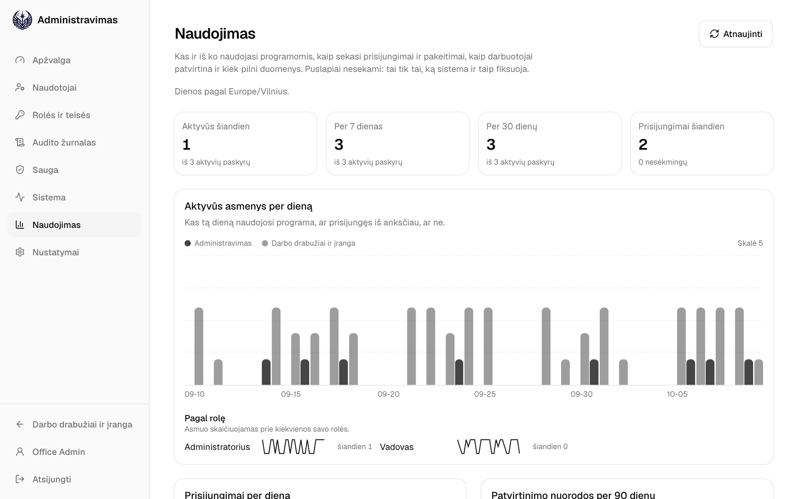

## 20. Nustatymai

*Tik administratoriams.*

**Tiekėjo WhatsApp grupė**: įrašykite grupės pavadinimą ir pakvietimo nuorodą. WhatsApp programėlėje atidarykite grupę, palieskite jos pavadinimą, tada **Pakviesti per nuorodą** ir **Kopijuoti nuorodą**.

**Kopijuoti į WhatsApp** tada pasiūlo atidaryti šią grupę, kur įklijuojate užsakymo žinutę. WhatsApp negali atidaryti grupės su jau įrašyta žinute. **Pašalinti grupę** grąžina WhatsApp atidarymą nepasirinkus pokalbio.

## 21. Jūsų paskyra

- **Kalba**: English, Lietuvių arba Русский. Pasirinkimas išsaugomas jūsų paskyroje, todėl galioja kiekviename įrenginyje, kuriame prisijungiate. Darbuotojo patvirtinimo puslapis ir įrašas lieka anglų ir rusų kalbomis.
- **Tema**: **Šviesi**, **Tamsi** arba **Kaip įrenginyje**. Ji išsaugoma šiame įrenginyje ir galioja ir prisijungimo puslapyje.
- **Keisti slaptažodį**: kiti jūsų įrenginiai atjungiami, o šis lieka prisijungęs.
- **Prisijungę įrenginiai**: visos naršyklės, kuriose esate prisijungę, ir kada jos naudotos paskutinį kartą. **Šis įrenginys** – pirmas. Atjunkite įrenginį, kurio nebenaudojate ar neatpažįstate, arba pasirinkite **Atjungti visus kitus įrenginius**.
- **Lentelės eilutės**: **Kompaktiškos** ekrane sutalpina daugiau eilučių.

## 22. Paieška ir spartieji klavišai

| Klavišas | Ką daro |
| --- | --- |
| `⌘K` / `Ctrl K` | Ieško įrašų numerių, darbuotojų, prekių, įmonės turto ir ekranų. Pavyzdžiui, įveskite vardą ir pasirinkite **Naujas užsakymas: …**. |
| `/` | Pereina į paieškos arba „Pridėti prekę“ lauką. |
| `G`, tada `D` `O` `H` `E` `A` `C` `S` `U` | Pereina į Suvestinę, Kurti užsakymą, Užsakymus, Darbuotojus, Įmonės turtą, Katalogą, Prekių rinkinius arba Naudotojus (Administravime). |
| `J` / `K`, `Esc` | Pereina per Užsakymus arba uždaro atidarytą užsakymą. |
| `⌘/Ctrl` `Enter` | Ekrane „Kurti užsakymą“ atidaro užsakymo peržiūrą. |
| `?` | Rodo visus sparčiuosius klavišus. |

Ekrano nuotraukose rodomi demonstraciniai duomenys. Prekių pavadinimai yra duomenys, todėl rodomi taip, kaip įvesti.
