# Darbo drabužiai ir įranga: naudotojo vadovas

[English](user-guide.md) · Lietuvių · [Русский](user-guide.ru.md)

Programa registruoja darbuotojams išduotus darbo drabužius ir apsaugos priemones. Paruošiate užsakymą ir pažymite jį kaip užsakytą. Gavęs prekes, darbuotojas patvirtina gavimą, o programa išsaugo užrakintą įrašą anglų ir rusų kalbomis.

## 1. Prisijungimas

1. Atidarykite **workwear.gavort.nl** ir prisijunkite savo el. paštu ir slaptažodžiu.
2. Pirmasis ekranas priklauso nuo jūsų rolės:
   - administratoriai pradeda ekrane **Suvestinė**;
   - vadovai – ekrane **Vadovo suvestinė**;
   - darbuotojo rolė – ekrane **Darbuotojo suvestinė**.

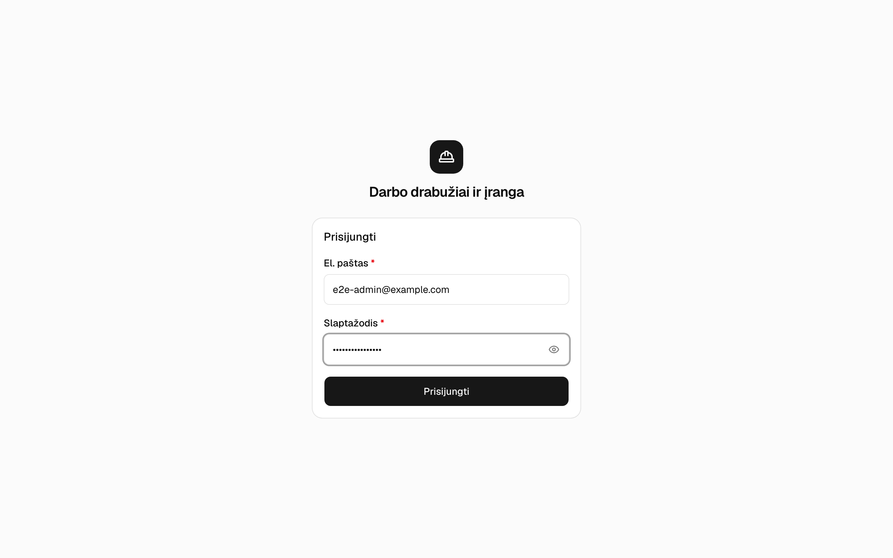

## 2. Suvestinė

Viršuje rodomi patvirtinimo laukiantys užsakymai, šio mėnesio išlaidos ir artėjantys pakeitimai.

**Reikia jūsų dėmesio** rodo, ką daryti toliau, pradedant skubiausiais darbais. Kiekvienoje eilutėje yra jos užduoties mygtukas:

- pavėluota prekė – **Užsakyti vėl**;
- nepatvirtintas užsakymas – **Siųsti nuorodą**;
- trūkstamas dydis – **Pridėti dydžius**;
- prekė be kainos – **Taisyti**.

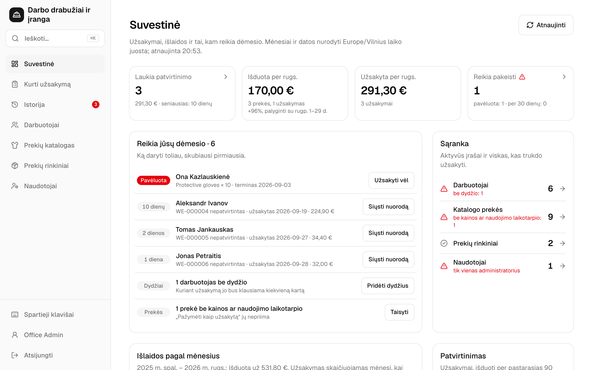

## 3. Užsakymo kūrimas

1. Atidarykite **Kurti užsakymą**.
2. Lauke **Kam skirta** įveskite darbuotojo vardo dalį. Naujam darbuotojui pasirinkite **+ Naujas darbuotojas**.
3. Pridėkite prekes:
   - **Prekių rinkinys** vienu paspaudimu prideda visą komplektą.
   - **Pridėti prekę** prideda vieną prekę. Paspaudę `/`, pereisite į šį lauką.
4. Patikrinkite kiekvienos eilutės dydį ir kiekį:
   - Dydžiai imami iš darbuotojo išsaugotų dydžių. Drabužių dydis renkamas raide, pvz., `S (44–46)`.
   - Kol nepasirinkti visi trūkstami dydžiai, užsakyti negalima.
5. Pasirinkite **Peržiūrėti ir pažymėti kaip užsakytą** arba paspauskite `⌘/Ctrl` `Enter`.

Kol dirbate, šis įrenginys saugo užsakymo juodraštį. **Kopijuoti į WhatsApp** nukopijuoja žinutę tiekėjui.

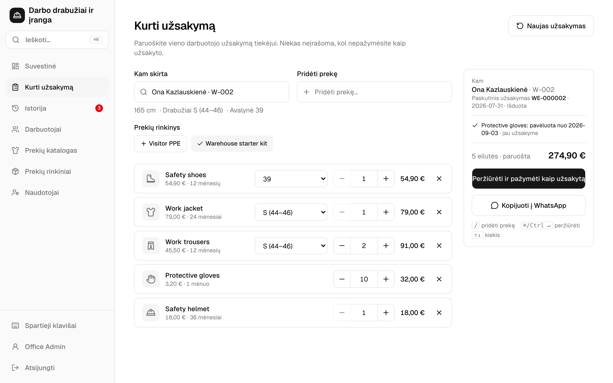

## 4. Peržiūra ir „Pažymėti kaip užsakytą“

1. Patikrinkite eilutes ir bendrą sumą.
2. Jei darbuotojas patvirtins telefonu, palikite pažymėtą **Kartu sukurti patvirtinimo nuorodą**.
3. Pasirinkite **Pažymėti kaip užsakytą**. Užsakymo būsena tampa **Užsakyta**, ir jo nebegalima keisti.
4. Nusiųskite darbuotojui nuorodą: **Siųsti nuorodą per WhatsApp** arba **Kopijuoti nuorodą**. Nuoroda galioja 7 dienas ir rodoma tik vieną kartą.

Jei darbuotojas pasirašys popieriuje, vietoj to pasirinkite **Spausdinti įrašą**.

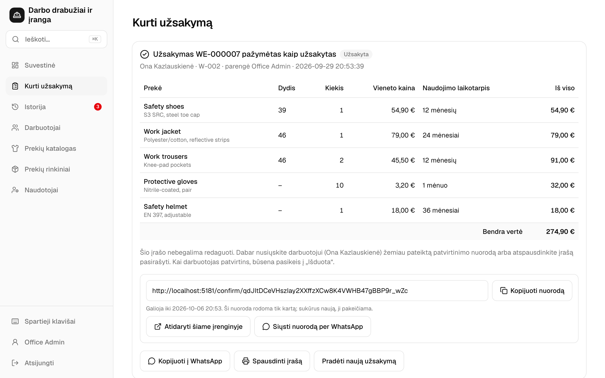

## 5. Darbuotojas patvirtina

1. Darbuotojas atidaro nuorodą. Paskyros jam nereikia.
2. Jis peržiūri prekes anglų arba rusų kalba (**EN / RU**). Šis puslapis lietuviškai nerodomas.
3. Jis pažymi sutikimą ir paspaudžia **Confirm receipt** (**Подтвердить получение**). Užsakymo būsena tampa **Išduota**.

## 6. Istorija

**Laukia**, **Išduota** ir **Visi** filtruoja užsakymus pagal būseną. Taip pat galima filtruoti pagal darbuotoją ir datą. Spustelėjus įrašo numerį, užsakymas atsidaro šalia sąrašo. `J` ir `K` pereina tarp užsakymų, o `Esc` užsakymą uždaro.

Užsakymas, kurio būsena **Užsakyta**, turi šiuos veiksmus:

- **Atidaryti darbuotojo patvirtinimą** sukuria naują nuorodą. Ten pat galima pažymėti pasirašytą popierinį egzempliorių (**Pažymėti pasirašytą popierinį patvirtinimą**).
- **Išduoti dabar** perduoda šį įrenginį darbuotojui, ir jis patvirtina gavimą vietoje.
- **Spausdinti įrašą** atspausdina įrašą pasirašyti.
- **Kopijuoti į WhatsApp** nukopijuoja žinutę tiekėjui.

Tik vadovams: **⋯ → Ištrinti užsakymą…** pašalina užsakymą, pvz., bandomąjį. Prieš tai programa paklausia.

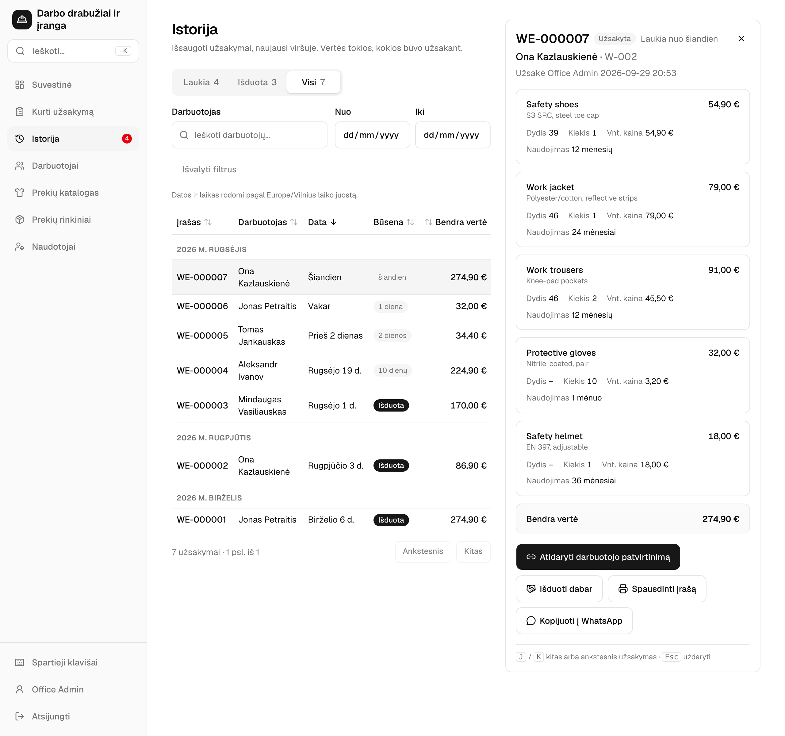

## 7. Išdavimo įrašas

Užsakymas, kurio būsena **Išduota**, turi užrakintą įrašą anglų ir rusų kalbomis (*Items Given Record / Акт выдачи*). Atidarykite jį mygtuku **Peržiūrėti įrašą**.

- **Spausdinti įrašą** atspausdina jį viename A4 lape.
- **Siųsti per WhatsApp** jį išsiunčia.

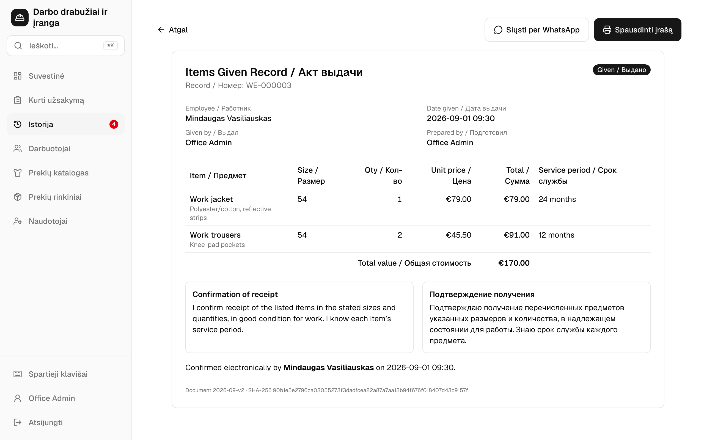

## 8. Darbuotojai

Sąraše matyti kiekvieno darbuotojo dydžiai. Darbuotojai, kuriems trūksta dydžio, pažymėti.

Darbuotojo puslapyje rodoma:

- jo dydžiai;
- visos išduotos prekės su naudojimo trukme ir pakeitimo data;
- dar neišduoti užsakymai.

Šiame puslapyje **Naujas užsakymas** pradeda užsakymą šiam darbuotojui, o **Keisti dydžius** pakeičia jo dydžius.

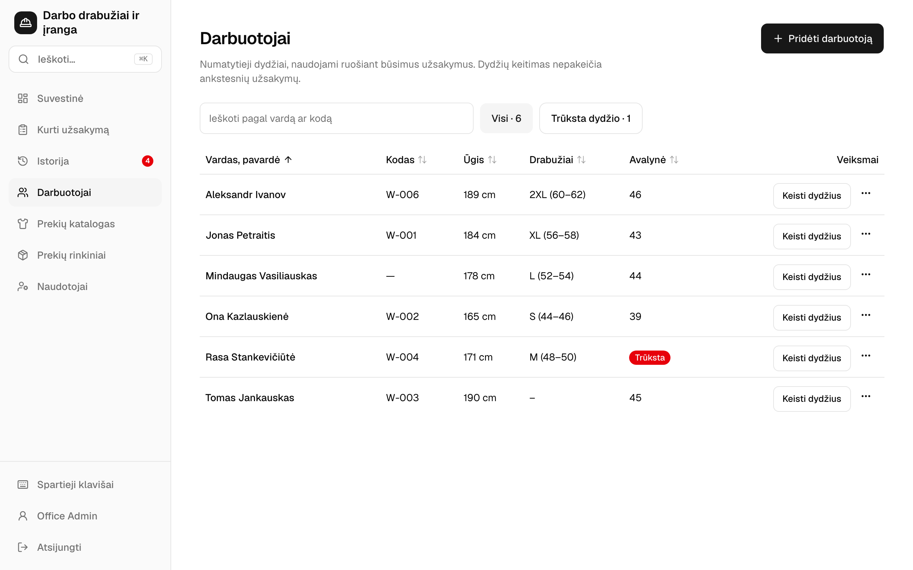

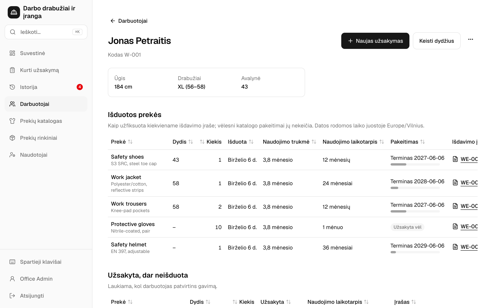

## 9. Prekių katalogas ir prekių rinkiniai

Administratoriams ir vadovams.

Kiekviena katalogo prekė turi kainą, naudojimo laikotarpį ir dydžių grupę. Prekės be kainos ar naudojimo laikotarpio užsakyti negalima. Pakeitus kainą, esami užsakymai nesikeičia.

Prekių rinkinys – tai prekių komplektas su numatytais kiekiais. Ekrane **Kurti užsakymą** jį pritaikote vienu paspaudimu.

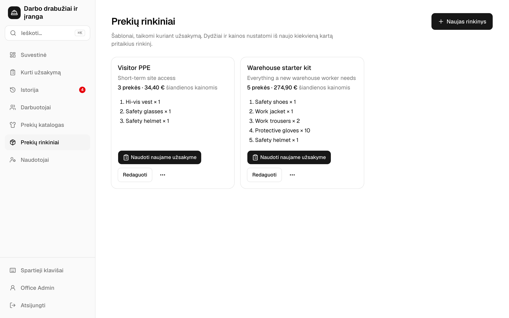

## 10. Naudotojai

Tik administratoriams.

- Kurkite, redaguokite ar deaktyvuokite paskyras ir priskirkite roles: administratorius, vadovas arba darbuotojas.
- Slaptažodžiui atkurti naudokite **⋯ → Nustatyti naują slaptažodį…**.

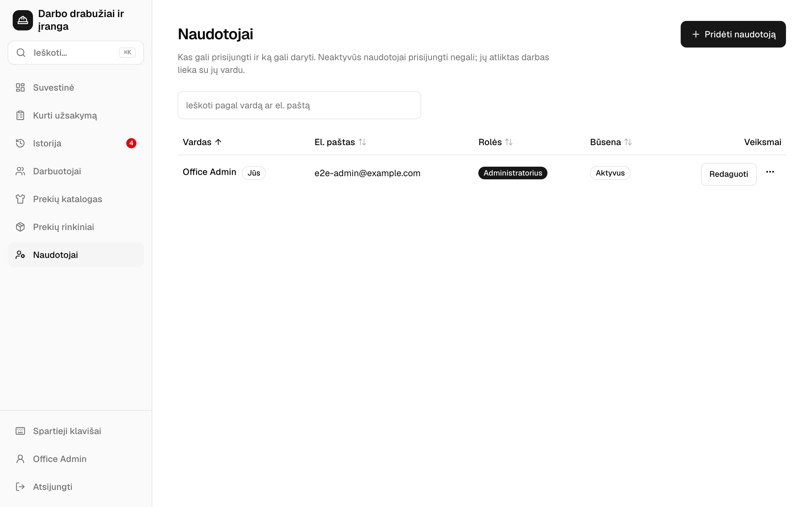

## 11. Jūsų paskyra

- **Kalba**: English, Lietuvių arba Русский. Pasirinkimas išsaugomas jūsų paskyroje, todėl galioja kiekviename įrenginyje, kuriame prisijungiate. Darbuotojo patvirtinimo puslapis ir įrašas lieka anglų ir rusų kalbomis.
- **Keisti slaptažodį**.
- **Lentelės eilutės**: **Kompaktiškos** kompiuterio ekrane sutalpina daugiau eilučių.

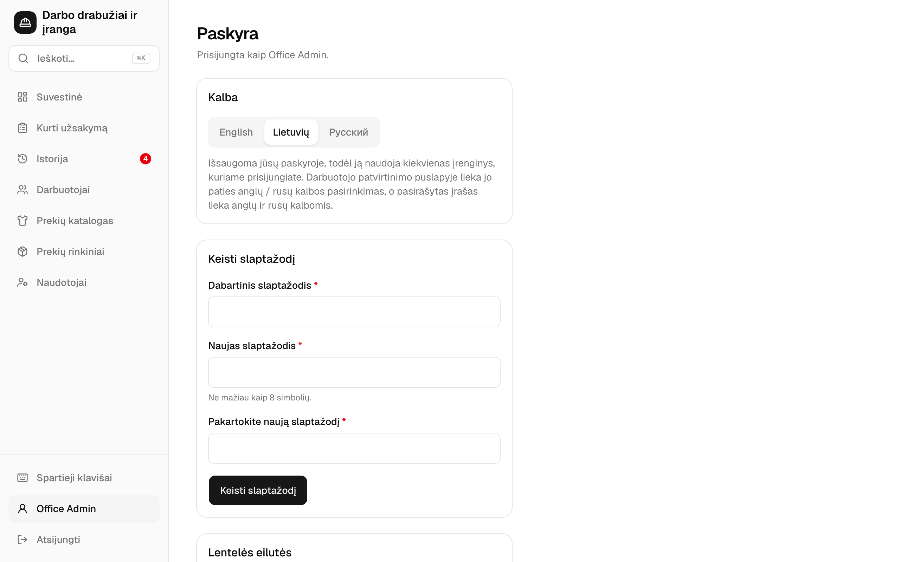

## 12. Paieška ir spartieji klavišai

| Klavišas | Ką daro |
| --- | --- |
| `⌘K` / `Ctrl K` | Ieško įrašų numerių, darbuotojų, prekių ir ekranų. Pavyzdžiui, įveskite vardą ir pasirinkite **Naujas užsakymas: …**. |
| `/` | Pereina į paieškos arba „Pridėti prekę“ lauką. |
| `G`, tada `D` `O` `H` `E` `C` `S` `U` | Pereina į Suvestinę, Kurti užsakymą, Istoriją, Darbuotojus, Katalogą, Prekių rinkinius arba Naudotojus. |
| `J` / `K`, `Esc` | Pereina per Istoriją arba uždaro atidarytą užsakymą. |
| `⌘/Ctrl` `Enter` | Ekrane „Kurti užsakymą“ atidaro užsakymo peržiūrą. |
| `?` | Rodo visus sparčiuosius klavišus. |

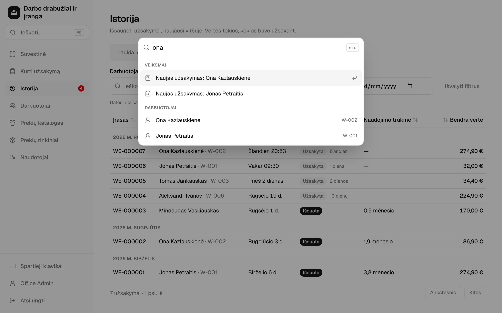

Ekrano nuotraukose rodomi demonstraciniai duomenys. Prekių pavadinimai yra duomenys, todėl rodomi taip, kaip įvesti. Norėdami nuotraukas padaryti iš naujo, aplanke `web/e2e` paleiskite `pnpm guide`.
