# Workwear & Equipment: User guide

English · [Lietuvių](user-guide.lt.md) · [Русский](user-guide.ru.md)

The app records workwear and safety equipment given to employees. You prepare an order and mark it as ordered. After the employee receives the items, they confirm receipt, and the app keeps a locked record in English and Russian.

## 1. Sign in

1. Open **workwear.gavort.nl** and sign in with your email and password.
2. Your first screen depends on your role:
   - Administrators start on the **Dashboard**.
   - Managers start on the **Manager Dashboard**.
   - The employee role starts on the **Employee Dashboard**.

The sidebar holds every section and **Search…** (`⌘K`). **Help**, **Keyboard shortcuts**, your account and **Sign out** are at its foot.

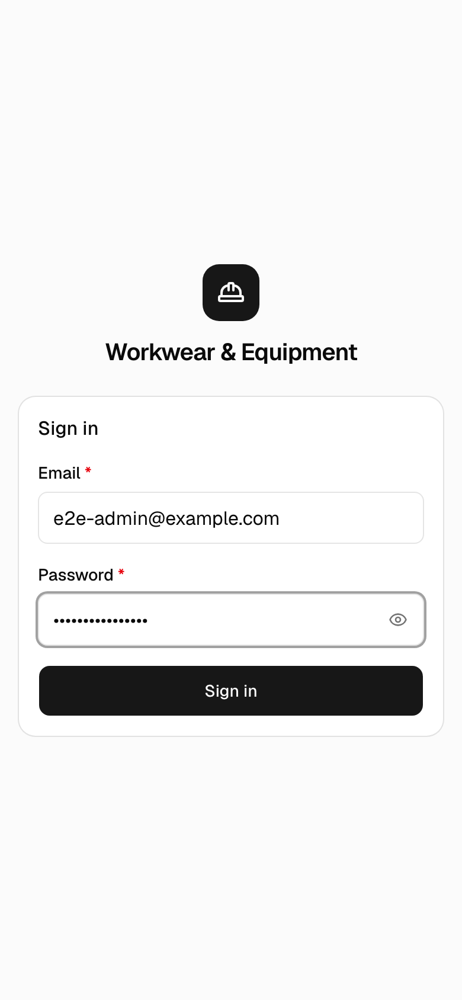

## 2. Dashboard

*Administrators only:*

The figures at the top show the orders awaiting confirmation, this month's spending and the replacements due.

**Needs you** lists what to do next, most urgent first. Each line has a button for its task:

- An overdue item: **Reorder**.
- An unconfirmed order: **Send link**.
- A missing size: **Add sizes**.
- An item without a price: **Fix**.

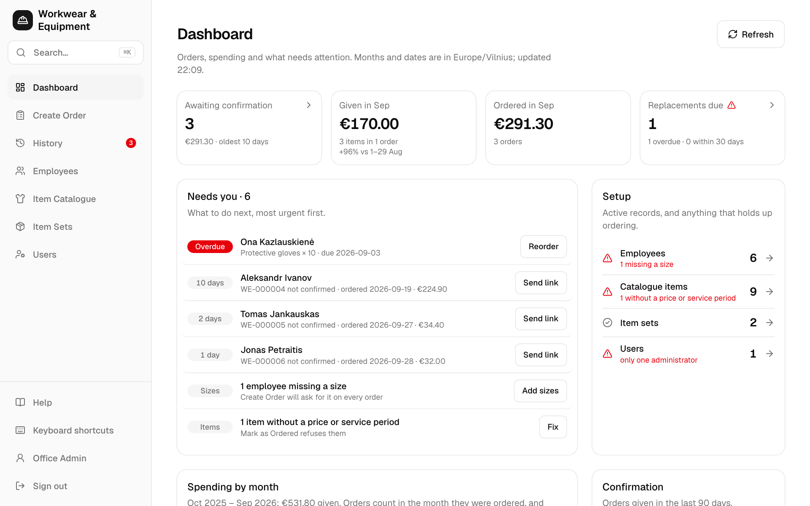

*Managers only:*

The **Manager Dashboard** covers items, prices and purchasing: what is on order, spending by item, the replacements that will need buying, recent price changes, what holds up ordering in the catalogue and item sets, and the sizes to stock.

*The employee role only:*

The **Employee Dashboard** starts with what needs doing: your orders still waiting for the employee's confirmation (**Send link**), items due for replacement and employees missing a size. Below are your orders by month and those given recently.

## 3. Create an order

1. Open **Create Order**.
2. In **Assigned to**, type part of the employee's name. For someone new, choose **+ Add New Employee**.
3. Add the items:
   - **Item Set** adds a whole kit in one tap.
   - **Add Item** adds one item. Press `/` to jump to it.
4. Check each line's size and quantity:
   - Sizes come from the employee's saved sizes. Clothing is picked by letter, for example `S (44–46)`.
   - You can't order until every missing size is chosen.
5. Choose **Review and mark as ordered** in the panel on the right, or press `⌘/Ctrl` `Enter`.

This device keeps a draft of the order while you work. **Copy for WhatsApp** copies the message for the supplier.

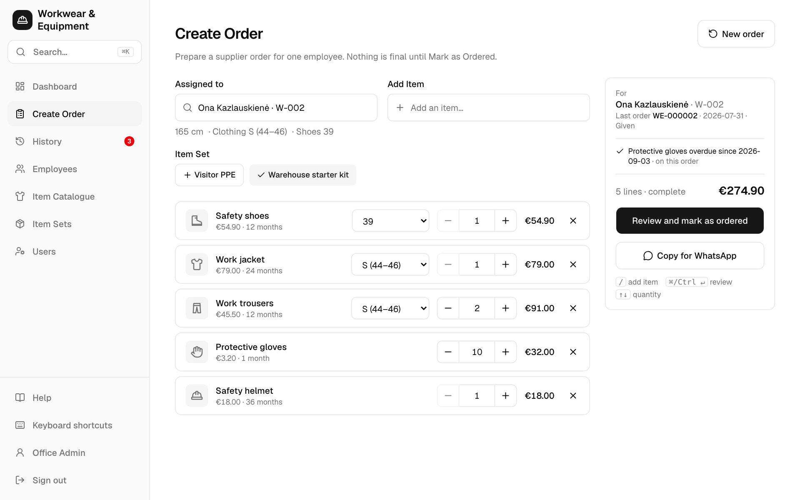

## 4. Review and Mark as Ordered

1. Check the lines and the total.
2. If the employee will confirm on their phone, leave **Create the confirmation link as well** ticked.
3. Choose **Mark as Ordered**. The order is now **Ordered**, and you can no longer edit it.
4. Send the employee the link with **Share link via WhatsApp** or **Copy link**. The link is valid for 7 days, and the app shows it only once.

If the employee will sign on paper, choose **Print record** instead.

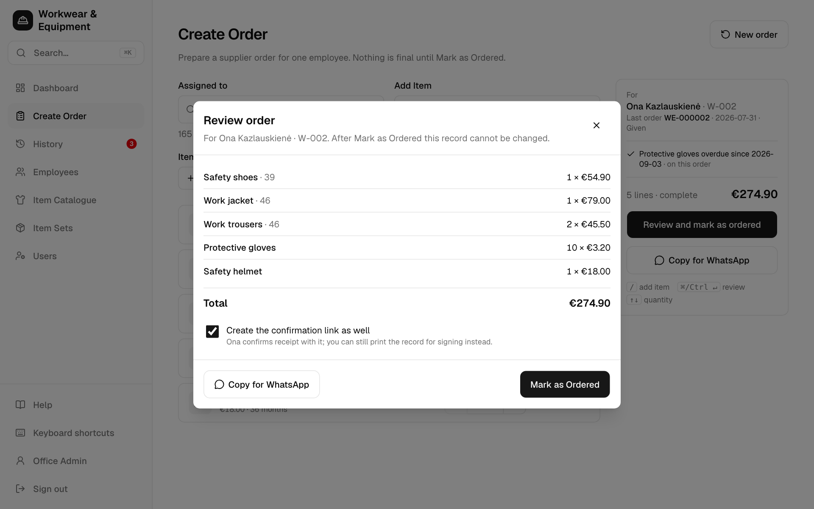
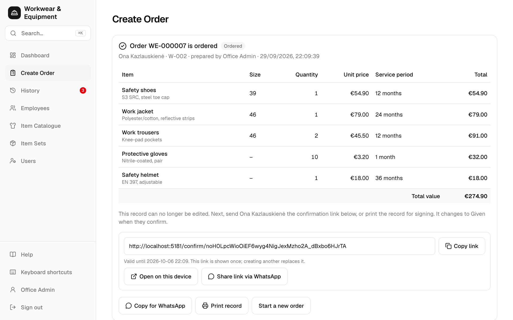

## 5. The employee confirms

1. The employee opens the link. They don't need an account.
2. They check the items, in English or Russian (**EN / RU**).
3. They tick the statement and tap **Confirm receipt**. The order becomes **Given**.

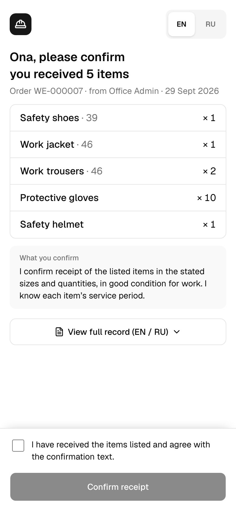

## 6. History

**Awaiting**, **Given** and **All** filter the orders by status. You can also filter by employee and date. Click a record number to open the order beside the list. `J` and `K` move between orders, and `Esc` closes the order.

An **Ordered** order has these actions:

- **Open Employee Confirmation** makes a new link. It also records a signed paper copy (**Record signed paper confirmation**).
- **Hand over now** turns this device to the employee, who confirms on it in person.
- **Print Record** prints the record for signing.
- **Copy for WhatsApp** copies the supplier message.

*Managers only:*

**⋯ → Delete order…** removes an order, such as a test order, after asking.

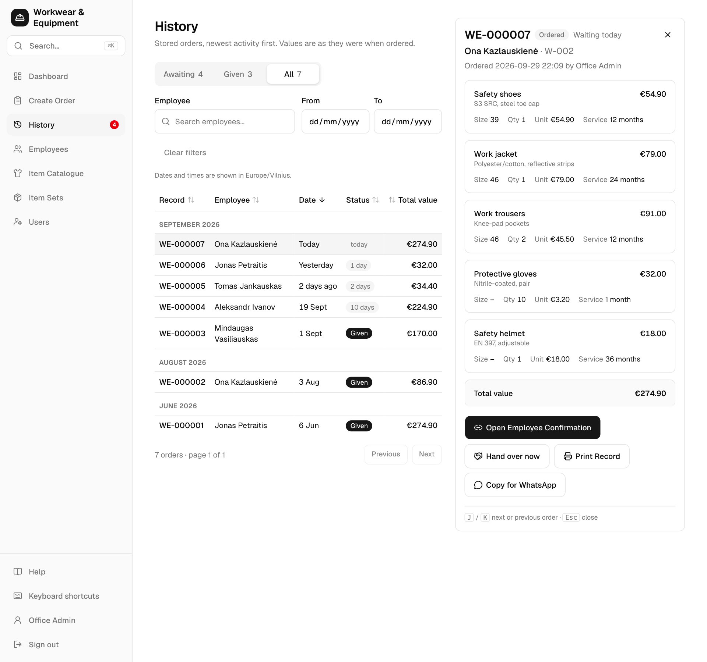

## 7. Items Given Record

A **Given** order has a locked record in English and Russian. Open it with **View Record**.

- **Print Record** prints it on one A4 page.
- **Share via WhatsApp** sends it.

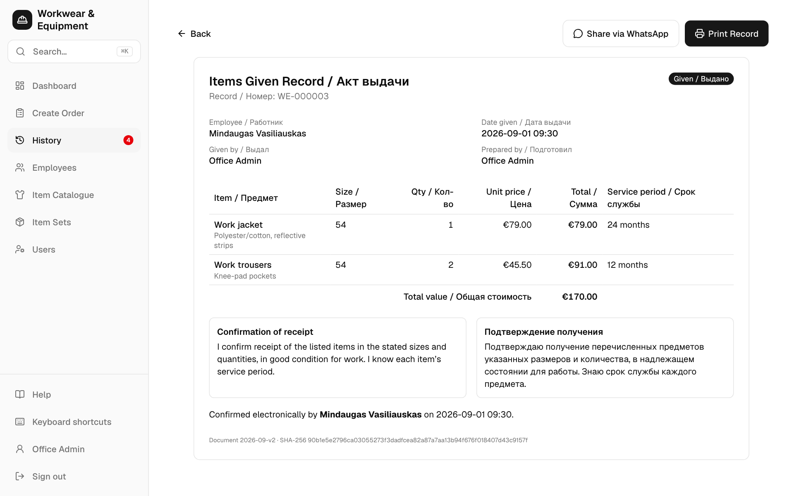

## 8. Employees

The list shows each employee's sizes and note, and marks anyone missing a size. A long note is cut to one line; point at it to read it all, or open the employee.

Each employee's page shows:

- their sizes;
- every item given, with its usage time and replacement date;
- orders not yet given.

From that page, **New order** starts an order for them, and **Edit Sizes** changes their sizes.

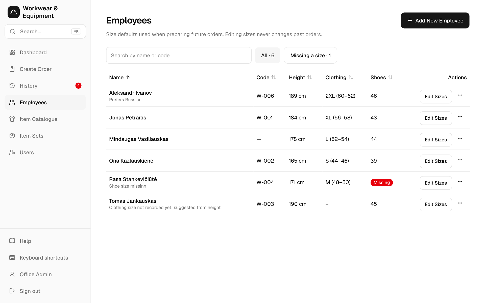
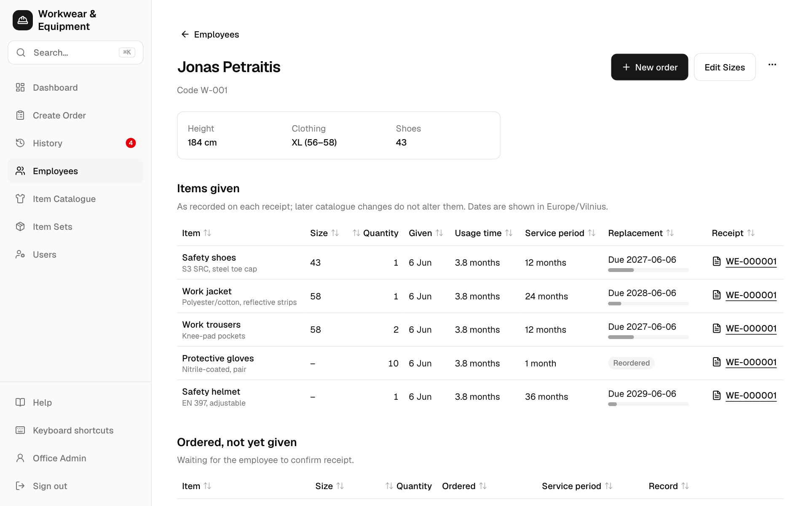

## 9. Item Catalogue and Item Sets

Each catalogue item has a price, a service period and a size group. You can't order an item without a price or service period. Changing a price never alters existing orders.

An item set is a kit of items with default quantities. You apply it on Create Order in one tap.

*Administrators and managers only:*

You add and change items in **Item Catalogue**, and kits in **Item Sets**.

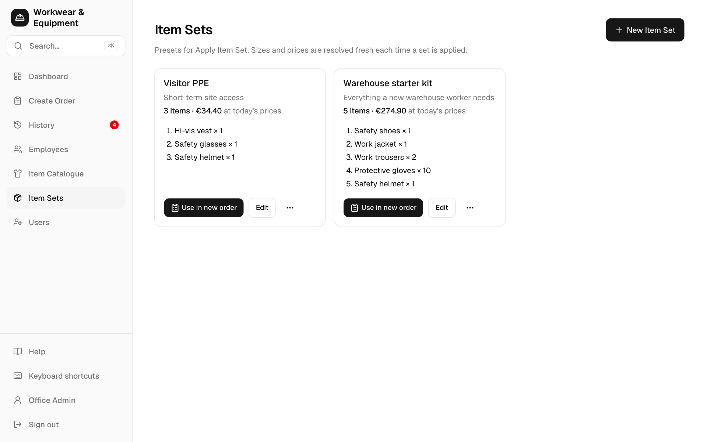

## 10. Users

*Administrators only.*

- Add, edit or deactivate accounts, and give each one roles: admin, manager or employee.
- To reset a password, use **⋯ → Reset password…**.

## 11. Your account

- **Language**: English, Lietuvių or Русский. The choice is saved on your account, so every device you sign in on uses it. The employee's confirmation page and the record stay in English and Russian.
- **Change password**.
- **Table rows**: **Compact** fits more rows on the screen.

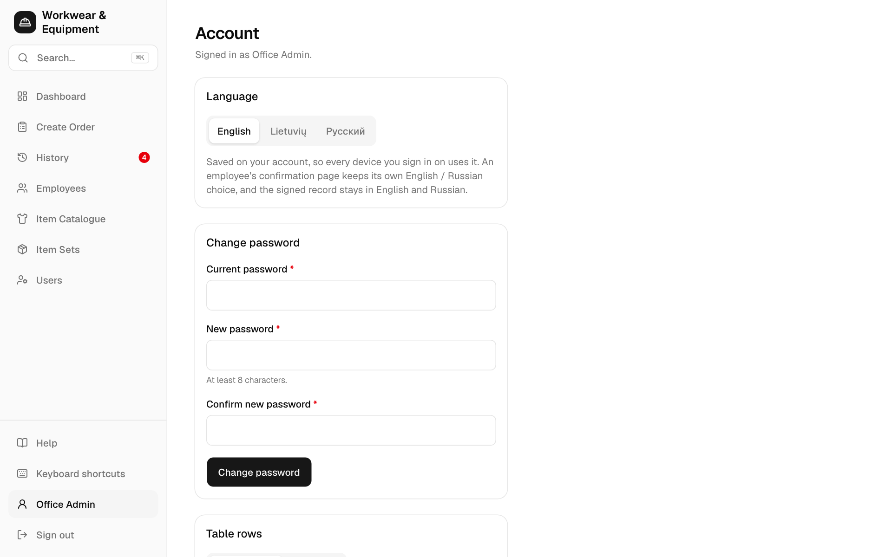

## 12. Search and shortcuts

| Key | Does |
| --- | --- |
| `⌘K` / `Ctrl K` | Search record numbers, employees, items and screens. For example, type a name, then choose **New order for …**. |
| `/` | Go to the search or Add Item field. |
| `G` then `D` `O` `H` `E` `C` `S` `U` | Go to Dashboard, Create Order, History, Employees, Catalogue, Item Sets or Users. |
| `J` / `K`, `Esc` | Move through History, or close the open order. |
| `⌘/Ctrl` `Enter` | On Create Order, review the order. |
| `?` | Show all shortcuts. |

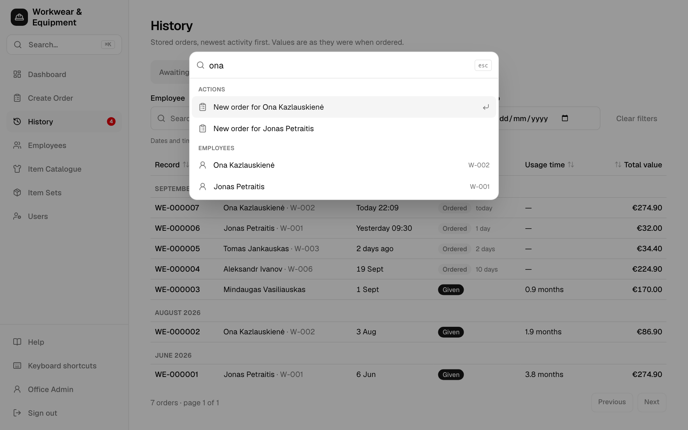

The screenshots show demo data. Item names are data, so they show as entered.
