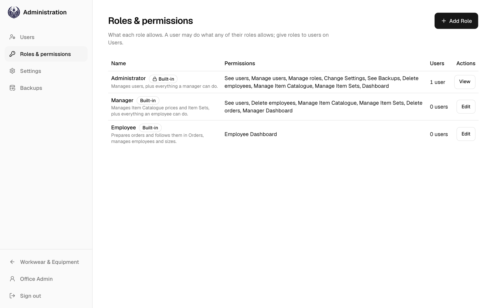
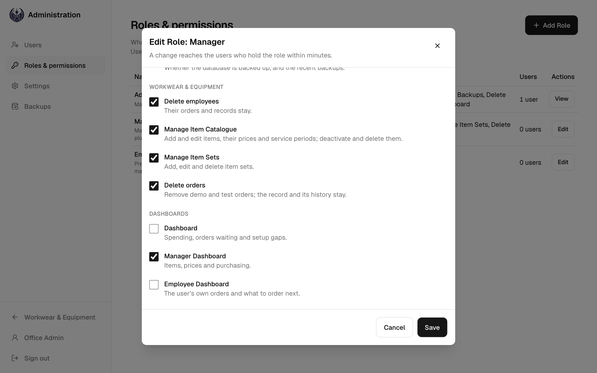
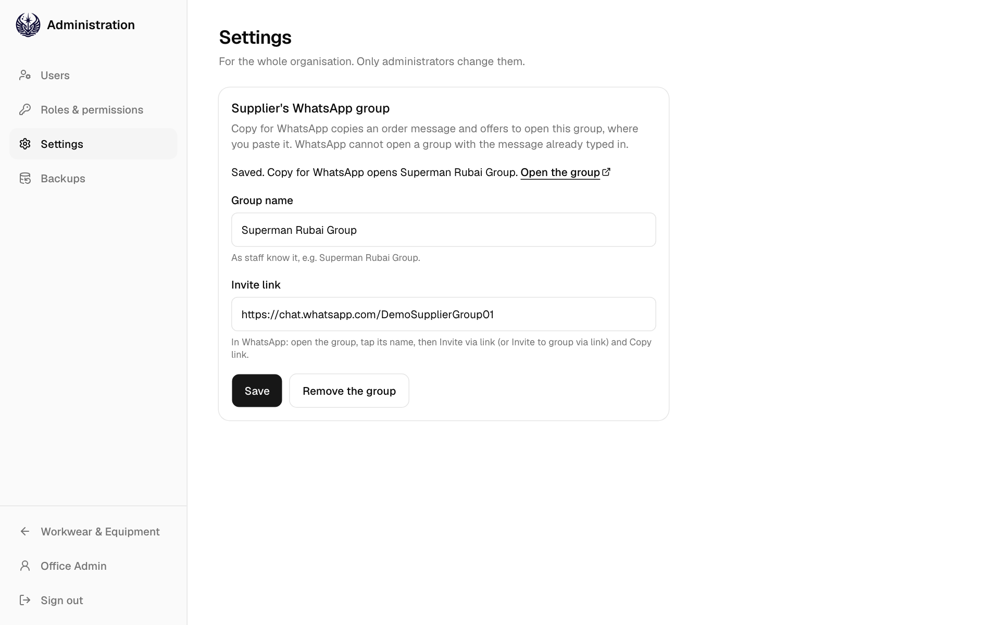
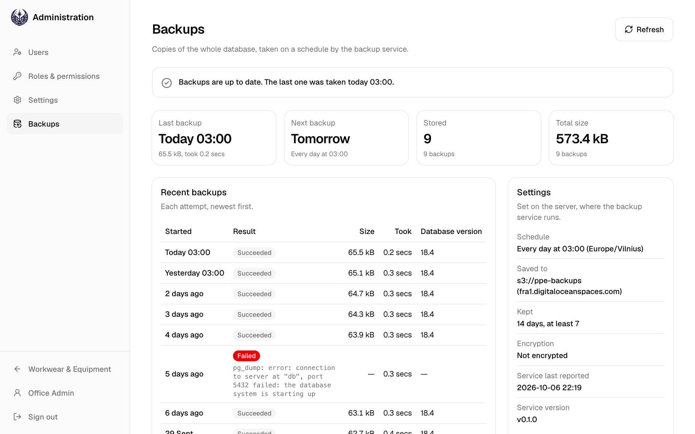
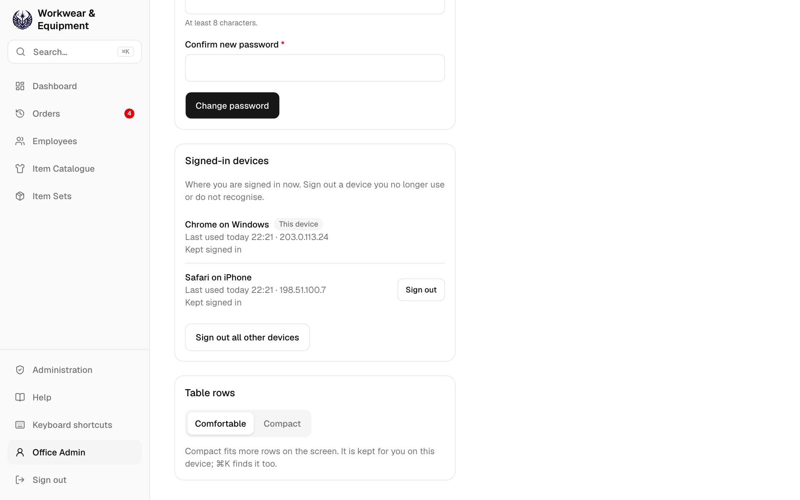

# Workwear & Equipment: User guide

English · [Lietuvių](user-guide.lt.md) · [Русский](user-guide.ru.md)

The app records workwear and safety equipment given to employees. You prepare an order and mark it as ordered. After the employee receives the items, they confirm receipt, and the app keeps a locked record in English and Russian.

## 1. Sign in

1. Open **workwear.gavort.nl** and sign in with your email and password.
2. Your first screen depends on your role:
   - Administrators start on the **Dashboard**.
   - Managers start on the **Manager Dashboard**.
   - The employee role starts on the **Employee Dashboard**.

The sidebar holds every section and **Search…** (`⌘K`). **Help**, **Keyboard shortcuts**, your account and **Sign out** are at its foot.

With **Keep me signed in** ticked, you stay signed in on this device after closing the app or restarting the device, for up to 30 days, or until you have not used it for 14 days. On a shared computer, untick it: you are signed out when the browser closes, and after 12 hours at the latest.

**Sign out** ends your sign-in on this device. When you change your password, your other devices are signed out. When an administrator resets your password or deactivates your account, you are signed out everywhere.

## 2. Dashboard

*Administrators only:*

The figures at the top show the orders awaiting confirmation, this month's spending and the replacements due.

**Needs you** lists what to do next, most urgent first. Each line has a button for its task:

- An overdue item: **Reorder**.
- An unconfirmed order: **Send link**.
- A missing size: **Add sizes**.
- An item without a price: **Fix**.

The **Backups** card says whether the database is backed up. Choose it to open **Backups** in **Administration**.

*Managers only:*

The **Manager Dashboard** covers items, prices and purchasing: what is on order, spending by item, the replacements that will need buying, recent price changes, what holds up ordering in the catalogue and item sets, and the sizes to stock.

*The employee role only:*

The **Employee Dashboard** starts with what needs doing: your orders still waiting for the employee's confirmation (**Send link**), items due for replacement and employees missing a size. Below are your orders by month and those given recently.

## 3. Create an order

1. On **Orders**, choose **Create Order** at the top.
2. In **Assigned to**, type part of the employee's name. For someone new, choose **+ Add New Employee**.
3. Add the items:
   - **Item Set** adds a whole kit in one tap.
   - **Add Item** adds one item. Press `/` to jump to it.
4. Check each line's size and quantity:
   - Sizes come from the employee's saved sizes. Clothing is picked by letter, for example `S (44–46)`.
   - You can't order until every missing size is chosen.
   - If you choose a size other than the employee's saved one, you're asked **Different size selected. Save it to employee profile?** **Save** keeps it for their future orders; **Skip size update** uses it on this order only.
5. Choose **Review and mark as ordered** in the panel on the right, or press `⌘/Ctrl` `Enter`.

This device keeps a draft of the order while you work. **Copy for WhatsApp**, for the supplier's message, is in the review.

## 4. Review and Mark as Ordered

1. Check the lines and the total.
2. Choose **Mark as Ordered**. The order is now **Ordered**, and you can no longer edit it. The app also creates the employee's confirmation link.
3. Send the employee the link with **Share link via WhatsApp** or **Copy link**. The link is valid for 7 days, and the app shows it only once.

If the employee will sign on paper, choose **Print record** instead.

**Copy for WhatsApp**, in the review, copies the message for the supplier. When an administrator has set the supplier's WhatsApp group in **Administration**, on **Settings**, it then offers to open that group: paste the message there.

## 5. The employee confirms

1. The employee opens the link. They don't need an account.
2. They check the items, their prices and the total, in English or Russian (**EN / RU**). The page opens in their preferred language when it is English or Russian.
3. They tick the statement and tap **Confirm receipt**. The order becomes **Given**.

## 6. Orders

**Orders** lists every order placed. **Create Order**, at the top, starts a new one.

**Awaiting**, **Given** and **All** filter the orders by status. You can also filter by employee and date. Click a record number to open the order beside the list. `J` and `K` move between orders, and `Esc` closes the order.

An **Ordered** order has these actions:

- **Open Employee Confirmation** makes a new link. It also records a signed paper copy (**Record signed paper confirmation**).
- **Hand over now** turns this device to the employee, who confirms on it in person.
- **Print Record** prints the record for signing.

*Managers only:*

**⋯ → Delete order…** removes an order, such as a test order, after asking.

## 7. Items Given Record

A **Given** order has a locked record in English and Russian. Open it with **View Record**.

- **Print Record** prints it on one A4 page.
- **Share via WhatsApp** sends it.

## 8. Employees

The list shows each employee's sizes and note, and marks anyone missing a size. A long note is cut to one line; point at it to read it all, or open the employee.

Each employee's page shows:

- their sizes and preferred language;
- every item given, with its usage time and replacement date;
- orders not yet given.

From that page, **New order** starts an order for them, and **Edit Sizes** changes their sizes.

## 9. Item Catalogue and Item Sets

Each catalogue item has a price, a service period and a size group. Orders show and total the price. You can't order an item without a price or service period. Changing a price never alters existing orders.

An item can also have a **Purchase price**: what we pay the supplier. It is optional, never needed to order, and orders don't show it. The item's page shows both prices and how they changed.

An item set is a kit of items with default quantities. You apply it on Create Order in one tap.

*Administrators and managers only:*

You add and change items in **Item Catalogue**, and kits in **Item Sets**.

## 10. Administration

*Administrators only.*

**Administration** is where you manage who may use the app and what they may do, and the organisation's settings. It has four screens: **Users**, **Roles & permissions**, **Settings** and **Backups**.

Open it with **Administration** at the foot of the sidebar. It has a sidebar of its own; **Workwear & Equipment**, at its foot, takes you back.

You are signed in to both at once, and **Sign out** in either signs you out of both. Anyone whose roles let them manage users, roles, settings or backups sees **Administration**, with only the screens their roles open.

## 11. Users

*Administrators only.*

- Add, edit or deactivate accounts. Give each account one or more roles: a user may do what any of their roles allows. **Roles & permissions** says what each role allows.
- A role change reaches the user within minutes, without signing in again. A deactivated user is signed out on every device.
- To reset a password, use **⋯ → Reset password…**.
- You can't deactivate your own account, or take from yourself the role that lets you manage users or roles. Someone active always holds **Administrator**.
- If you signed in more than 12 hours ago, the app asks you to **Confirm your password** before saving the change.

## 12. Roles & permissions

*Administrators only.*

**Roles & permissions** lists each role, what it allows and how many users hold it. A role is a set of permissions, such as **Manage Item Catalogue** or **Delete employees**. You give roles to users on **Users**.

- **Administrator**, **Manager** and **Employee** are built in. **Administrator** can do everything and cannot be changed: **View** shows what it allows. You can change what **Manager** and **Employee** allow, but not their names, and you cannot delete them.
- **Add Role** makes a new one: a name, what it is for, and its permissions. Some permissions need another, which is ticked with them: **Manage users** needs **See users**.
- A change reaches the users who hold the role within minutes.
- **⋯ → Delete role…** deletes a role that no user holds. Take it from its users on **Users** first.
- If you signed in more than 12 hours ago, the app asks you to **Confirm your password** before saving the change.

## 13. Settings

*Administrators only.*

**Supplier's WhatsApp group**: enter the group's name and its invite link. In WhatsApp, open the group, tap its name, then **Invite via link** and **Copy link**.

**Copy for WhatsApp** then offers to open that group, where you paste the order message. WhatsApp cannot open a group with the message already typed in. **Remove the group** goes back to opening WhatsApp without a chat chosen.

## 14. Backups

*Administrators only.*

**Backups** shows whether the database is backed up. The backup service on the server copies the whole database on a schedule, every night unless set otherwise, and deletes old copies after the retention period.

The line at the top says whether all is well. It turns red when the last backup failed, when a scheduled one is overdue, or when the service has stopped reporting. Tell whoever runs the server.

A second warning shows while the backups are kept only on the server itself, because they would be lost with it.

- **Last backup** and **Next backup**: when, with the last one's size and how long it took.
- **Stored** and **Total size**: the backups kept now.
- **Recent backups**: every attempt, newest first, with the error of a failed one.
- **Settings**: the schedule, where backups are saved, how long they are kept and whether they are encrypted.

The settings are made on the server, and a backup is restored there too: the app only shows them.

## 15. Your account

- **Language**: English, Lietuvių or Русский. The choice is saved on your account, so every device you sign in on uses it. The employee's confirmation page and the record stay in English and Russian.
- **Theme**: **Light**, **Dark** or **System**, which follows the device. It is kept on this device, and the sign-in page uses it too.
- **Change password**: your other devices are signed out, and this one stays signed in.
- **Signed-in devices**: every browser you are signed in on, with when it was last used. **This device** comes first. Sign out a device you no longer use or do not recognise, or choose **Sign out all other devices**.
- **Table rows**: **Compact** fits more rows on the screen.

## 16. Search and shortcuts

| Key | Does |
| --- | --- |
| `⌘K` / `Ctrl K` | Search record numbers, employees, items and screens. For example, type a name, then choose **New order for …**. |
| `/` | Go to the search or Add Item field. |
| `G` then `D` `O` `H` `E` `C` `S` `U` | Go to Dashboard, Create Order, Orders, Employees, Catalogue, Item Sets or Users (in Administration). |
| `J` / `K`, `Esc` | Move through Orders, or close the open order. |
| `⌘/Ctrl` `Enter` | On Create Order, review the order. |
| `?` | Show all shortcuts. |

The screenshots show demo data. Item names are data, so they show as entered.
