# Workwear & Equipment: user guide

English · [Lietuvių](user-guide.lt.md) · [Русский](user-guide.ru.md)

The app records workwear and safety equipment given to employees. You prepare an order, mark it as ordered and give it to the employee. The employee then confirms receipt, and the app keeps a locked record in English and Russian.

The screenshots show demo data. Run `pnpm guide` in `web/e2e` to take them again.

## 1. Sign in

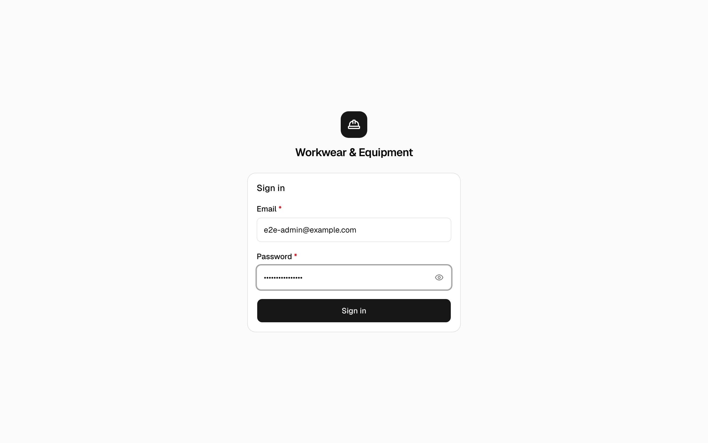

1. Open **https://workwear.gavort.nl** and sign in with your email and password.
2. Your first screen depends on your role:
   - Administrators start on the **Dashboard**.
   - Managers start on the **Manager Dashboard**.
   - The employee role starts on the **Employee Dashboard**.

## 2. Dashboard

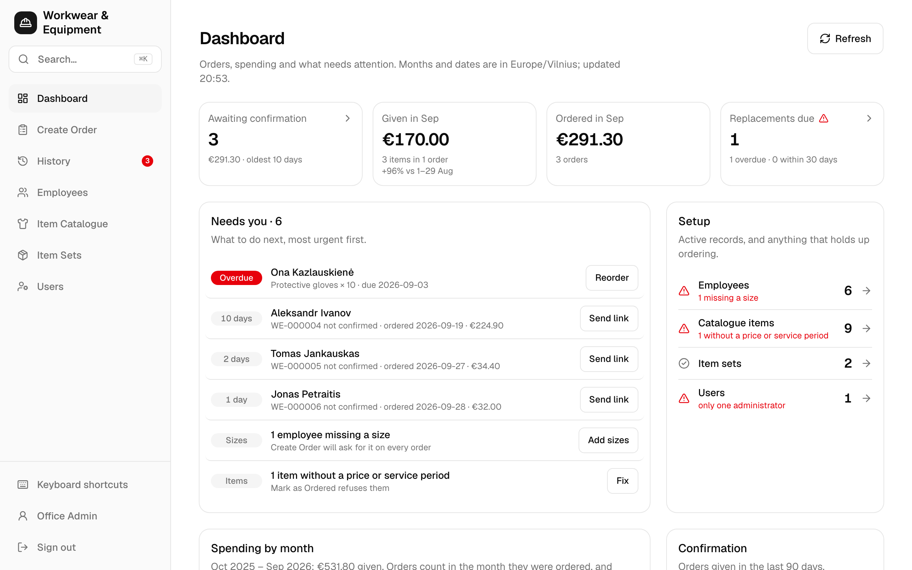

- The figures at the top show:
  - orders awaiting confirmation;
  - spending this month;
  - replacements due.
- **Needs you** lists what to do next, most urgent first. Each line has its own button:
  - an overdue item → **Reorder**;
  - an unconfirmed order → **Send link**;
  - a missing size → **Add sizes**;
  - an item without a price → **Fix**.

## 3. Create an order

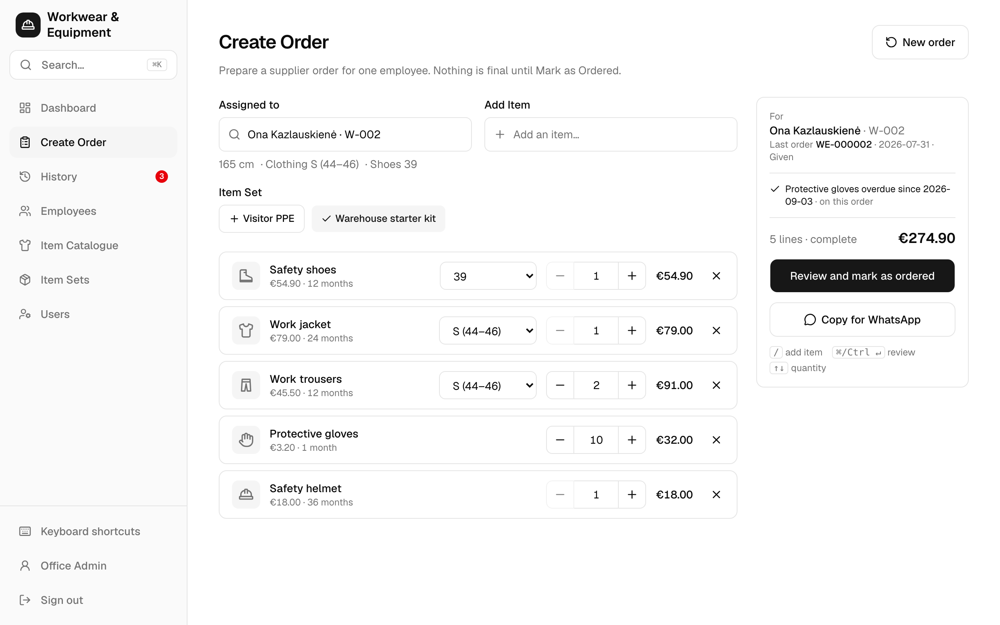

1. Open **Create Order**.
2. In **Assigned to**, type part of the employee's name. For someone new, choose **+ Add New Employee**.
3. Add the items:
   - **Item Set** adds a whole kit in one tap.
   - **Add Item** adds a single item; press `/` to jump to it.
4. Check each line:
   - **Size:** sizes come from the employee's saved sizes. Clothing is picked by letter, for example `S (44–46)`. A missing size blocks the order until you choose one.
   - **Quantity:** use − / +.
5. Choose **Review and mark as ordered**, or press `⌘/Ctrl + Enter`.

The order is saved as a draft on this device while you work. **Copy for WhatsApp** copies the supplier message.

## 4. Review and Mark as Ordered

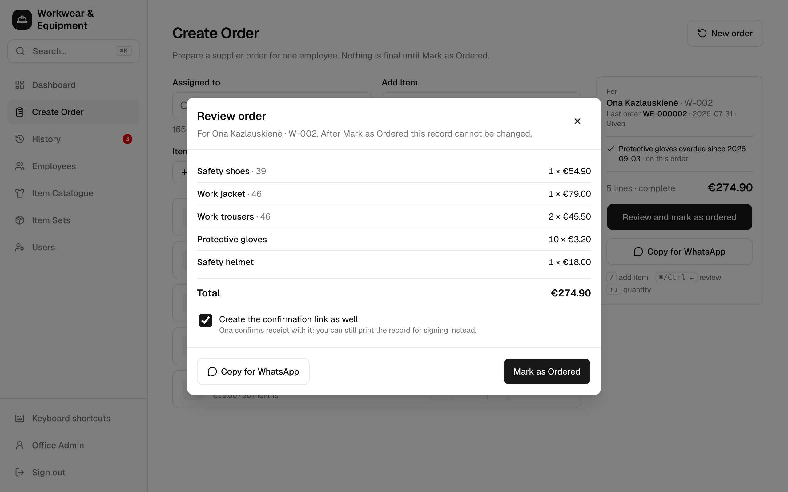

1. Check the lines and the total.
2. Leave **Create the confirmation link as well** ticked if the employee will confirm on their phone.
3. Choose **Mark as Ordered**. The order becomes **Ordered** and can no longer be edited.

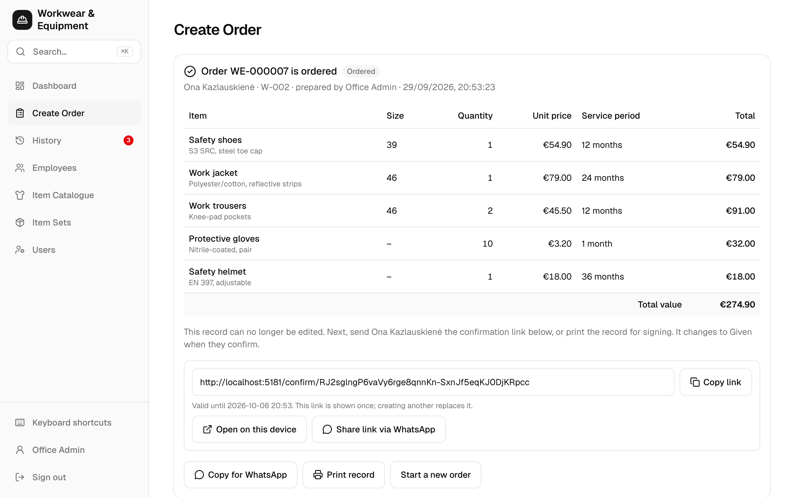

Next, send the employee the confirmation link:

- **Share link via WhatsApp**, or
- **Copy link**.

The link is valid for 7 days and is shown only once. To have the employee sign on paper instead, choose **Print record**.

## 5. The employee confirms

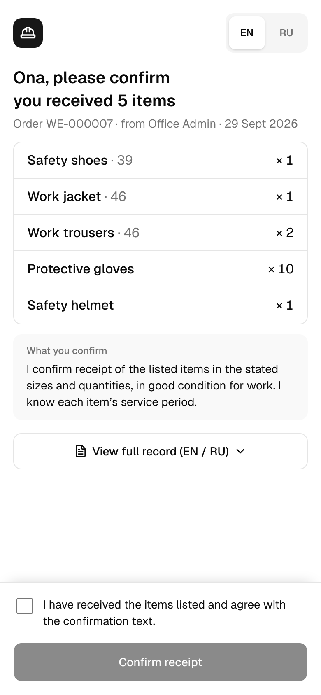

1. The employee opens the link. No account is needed.
2. They check the items, in English or Russian (**EN / RU**).
3. They tick the statement and tap **Confirm receipt**.

The order then changes to **Given**.

## 6. History

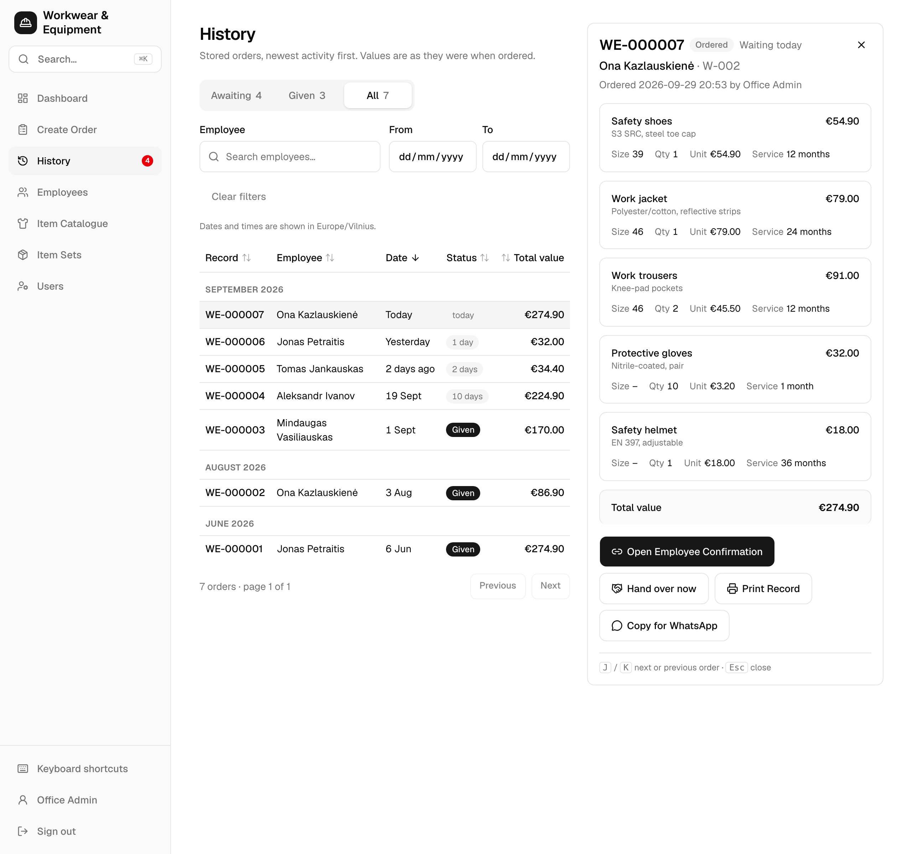

- **Awaiting**, **Given** and **All** filter by status. You can also filter by employee and date.
- Click a record number to open the order beside the list.
  - `J` / `K` move to the next or previous order.
  - `Esc` closes it.
- On an **Ordered** order:
  - **Open Employee Confirmation** creates a new link, or records a signed paper (**Record signed paper confirmation**).
  - **Hand over now** turns this device to the employee, who confirms on it in person.
  - **Print Record** prints the record for signing.
  - **Copy for WhatsApp** copies the supplier message.
- Managers only: **⋯ → Delete order…** removes an order, for example a test order. The app asks first.

## 7. Items Given Record

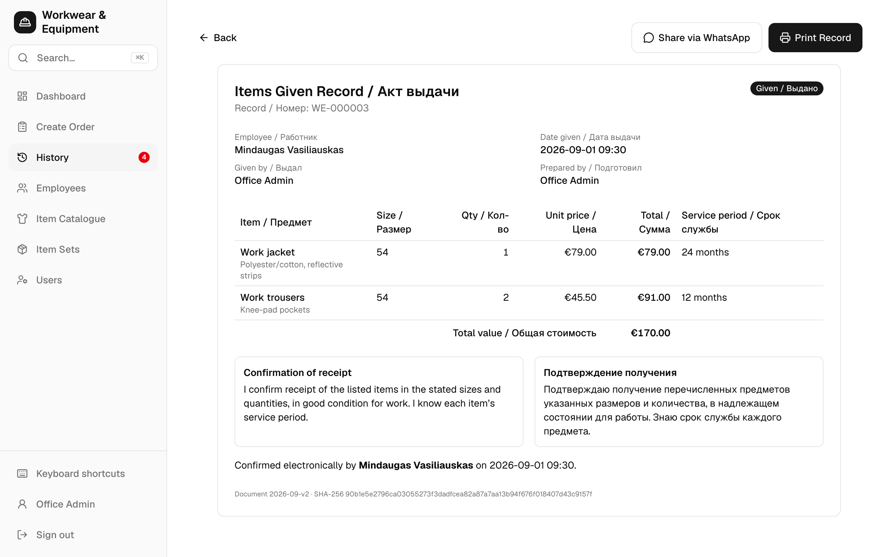

A **Given** order has a locked record in English and Russian. Open it with **View Record**. From there:

- **Print Record** prints one A4 page.
- **Share via WhatsApp** sends it.

## 8. Employees

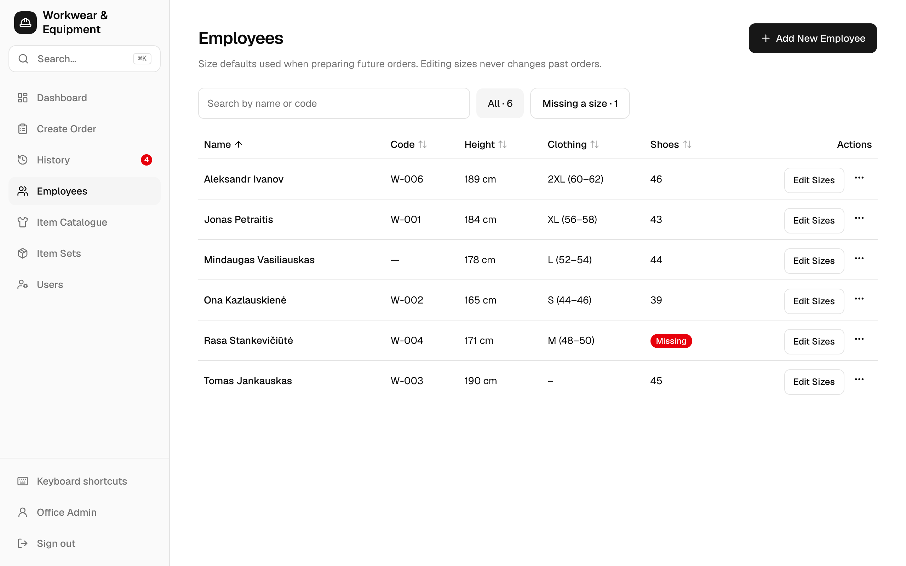

The list shows each employee's sizes. Anyone missing a size is marked.

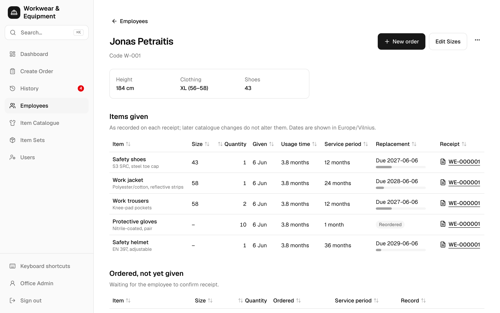

An employee's page shows:

- their sizes;
- every item given, with its usage time and replacement date;
- orders not yet given.

From this page:

- **New order** starts an order for them.
- **Edit Sizes** changes their saved sizes.

## 9. Item Catalogue and Item Sets

Administrators and managers use these screens.

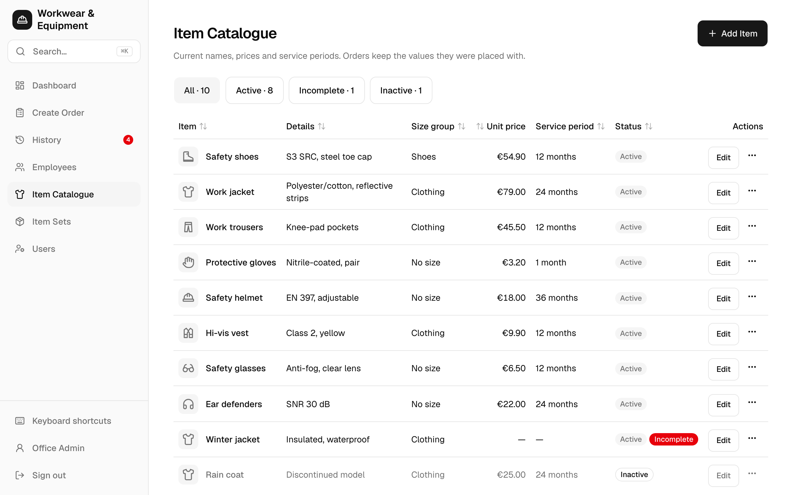

- Each item has a price, a service period and a size group. An item without a price or service period cannot be ordered.
- Price changes never alter orders that already exist.

An item set is a kit of items with default quantities, applied on Create Order in one tap.

## 10. Users

Administrators only.

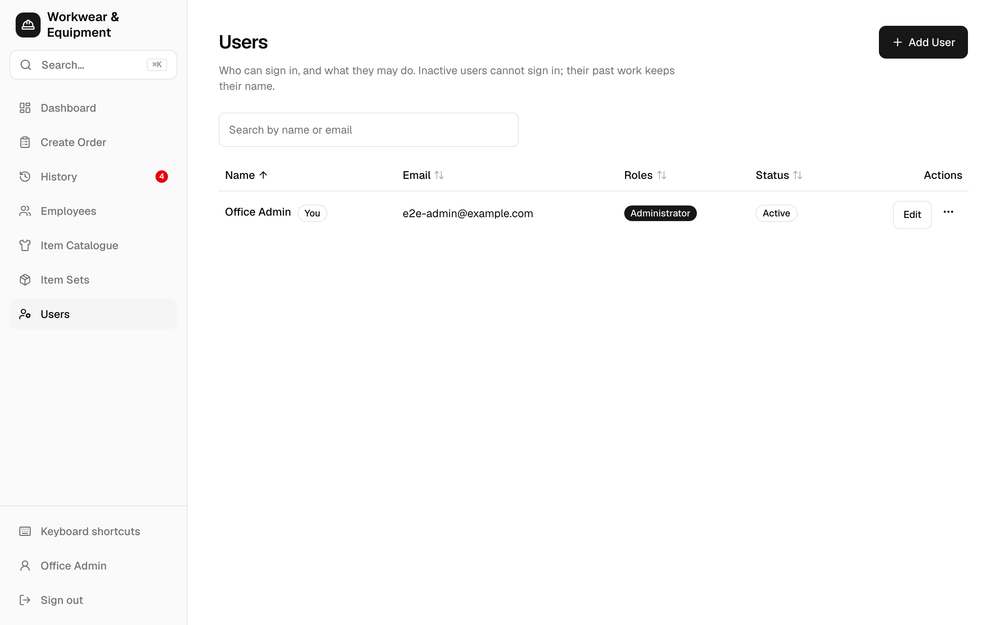

- Add, edit or deactivate accounts, and give each one roles (admin, manager, employee).
- To reset a password, use **⋯ → Reset password…**.

## 11. Your account

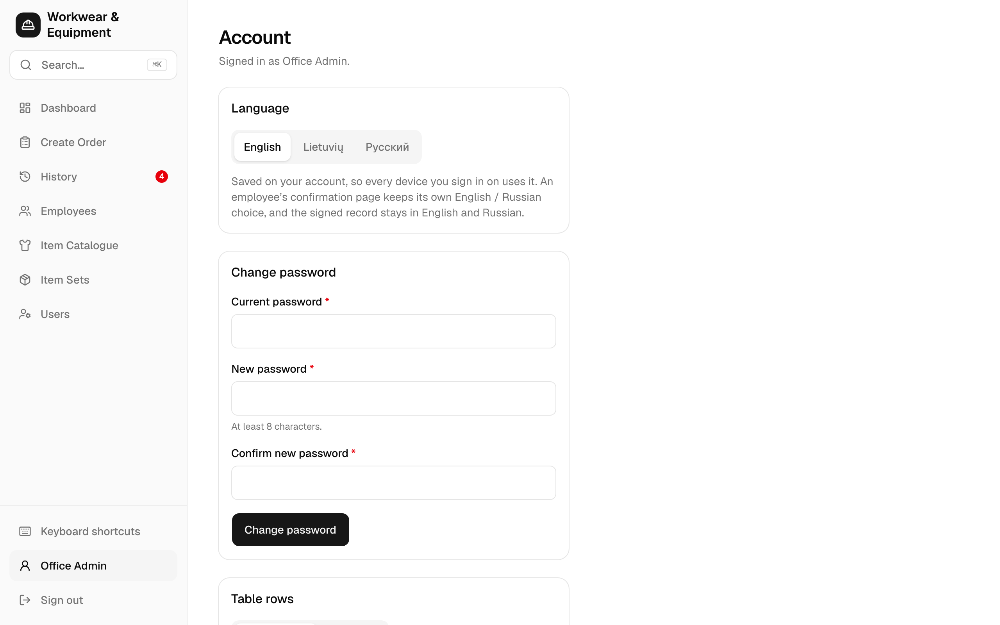

- **Language:** English, Lietuvių or Русский. The choice is saved on your account and every device follows it. The employee confirmation and the record stay in English / Russian.
- **Change password.**
- **Table rows:** **Compact** fits more rows on a desktop screen.

## 12. Search and shortcuts

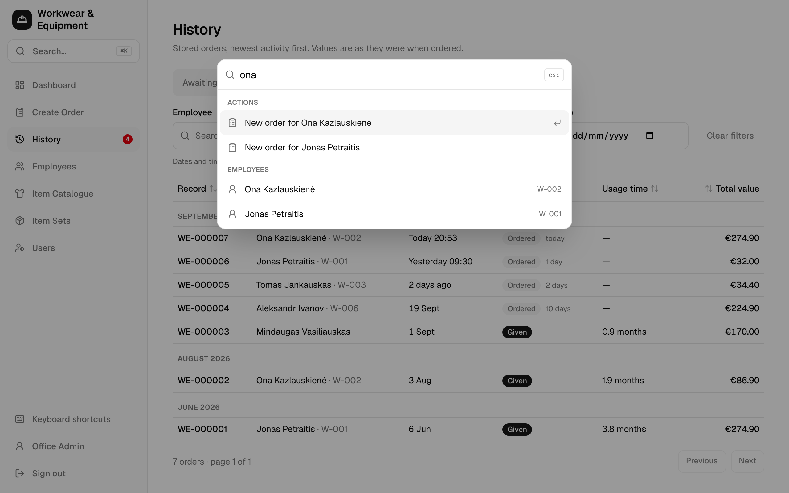

| Key | Does |
| --- | --- |
| `⌘K` / `Ctrl K` | Search record numbers, employees, items and screens. For example, type a name, then choose **New order for …**. |
| `/` | Go to the search or Add Item field |
| `G` then `D` `O` `H` `E` `C` `S` `U` | Go to Dashboard, Create Order, History, Employees, Catalogue, Item Sets or Users |
| `J` / `K`, `Esc` | Move through History, close the order |
| `⌘/Ctrl + Enter` | Review the order on Create Order |
| `?` | Show all shortcuts |
