# Спецодежда и снаряжение: Руководство пользователя

[English](user-guide.md) · [Lietuvių](user-guide.lt.md) · Русский

Приложение учитывает спецодежду и средства защиты, выданные сотрудникам. Вы готовите заказ и отмечаете его как заказанный. Получив предметы, сотрудник подтверждает получение, а приложение сохраняет неизменяемую запись на английском и русском языках. Оно также учитывает SIM, оборудование и мебель компании и то, у кого находится каждый предмет.

## 1. Вход

1. Откройте **workwear.gavort.nl** и войдите со своей эл. почтой и паролем.
2. Первый экран зависит от вашей роли:
   - администраторы начинают с экрана **Сводка**;
   - менеджеры — с экрана **Сводка менеджера**;
   - роль «сотрудник» — с экрана **Сводка сотрудника**.

В боковой панели — все разделы и **Поиск…** (`⌘K`). **Справка**, **Сочетания клавиш**, ваша учётная запись и **Выйти** — внизу панели.

С отметкой **Оставаться в системе** вход на этом устройстве сохраняется и после закрытия приложения или перезапуска устройства — до 30 дней или пока вы не пользуетесь им 14 дней. На общем компьютере снимите отметку: выход произойдёт при закрытии браузера и не позже чем через 12 часов.

**Выйти** завершает вход на этом устройстве. Когда вы меняете пароль, на других ваших устройствах выполняется выход. Если администратор сбрасывает ваш пароль или отключает учётную запись, выход выполняется везде.

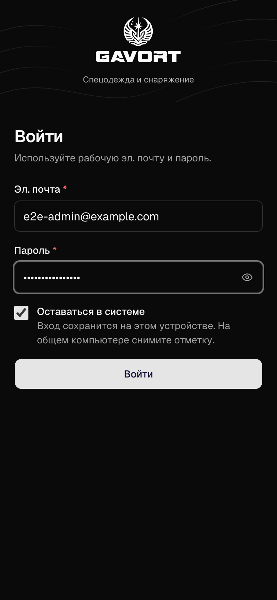

## 2. Сводка

*Только для администраторов:*

Вверху показаны заказы, ожидающие подтверждения, расходы за этот месяц и предстоящие замены.

**Требует внимания** показывает, что сделать дальше, начиная с самого срочного. У каждой строки есть кнопка для её задачи:

- просроченный предмет — **Заказать снова**;
- неподтверждённый заказ — **Отправить ссылку**;
- не указан размер — **Добавить размеры**;
- предмет без цены — **Исправить**.

Карточка **Резервные копии** показывает, копируется ли база данных. Выберите её, чтобы открыть **Резервные копии** в разделе **Администрирование**.

*Только для менеджеров:*

**Сводка менеджера** посвящена предметам, ценам и закупкам: что заказано, расходы по предметам, какие замены придётся закупать, последние изменения цен, что в каталоге и наборах мешает заказу и какие размеры держать в запасе.

*Только для роли «сотрудник»:*

**Сводка сотрудника** начинается с того, что нужно сделать: ваши заказы, ещё ожидающие подтверждения сотрудником (**Отправить ссылку**), предметы, которые пора заменить, и сотрудники без размера. Ниже — ваши заказы по месяцам и недавно выданные.

## 3. Создание заказа

1. В разделе **Заказы** выберите **Создать заказ** вверху.
2. В поле **Для кого** введите часть имени сотрудника. Для нового сотрудника выберите **+ Новый сотрудник**.
3. Добавьте предметы:
   - **Набор предметов** добавляет весь комплект одним нажатием.
   - **Добавить предмет** добавляет один предмет. Нажмите `/`, чтобы перейти в это поле.
4. Проверьте размер и количество в каждой строке:
   - Размеры берутся из сохранённых размеров сотрудника. Размер одежды выбирается буквой, например `S (44–46)`.
   - Пока не выбраны все недостающие размеры, заказать нельзя.
   - Если выбрать размер, отличный от сохранённого у сотрудника, приложение спросит **Выбран другой размер. Сохранить его в профиле сотрудника?** **Сохранить** — размер будет использоваться и в следующих заказах; **Пропустить обновление размера** — только в этом заказе.
5. Выберите **Проверить и отметить как заказанный** в панели справа или нажмите `⌘/Ctrl` `Enter`.

Пока вы работаете, это устройство хранит черновик заказа. **Копировать для WhatsApp** (сообщение поставщику) — в окне проверки.

## 4. Проверка и «Отметить как заказанный»

1. Проверьте строки и общую сумму.
2. Выберите **Отметить как заказанный**. Заказ получает статус **Заказано**, и изменить его больше нельзя. Приложение сразу создаёт ссылку для подтверждения сотрудником.
3. Отправьте сотруднику ссылку: **Отправить ссылку в WhatsApp** или **Копировать ссылку**. Ссылка действует 7 дней и показывается только один раз.

Если сотрудник будет расписываться на бумаге, выберите вместо этого **Печать записи**.

**Копировать для WhatsApp** в окне проверки копирует сообщение для поставщика. Если администратор указал группу поставщика в WhatsApp в разделе **Администрирование**, на экране **Настройки**, приложение предложит открыть эту группу: вставьте сообщение туда.

## 5. Сотрудник подтверждает

1. Сотрудник открывает ссылку. Учётная запись ему не нужна.
2. Он проверяет предметы, их цены и итог на английском или русском (**EN / RU**). Страница открывается на предпочитаемом языке сотрудника, если это английский или русский.
3. Он отмечает согласие и нажимает **Подтвердить получение**. Заказ получает статус **Выдано**.

## 6. Заказы

В **Заказах** — все оформленные заказы. **Создать заказ** вверху начинает новый.

**Ожидают**, **Выдано** и **Все** фильтруют заказы по статусу. Также можно фильтровать по сотруднику и дате. Нажмите номер записи, и заказ откроется рядом со списком. `J` и `K` переходят между заказами, `Esc` закрывает заказ.

У заказа со статусом **Заказано** есть такие действия:

- **Открыть подтверждение сотрудника** создаёт новую ссылку. Там же можно отметить подписанный бумажный экземпляр (**Отметить подписанное подтверждение на бумаге**).
- **Выдать сейчас** передаёт это устройство сотруднику, и он подтверждает получение на месте.
- **Печать записи** печатает запись для подписи.

*Только для менеджеров:*

**⋯ → Удалить заказ…** удаляет заказ, например тестовый. Перед этим приложение спрашивает подтверждение.

В разделе **Изменения** заказа видно, что с ним происходило и кто это сделал: оформлен, создана или открыта ссылка, выдан.

## 7. Акт выдачи

У заказа со статусом **Выдано** есть неизменяемая запись на английском и русском (Items Given Record / Акт выдачи). Откройте её кнопкой **Открыть запись**.

- **Печать записи** печатает её на одном листе A4.
- **Отправить в WhatsApp** отправляет её.

## 8. Сотрудники

В списке видны размеры и примечания каждого сотрудника. Сотрудники без какого-либо размера отмечены. Длинное примечание обрезается до одной строки; целиком его видно при наведении указателя или на странице сотрудника.

На странице сотрудника показаны:

- его размеры и предпочитаемый язык;
- все выданные предметы со сроком использования и датой замены;
- ещё не выданные заказы;
- имущество компании, которое у него есть и было: **Выданные SIM** и **Оборудование**;
- **Изменения**: кто и когда менял его данные или размеры.

На этой странице **Новый заказ** начинает заказ для сотрудника, а **Изменить размеры** меняет его размеры.

*Только для администраторов и менеджеров:*

Сотрудника, у которого ещё есть имущество компании, удалить нельзя: увольнение ничего не возвращает само. Сначала зарегистрируйте возврат.

## 9. Каталог предметов и наборы предметов

У каждого предмета в каталоге есть цена, срок службы и группа размеров. В заказах показывается и суммируется эта цена. Предмет без цены или срока службы заказать нельзя. Изменение цены не меняет уже созданные заказы.

У предмета может быть и **Закупочная цена** — сколько мы платим поставщику. Она необязательна, для заказа не нужна и в заказах не показывается. На странице предмета видны обе цены и история их изменений, а в разделе **Изменения** — кто и когда менял предмет.

Набор предметов — это комплект предметов с количествами по умолчанию. На экране «Создать заказ» он применяется одним нажатием.

*Только для администраторов и менеджеров:*

Предметы вы добавляете и меняете в **Каталоге предметов**, а комплекты — в **Наборах предметов**.

## 10. Имущество компании

В разделе **Имущество компании** учитываются SIM, оборудование и мебель, которые компания выдаёт сотрудникам: где находится каждый предмет, у кого он и какой акт подписан при выдаче. В нём две вкладки: **SIM** и **Оборудование и мебель**. Каждый предмет — отдельная запись со своим инвентарным номером, поэтому три одинаковых ноутбука — это три единицы имущества.

Откройте его в боковой панели или нажмите `G`, затем `A`.

*Только для администраторов и менеджеров:*

Карточка **Имущество компании** на сводке показывает те же цифры. Выберите одну, чтобы открыть список по ней.

Плитки вверху считают, что находится **В офисе**, **У сотрудников** и что **Не возвращено**. Выберите плитку, чтобы видеть только их; цифры пересекаются, так как невозвращённая карта всё ещё у сотрудника. Ищите по номеру или сотруднику, фильтруйте по статусу, местонахождению и оператору, а оборудование — по категории.

**Статус** SIM — это то, что подтверждает оператор: **Не активирована**, **Активна** или **Заблокирована**. Он не зависит от того, где карта и у кого она: блокировка не возвращает карту, а возврат не меняет её статус.

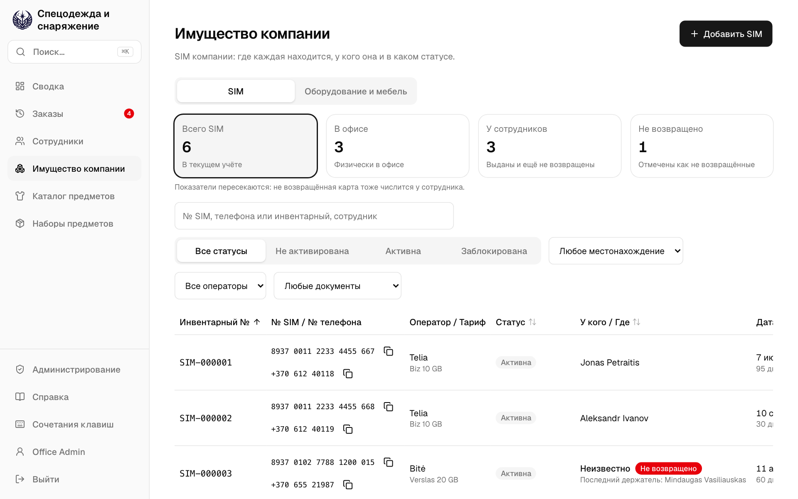

*Только для администраторов и менеджеров:*

**Добавить SIM** регистрирует карту, когда её присылает оператор. № SIM, оператор и инвентарный номер (предлагается следующий) нужны сразу; номер телефона, тариф и стоимость при невозврате могут подождать до выдачи. Если отметить **По умолчанию для новых карт**, «Добавить SIM» в следующий раз подставит этого оператора. На вкладке **Оборудование и мебель** кнопка **Добавить имущество** регистрирует один предмет: его название и категорию, по которой предлагается номер, например `PC-000003`.

**Изменить статус** записывает статус, подтверждённый оператором. Карту он не активирует и не блокирует: для этого напишите оператору.

SIM или предмет выдаётся в три шага в окне **Выдать SIM** или **Выдать имущество**:

1. Откройте его и выберите **Выдать SIM** или **Выдать имущество**. На странице сотрудника та же кнопка в разделе **Выданные SIM** или **Оборудование** начинает с сотрудника и показывает, что есть в офисе.
2. **Кому и когда**: выберите сотрудника и дату выдачи, сегодня или раньше. Тариф SIM необязателен; стоимость при невозврате указана в акте, поэтому она нужна.
3. **Напечатайте акт и дайте подписать**: **Печать акта** печатает акт выдачи прямо с этой страницы, без новой вкладки, а **Скачать PDF** сохраняет тот же акт файлом. Дайте сотруднику подписать бумажный акт, затем отметьте **Сотрудник подписал напечатанный акт**.
4. **Передайте SIM** или **Передайте предмет**: выберите **Выдать SIM** или **Выдать имущество**. Это сразу записывает держателя, местонахождение и подписанный акт.

Каждый шаг открывается, когда выполнен предыдущий, а строка рядом с кнопкой говорит, что осталось. После печати акта сотрудник и дата сворачиваются в одну строку; **Изменить** снова открывает их. Выдать можно только **Активную** карту, которая находится в офисе и имеет номер телефона. Если после печати акт изменился, отметка снимается: напечатайте его снова и дайте подписать. Если после печати окно закрыли или страница перезагрузилась, «Выдать SIM» снова открывается с введёнными данными и напечатанным актом. Мебель и другие предметы выдаются без акта, в два шага.

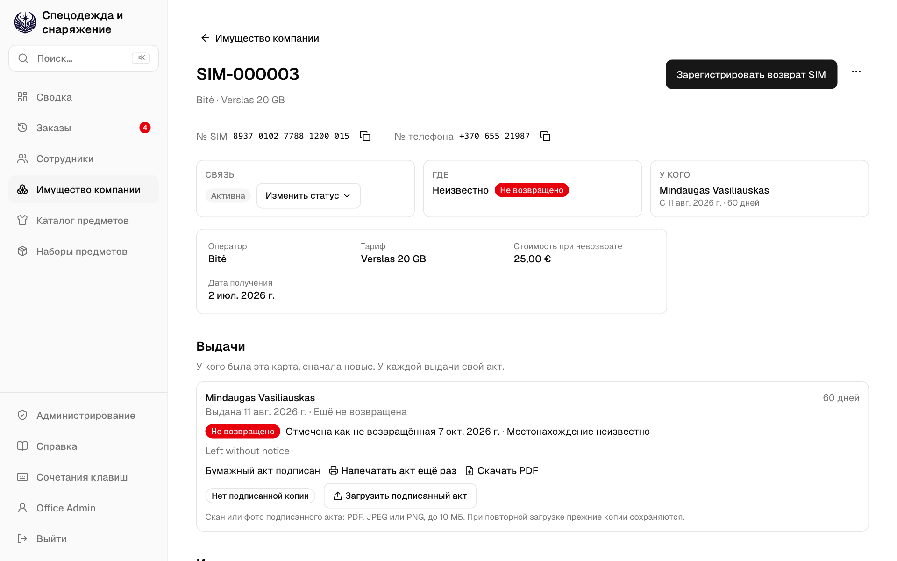
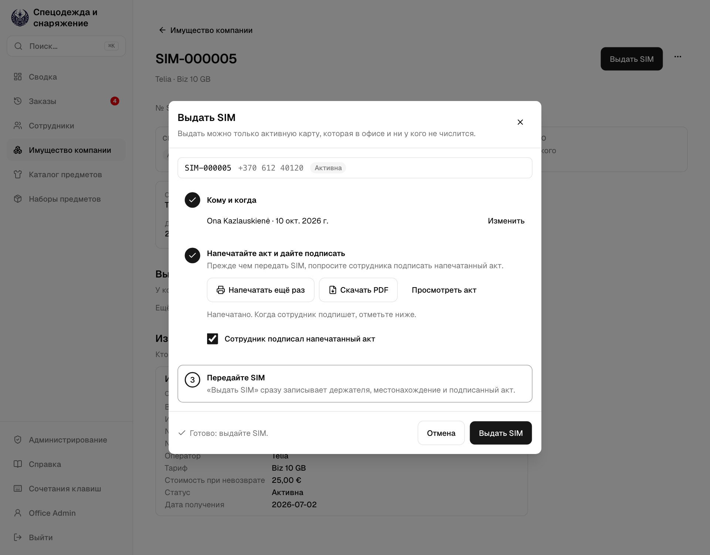

*Только для роли «сотрудник»:*

У выдачи с актом на странице карты написано **Подписанная копия загружена**, со сканом для скачивания, или **Нет подписанной копии**. Фильтр **Документы** находит недостающие.

*Только для администраторов и менеджеров:*

Когда сотрудник подписал акт, отсканируйте или сфотографируйте его и под выдачей выберите **Загрузить подписанный акт**: файл PDF, JPEG или PNG до 10 МБ. Из фото удаляются место съёмки и данные камеры. При повторной загрузке прежние копии остаются под новой.

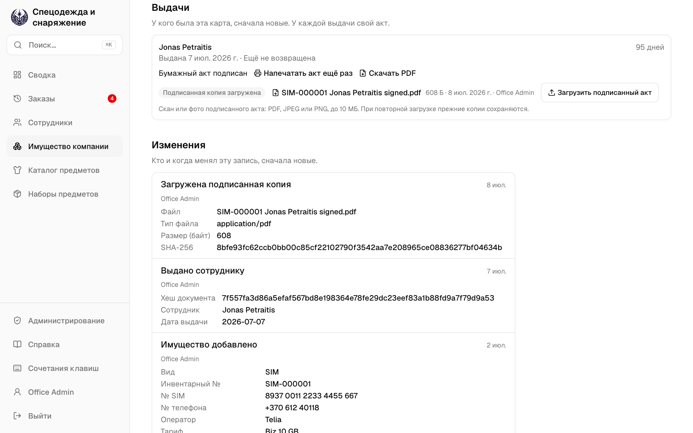

*Только для администраторов и менеджеров:*

Когда предмет физически вернулся в офис, **Зарегистрировать возврат SIM** или **Зарегистрировать возврат имущества** записывает его туда. Каждая выдача и возврат остаются на его странице в разделе **Выдачи**, а **Напечатать акт ещё раз** и **Скачать PDF** дают её акт. Печать, каждый скачанный PDF и письмо о блокировке записываются в разделе **Изменения**.

Увольнение ничего не возвращает само. Если сотрудник не вернул карту, **Отметить как не возвращённую** записывает, где она: всё ещё у него или неизвестно. Карта остаётся за ним, пока не вернётся. Затем **Подготовить письмо о блокировке** даёт текст, который вы скопируете в своё письмо оператору; когда он подтвердит, выберите **Заблокирована** в **Изменить статус**.

Поиск находит SIM по номеру SIM, телефона или инвентарному номеру, а предмет — по инвентарному номеру.

## 11. Администрирование

*Только для администраторов.*

В разделе **Администрирование** вы управляете тем, кто может пользоваться приложением и что ему разрешено, следите за его работой и ведёте настройки организации. Он открывается на экране **Обзор**. Другие его экраны: **Пользователи**, **Роли и права**, **Журнал аудита**, **Безопасность**, **Система**, **Использование** и **Настройки**.

Откройте его кнопкой **Администрирование** внизу боковой панели. У него своя боковая панель; **Спецодежда и снаряжение** внизу неё возвращает назад.

Вы входите в оба сразу, а **Выйти** в любом из них выполняет выход из обоих. **Администрирование** видят все, чьи роли позволяют управлять пользователями, ролями или настройками либо просматривать журнал аудита, безопасность, систему, использование или резервные копии, — только с теми экранами, которые открывают их роли.

## 12. Обзор

*Только для администраторов.*

**Обзор** отвечает на вопрос: всё ли в порядке? **Требует внимания** перечисляет, на что посмотреть, сначала самое срочное, со ссылкой туда, где это исправляется. Когда всё в порядке, там написано **Ничто не требует вашего внимания.**

- Резервная копия не удалась, или копии перестали создаваться.
- Был использован скопированный вход, или много входов не удалось.
- Запросы завершаются с ошибкой, или появился новый вид ошибки.
- Пора проверить доступ. Проверяйте его каждые 90 дней.
- Журнал аудита не совпадает со своими печатями: кто-то изменил его в обход приложения.
- Печати не получают меток времени: служба меток времени не отвечает уже сутки.

**Показатели** ниже: активные пользователи, кто сейчас вошёл, входы за сегодня, запросы за последние 24 часа, база данных и последняя резервная копия.

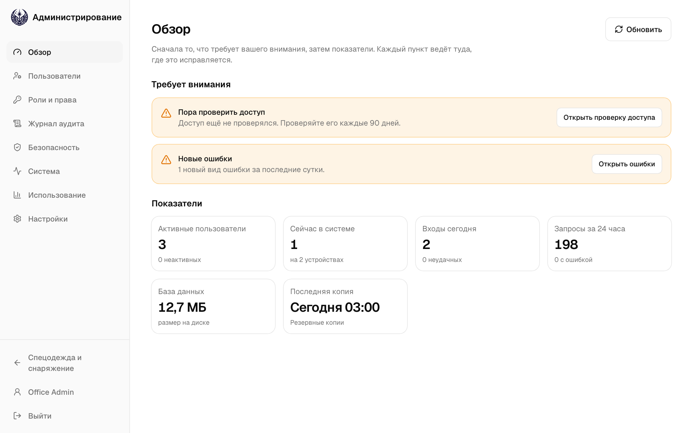

## 13. Пользователи

*Только для администраторов.*

- Создавайте, изменяйте и деактивируйте учётные записи. Назначайте каждой одну или несколько ролей: пользователь может то, что разрешает любая из его ролей. Что разрешает каждая роль, показано в разделе **Роли и права**.
- Изменение ролей доходит до пользователя в течение нескольких минут, без повторного входа. На всех устройствах деактивированного пользователя выполняется выход.
- Чтобы сбросить пароль, используйте **⋯ → Сбросить пароль…**.
- Нельзя деактивировать собственную учётную запись или снять с себя роль, которая позволяет управлять пользователями или ролями. Роль **Администратор** всегда есть хотя бы у одного активного пользователя.
- Если вы вошли больше 12 часов назад, перед сохранением изменения приложение попросит подтвердить пароль (**Подтвердите пароль**).

## 14. Роли и права

*Только для администраторов.*

В разделе **Роли и права** — каждая роль, что она разрешает и у скольких пользователей она есть. Роль — это набор прав, например **Управлять каталогом предметов** или **Удалять сотрудников**. Роли пользователям назначаются в разделе **Пользователи**.

- **Администратор**, **Менеджер** и **Сотрудник** — встроенные роли. **Администратор** может всё, и его нельзя изменить: **Открыть** показывает, что он разрешает. Что разрешают **Менеджер** и **Сотрудник**, можно изменить, но не их названия и описания, и удалить их нельзя.
- **Добавить роль** создаёт новую: название, для чего она, и её права. Некоторым правам нужно другое, и оно отмечается вместе с ними: для **Управлять пользователями** нужно **Видеть пользователей**.
- Изменение доходит до пользователей с этой ролью в течение нескольких минут.
- **⋯ → Удалить роль…** удаляет роль, которой нет ни у одного пользователя. Сначала снимите её с пользователей в разделе **Пользователи**.
- Если вы вошли больше 12 часов назад, перед сохранением изменения приложение попросит подтвердить пароль (**Подтвердите пароль**).

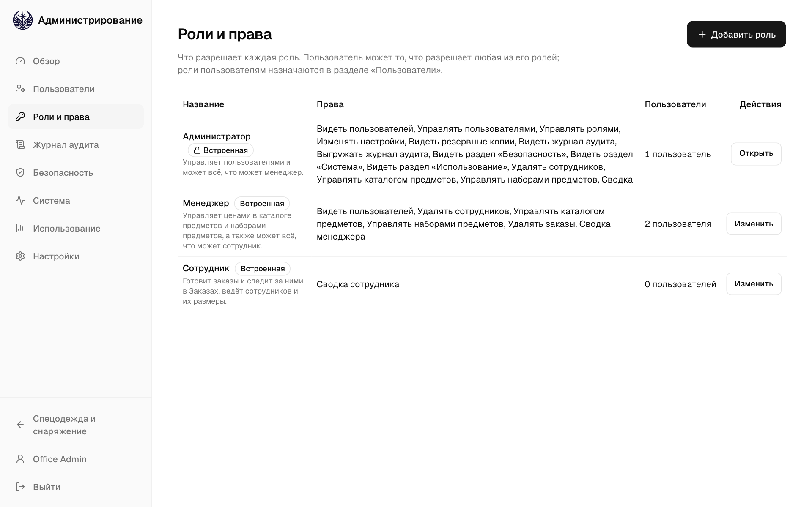
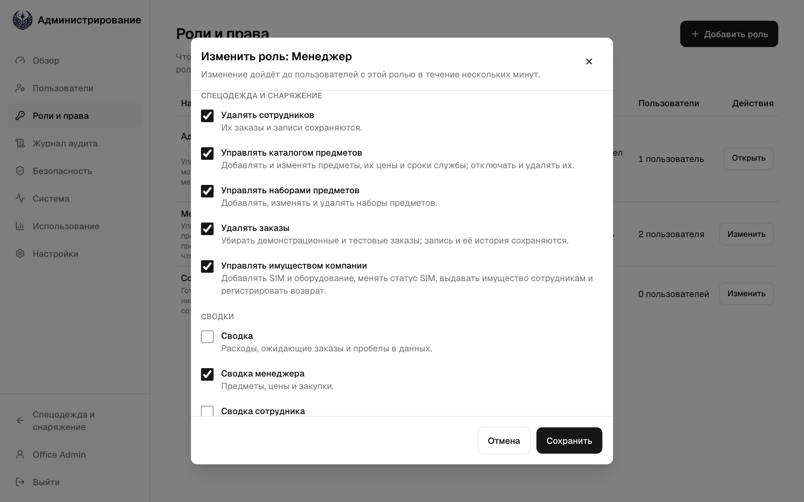

## 15. Журнал аудита

*Только для администраторов.*

**Журнал аудита** показывает каждое записанное изменение: что изменено, кто это сделал, когда и где. Изменение вносится в **Спецодежде и снаряжении**, в **Администрировании**, через **Ссылку для подтверждения** сотрудника или самой **Системой**.

Фильтруйте по полям **Раздел**, **Изменение**, **Пользователь** и датам. Нажмите на изменение, чтобы открыть его рядом со списком. В нём видно каждое поле до и после, а **Открыть в «Спецодежде и снаряжении»** открывает запись. **Все изменения этой записи** сужает список до неё.

- **Печати** вверху: изменения каждого дня опечатываются через час после его окончания хешем, который охватывает и предыдущий день, поэтому изменение, позже исправленное, добавленное или удалённое, становится заметно. **Проверить** заново проверяет все печати; приложение также проверяет их каждый час.
- Каждая печать также получает метку времени: публичная служба меток времени подписывает печать вместе со временем. Печать, сделанная позже заново, не может получить исходное время, поэтому даже тот, у кого есть доступ к серверу, не может незаметно переписать журнал. Панель показывает, по какой день печати получили метки времени.
- Если опечатанный день не совпадает или его метка времени неверна, поставлена поздно или отсутствует, об этом сообщит Обзор. Сообщите тому, кто обслуживает сервер, и сохраните резервные копии, сделанные до этого дня.
- **Выгрузить** скачивает изменения, отобранные фильтрами, между двумя датами не более чем за год, как **CSV, для таблицы** или **Строки JSON, для архива**. Сама выгрузка тоже записывается в журнал аудита.
- Изменения хранятся годами (10 лет, если на сервере не задано иначе), затем удаляются по одному дню.

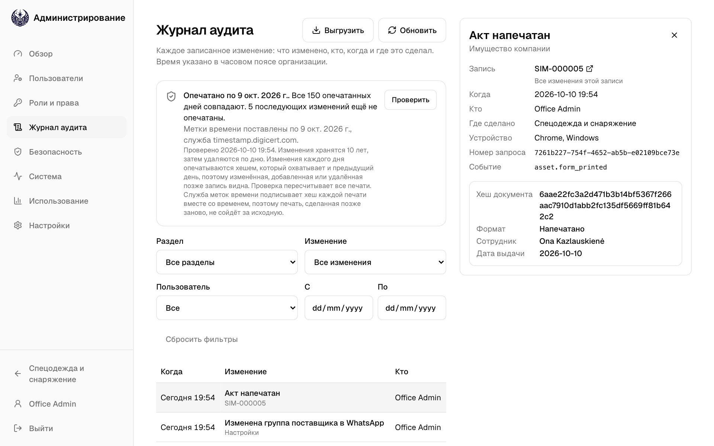

## 16. Безопасность

*Только для администраторов.*

У экрана **Безопасность** три вкладки:

- **Входы**: каждый вход, неудачная попытка, подтверждённый пароль и выход — с учётной записью, адресом, откуда был вход, и устройством. Фильтруйте по событию, пользователю и датам. У неудачной попытки указана причина, например **Неверный пароль**. Записи о входах хранятся 180 дней.
- **Устройства со входом**: каждый браузер, в котором кто-то сейчас вошёл. Кнопкой **Завершить вход** завершите вход на потерянном или незнакомом устройстве: этому человеку придётся снова войти там со своим паролем.
- **Проверка доступа**: каждый пользователь с его ролями, тем, что они разрешают, и последним входом. Администраторы и учётные записи, не использовавшиеся 90 дней, отмечены. Проверьте, нужен ли каждому его доступ, измените его на экране **Пользователи**, затем выберите **Отметить как проверенный**. Делайте это каждые 90 дней: Обзор напомнит.

**Скопированный вход остановлен** означает, что кто-то использовал старую копию входа, поэтому вход был завершён на всех устройствах, где он был. Спросите пользователя, был ли это он. Если нет, пусть сменит пароль.

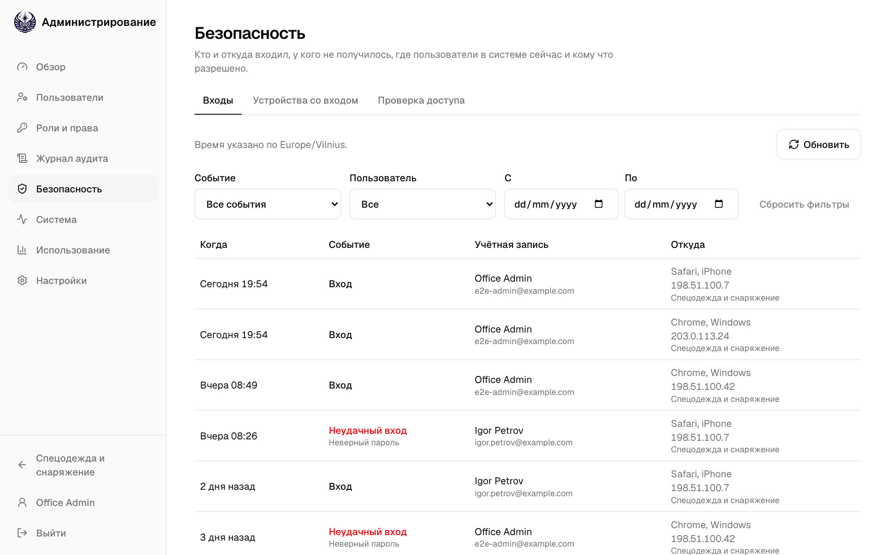
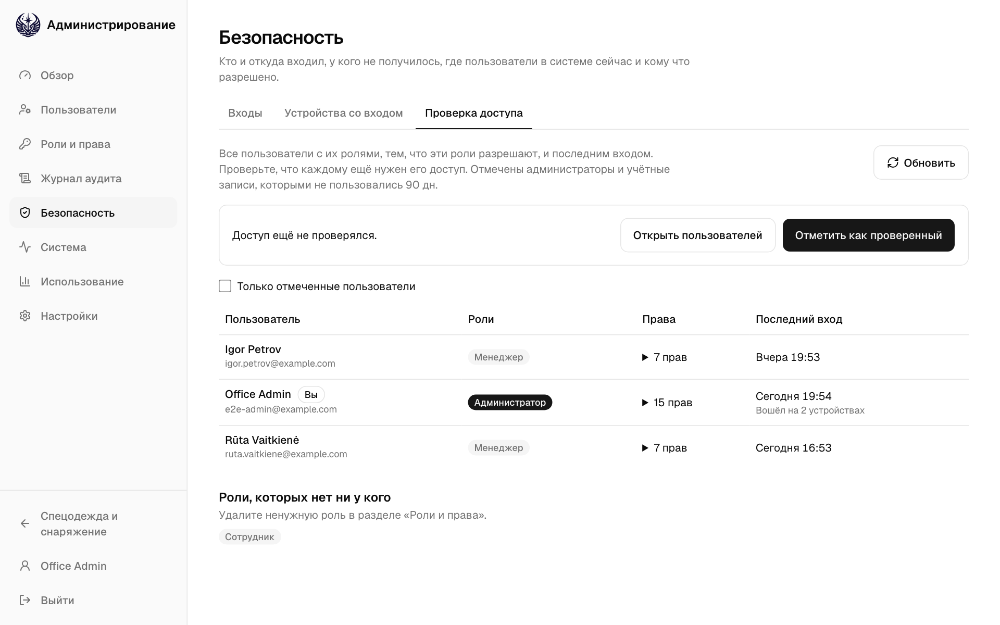

## 17. Система

*Только для администраторов.*

**Система** показывает, как работает приложение. В ней три вкладки: **Состояние**, **Ошибки** и **Резервные копии**.

- **Состояние**: **Работает** ли приложение, его версия и время запуска; запросы за последние 24 часа, сколько из них не удалось и сколько они заняли; размер базы данных и последняя миграция; сколько хранятся входы, ошибки и изменения.
- **Ошибки**: что пошло не так на сервере или в чьём-то браузере, сколько раз и когда в последний раз. Откройте ошибку, чтобы увидеть, кто с ней столкнулся, где и на каком устройстве. Ошибки хранятся 30 дней.
- **Резервные копии**: см. ниже.

Когда что-то идёт не так, приложение показывает **Номер запроса**, например `9f2c1a7e`. Ошибка на вкладке **Ошибки** показывает тот же номер. Передайте его тому, кто обслуживает сервер: по нему он найдёт ошибку в журнале сервера.

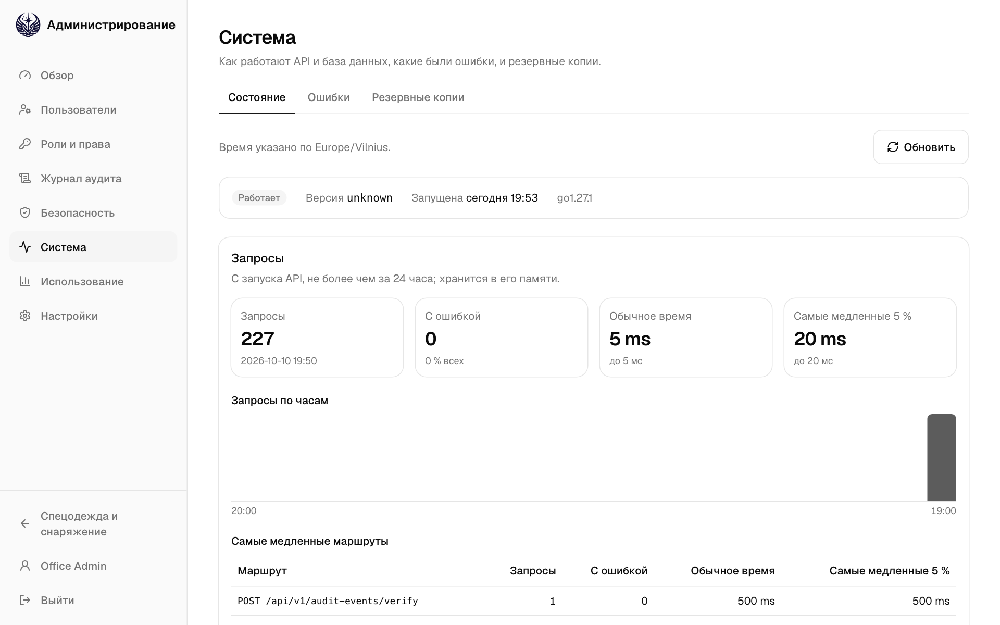
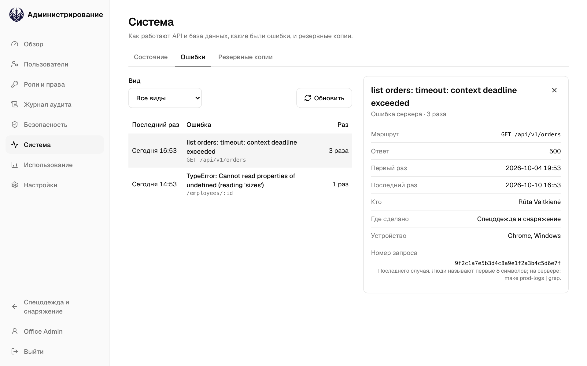

## 18. Резервные копии

*Только для администраторов.*

**Система → Резервные копии** показывает, копируется ли база данных. Служба резервного копирования на сервере копирует всю базу данных по расписанию, если не задано иначе, каждую ночь, и удаляет старые копии по истечении срока хранения.

Строка вверху говорит, всё ли в порядке. Она становится красной, если последняя копия не удалась, если плановая копия запаздывает или если служба перестала выходить на связь. Сообщите тому, кто обслуживает сервер.

Второе предупреждение показано, пока копии хранятся только на самом сервере: они пропали бы вместе с ним.

- **Последняя копия** и **Следующая копия**: когда, размер последней и сколько она заняла.
- **Хранится** и **Общий размер**: копии, которые хранятся сейчас.
- **Последние копии**: каждая попытка, сначала новые, у неудачной — с ошибкой.
- **Настройки**: расписание, куда сохраняются копии, сколько хранятся и зашифрованы ли.

Настройки задаются на сервере, и восстанавливают копию тоже там: приложение их только показывает.

## 19. Использование

*Только для администраторов.*

**Использование** показывает, как пользуются приложениями. Страницы не отслеживаются: всё берётся из того, что приложение и так записывает.

- Вверху: люди, активные сегодня, за последние 7 и за 30 дней, из всех активных учётных записей, и входы за сегодня.
- **Активные люди по дням** по приложениям, с линией для каждой роли. **Входы по дням**, с неудачными.
- **Ссылки для подтверждения за 90 дней**: сколько ссылок сотрудникам отправлено, открыто и подтверждено и сколько ещё ждут, истекли или были заменены.
- **Изменения по неделям** по разделам (чем темнее, тем больше) и люди, сделавшие больше всего изменений.
- **Устройства за 30 дней** и **Языки**: телефоны, планшеты и компьютеры с их системами и браузерами, языки пользователей и сотрудников.
- **Качество данных за 90 дней**: сотрудники без размеров и предметы без цены или срока службы. Чем меньше, тем лучше.

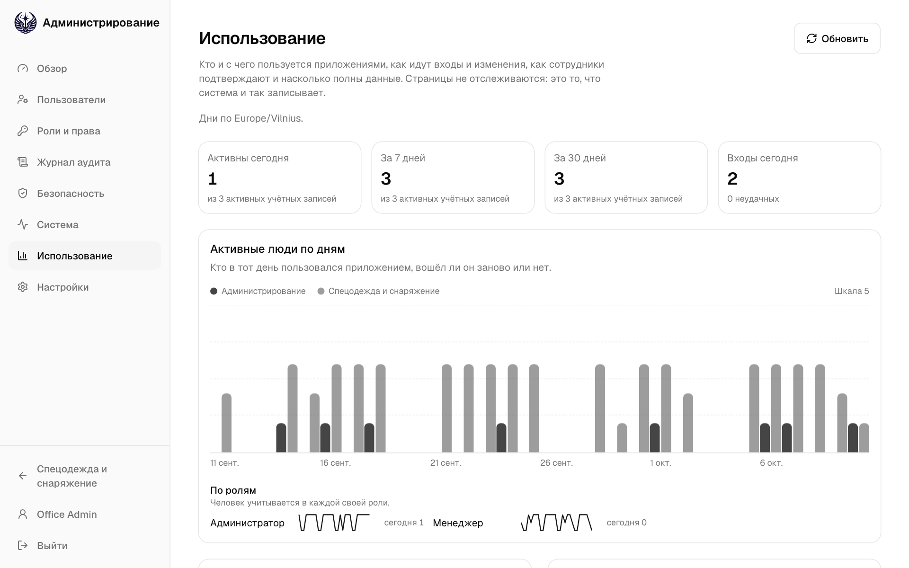

## 20. Настройки

*Только для администраторов.*

**Группа поставщика в WhatsApp**: укажите название группы и ссылку-приглашение. В WhatsApp откройте группу, нажмите на её название, затем **Пригласить по ссылке** и **Копировать ссылку**.

**Копировать для WhatsApp** затем предлагает открыть эту группу, где нужно вставить сообщение о заказе. WhatsApp не умеет открывать группу с уже набранным сообщением. **Убрать группу** возвращает открытие WhatsApp без выбранного чата.

## 21. Ваша учётная запись

- **Язык**: English, Lietuvių или Русский. Выбор сохраняется в вашей учётной записи, поэтому действует на любом устройстве, где вы входите. Страница подтверждения для сотрудника и запись остаются на английском и русском.
- **Тема**: **Светлая**, **Тёмная** или **Как в системе**. Она сохраняется на этом устройстве и действует и на странице входа.
- **Сменить пароль**: на других ваших устройствах выполняется выход, а на этом вход сохраняется.
- **Устройства со входом**: все браузеры, где вы вошли, и когда они использовались последний раз. **Это устройство** — первое. Выйдите на устройстве, которым больше не пользуетесь или которого не узнаёте, или выберите **Выйти на всех других устройствах**.
- **Строки таблиц**: **Компактные** помещают больше строк на экране.

## 22. Поиск и сочетания клавиш

| Клавиша | Действие |
| --- | --- |
| `⌘K` / `Ctrl K` | Ищет номера записей, сотрудников, предметы, имущество компании и экраны. Например, введите имя и выберите **Новый заказ: …**. |
| `/` | Переходит в поле поиска или «Добавить предмет». |
| `G`, затем `D` `O` `H` `E` `A` `C` `S` `U` | Переходит в Сводку, Создать заказ, Заказы, Сотрудников, Имущество компании, Каталог, Наборы предметов или Пользователей (в Администрировании). |
| `J` / `K`, `Esc` | Перемещается по Заказам или закрывает открытый заказ. |
| `⌘/Ctrl` `Enter` | На экране «Создать заказ» открывает проверку заказа. |
| `?` | Показывает все сочетания клавиш. |

На снимках экрана — демонстрационные данные. Названия предметов — это данные, поэтому они показаны так, как введены.
