# Спецодежда и снаряжение: Руководство пользователя

[English](user-guide.md) · [Lietuvių](user-guide.lt.md) · Русский

Приложение учитывает спецодежду и средства защиты, выданные сотрудникам. Вы готовите заказ и отмечаете его как заказанный. Получив предметы, сотрудник подтверждает получение, а приложение сохраняет неизменяемую запись на английском и русском языках.

## 1. Вход

1. Откройте **workwear.gavort.nl** и войдите со своей эл. почтой и паролем.
2. Первый экран зависит от вашей роли:
   - администраторы начинают с экрана **Сводка**;
   - менеджеры — с экрана **Сводка менеджера**;
   - роль «сотрудник» — с экрана **Сводка сотрудника**.

В боковой панели — все разделы и **Поиск…** (`⌘K`). **Справка**, **Сочетания клавиш**, ваша учётная запись и **Выйти** — внизу панели.

С отметкой **Оставаться в системе** вход на этом устройстве сохраняется и после закрытия приложения или перезапуска устройства — до 30 дней или пока вы не пользуетесь им 14 дней. На общем компьютере снимите отметку: выход произойдёт при закрытии браузера и не позже чем через 12 часов.

**Выйти** завершает вход на этом устройстве. Когда вы меняете пароль, на других ваших устройствах выполняется выход. Если администратор сбрасывает ваш пароль или отключает учётную запись, выход выполняется везде.

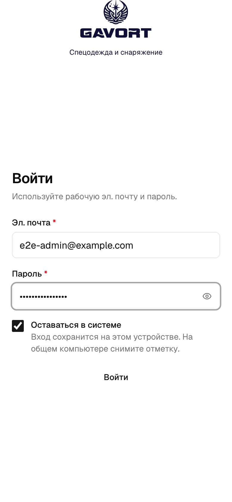

## 2. Сводка

*Только для администраторов:*

Вверху показаны заказы, ожидающие подтверждения, расходы за этот месяц и предстоящие замены.

**Требует внимания** показывает, что сделать дальше, начиная с самого срочного. У каждой строки есть кнопка для её задачи:

- просроченный предмет — **Заказать снова**;
- неподтверждённый заказ — **Отправить ссылку**;
- не указан размер — **Добавить размеры**;
- предмет без цены — **Исправить**.

Карточка **Резервные копии** показывает, копируется ли база данных. Выберите её, чтобы открыть **Резервные копии**.

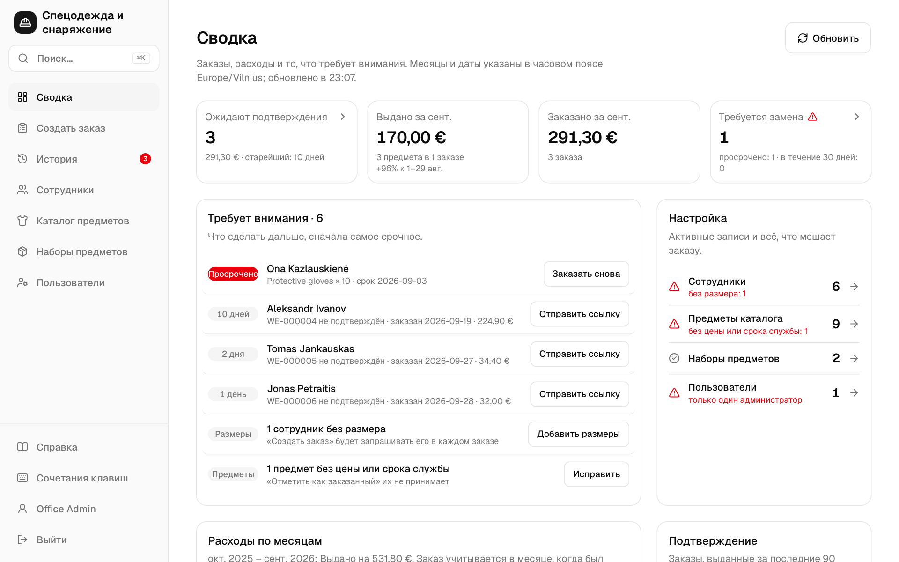

*Только для менеджеров:*

**Сводка менеджера** посвящена предметам, ценам и закупкам: что заказано, расходы по предметам, какие замены придётся закупать, последние изменения цен, что в каталоге и наборах мешает заказу и какие размеры держать в запасе.

*Только для роли «сотрудник»:*

**Сводка сотрудника** начинается с того, что нужно сделать: ваши заказы, ещё ожидающие подтверждения сотрудником (**Отправить ссылку**), предметы, которые пора заменить, и сотрудники без размера. Ниже — ваши заказы по месяцам и недавно выданные.

## 3. Создание заказа

1. В разделе **Заказы** выберите **Создать заказ** вверху.
2. В поле **Для кого** введите часть имени сотрудника. Для нового сотрудника выберите **+ Новый сотрудник**.
3. Добавьте предметы:
   - **Набор предметов** добавляет весь комплект одним нажатием.
   - **Добавить предмет** добавляет один предмет. Нажмите `/`, чтобы перейти в это поле.
4. Проверьте размер и количество в каждой строке:
   - Размеры берутся из сохранённых размеров сотрудника. Размер одежды выбирается буквой, например `S (44–46)`.
   - Пока не выбраны все недостающие размеры, заказать нельзя.
   - Если выбрать размер, отличный от сохранённого у сотрудника, приложение спросит **Выбран другой размер. Сохранить его в профиле сотрудника?** **Сохранить** — размер будет использоваться и в следующих заказах; **Пропустить обновление размера** — только в этом заказе.
5. Выберите **Проверить и отметить как заказанный** в панели справа или нажмите `⌘/Ctrl` `Enter`.

Пока вы работаете, это устройство хранит черновик заказа. **Копировать для WhatsApp** (сообщение поставщику) — в окне проверки.

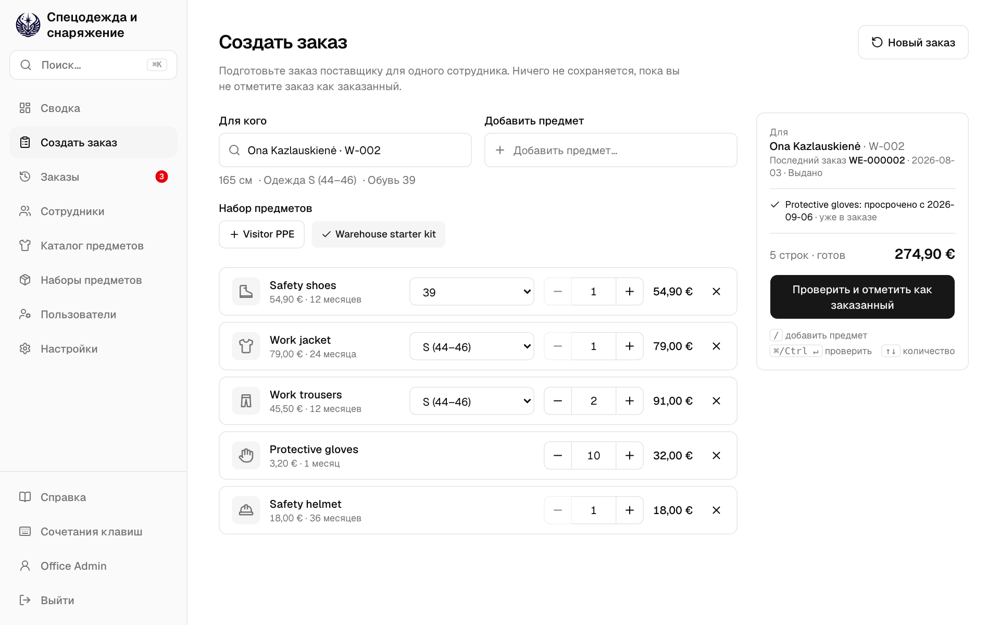

## 4. Проверка и «Отметить как заказанный»

1. Проверьте строки и общую сумму.
2. Выберите **Отметить как заказанный**. Заказ получает статус **Заказано**, и изменить его больше нельзя. Приложение сразу создаёт ссылку для подтверждения сотрудником.
3. Отправьте сотруднику ссылку: **Отправить ссылку в WhatsApp** или **Копировать ссылку**. Ссылка действует 7 дней и показывается только один раз.

Если сотрудник будет расписываться на бумаге, выберите вместо этого **Печать записи**.

**Копировать для WhatsApp** в окне проверки копирует сообщение для поставщика. Если администратор указал группу поставщика в WhatsApp в **Настройках**, приложение предложит открыть эту группу: вставьте сообщение туда.

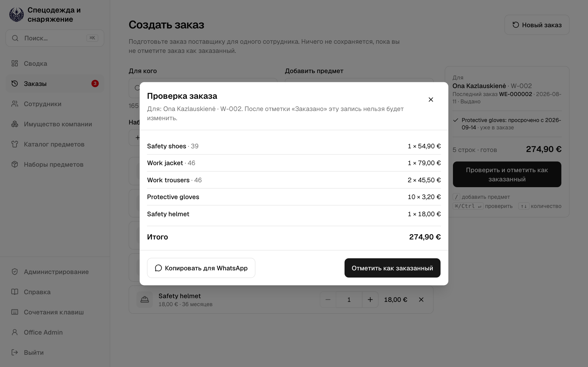
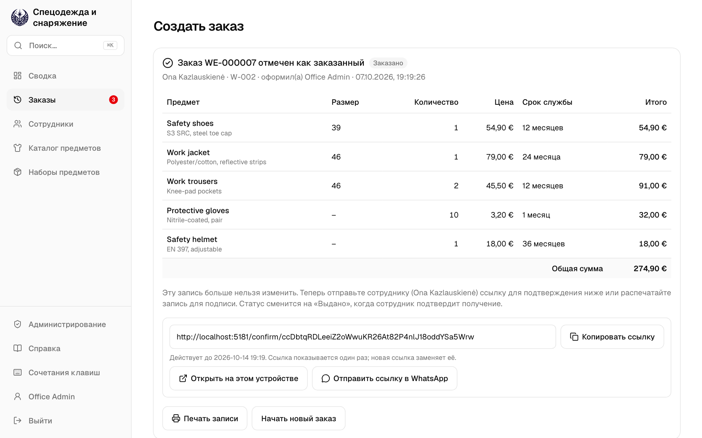

## 5. Сотрудник подтверждает

1. Сотрудник открывает ссылку. Учётная запись ему не нужна.
2. Он проверяет предметы, их цены и итог на английском или русском (**EN / RU**). Страница открывается на предпочитаемом языке сотрудника, если это английский или русский.
3. Он отмечает согласие и нажимает **Подтвердить получение**. Заказ получает статус **Выдано**.

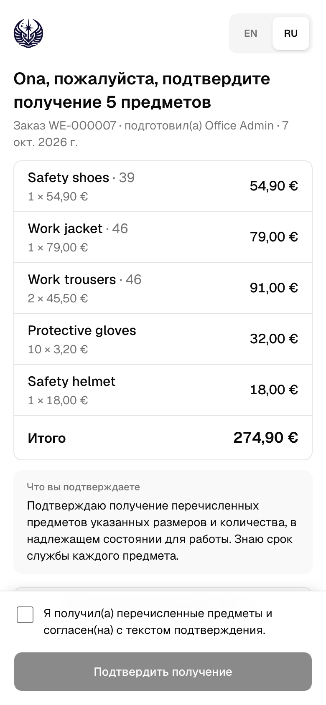

## 6. Заказы

В **Заказах** — все оформленные заказы. **Создать заказ** вверху начинает новый.

**Ожидают**, **Выдано** и **Все** фильтруют заказы по статусу. Также можно фильтровать по сотруднику и дате. Нажмите номер записи, и заказ откроется рядом со списком. `J` и `K` переходят между заказами, `Esc` закрывает заказ.

У заказа со статусом **Заказано** есть такие действия:

- **Открыть подтверждение сотрудника** создаёт новую ссылку. Там же можно отметить подписанный бумажный экземпляр (**Отметить подписанное подтверждение на бумаге**).
- **Выдать сейчас** передаёт это устройство сотруднику, и он подтверждает получение на месте.
- **Печать записи** печатает запись для подписи.

*Только для менеджеров:*

**⋯ → Удалить заказ…** удаляет заказ, например тестовый. Перед этим приложение спрашивает подтверждение.

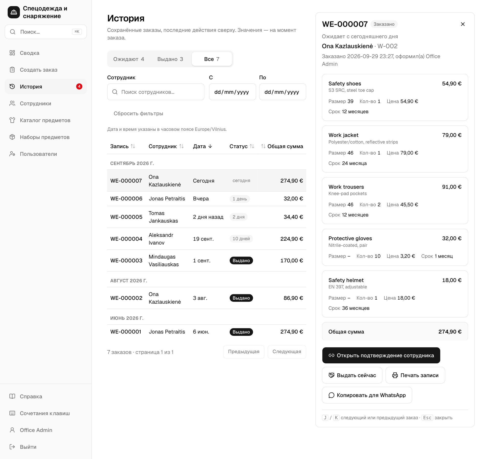

## 7. Акт выдачи

У заказа со статусом **Выдано** есть неизменяемая запись на английском и русском (Items Given Record / Акт выдачи). Откройте её кнопкой **Открыть запись**.

- **Печать записи** печатает её на одном листе A4.
- **Отправить в WhatsApp** отправляет её.

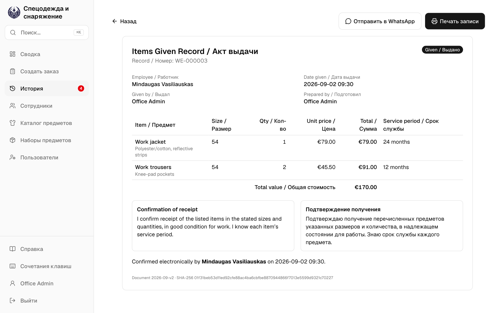

## 8. Сотрудники

В списке видны размеры и примечания каждого сотрудника. Сотрудники без какого-либо размера отмечены. Длинное примечание обрезается до одной строки; целиком его видно при наведении указателя или на странице сотрудника.

На странице сотрудника показаны:

- его размеры и предпочитаемый язык;
- все выданные предметы со сроком использования и датой замены;
- ещё не выданные заказы.

На этой странице **Новый заказ** начинает заказ для сотрудника, а **Изменить размеры** меняет его размеры.

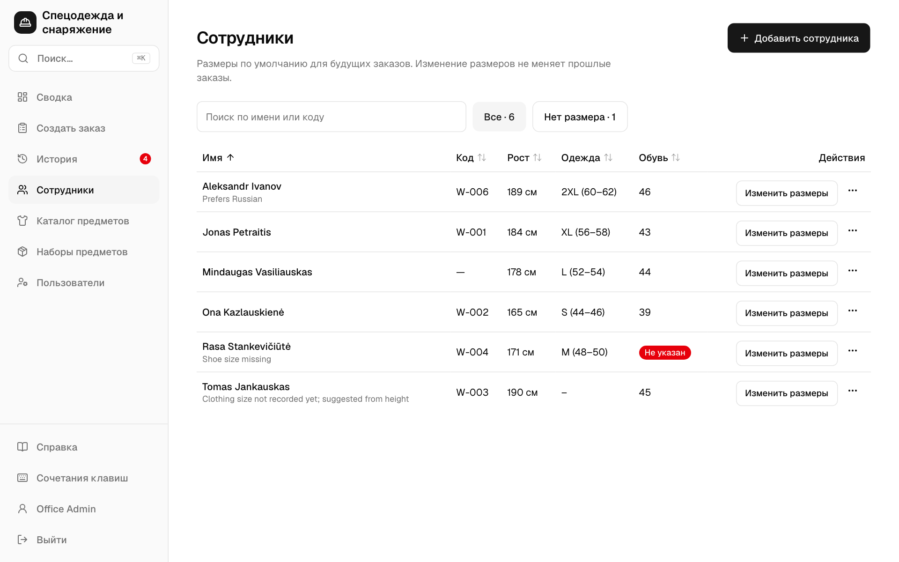
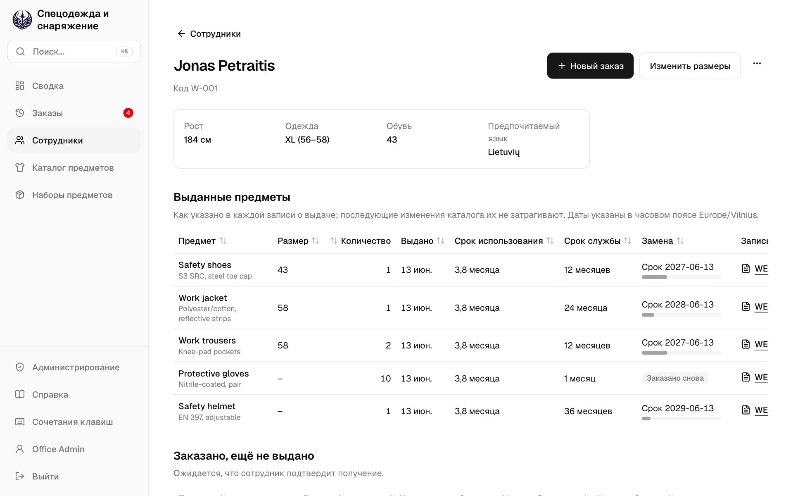

## 9. Каталог предметов и наборы предметов

У каждого предмета в каталоге есть цена, срок службы и группа размеров. В заказах показывается и суммируется эта цена. Предмет без цены или срока службы заказать нельзя. Изменение цены не меняет уже созданные заказы.

У предмета может быть и **Закупочная цена** — сколько мы платим поставщику. Она необязательна, для заказа не нужна и в заказах не показывается. На странице предмета видны обе цены и история их изменений.

Набор предметов — это комплект предметов с количествами по умолчанию. На экране «Создать заказ» он применяется одним нажатием.

*Только для администраторов и менеджеров:*

Предметы вы добавляете и меняете в **Каталоге предметов**, а комплекты — в **Наборах предметов**.

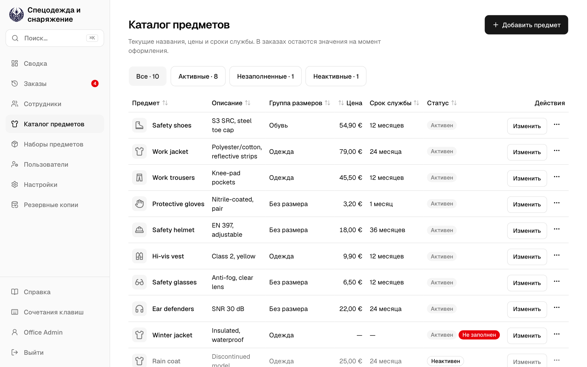
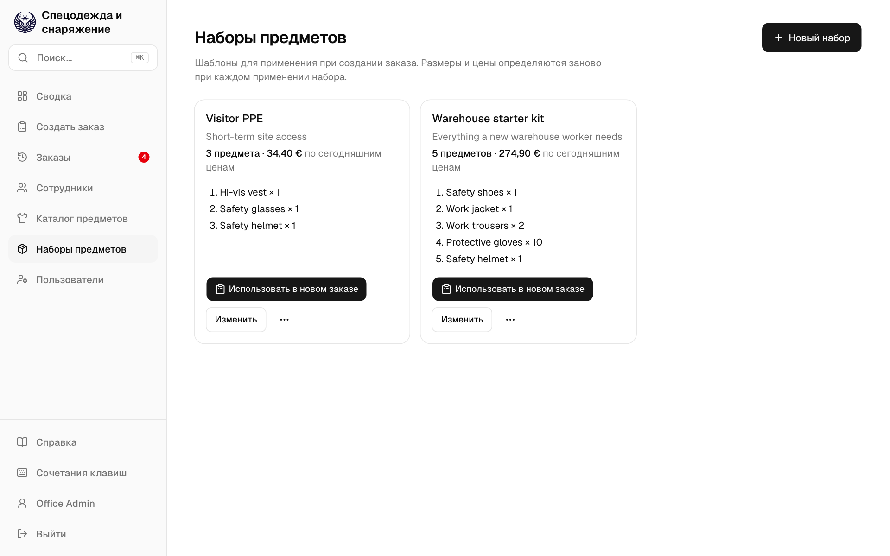

## 10. Пользователи

*Только для администраторов.*

- Создавайте, изменяйте и деактивируйте учётные записи и назначайте роли: администратор, менеджер или сотрудник.
- Чтобы сбросить пароль, используйте **⋯ → Сбросить пароль…**.
- Если вы вошли больше 12 часов назад, перед сохранением изменения приложение попросит подтвердить пароль (**Подтвердите пароль**).

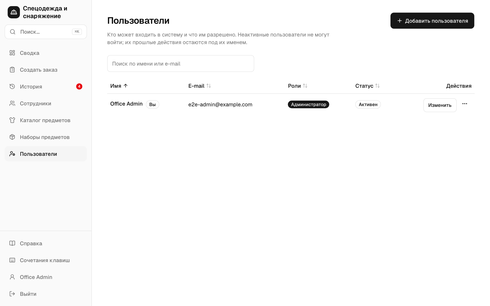

## 11. Настройки

*Только для администраторов.*

**Группа поставщика в WhatsApp**: укажите название группы и ссылку-приглашение. В WhatsApp откройте группу, нажмите на её название, затем **Пригласить по ссылке** и **Копировать ссылку**.

**Копировать для WhatsApp** затем предлагает открыть эту группу, где нужно вставить сообщение о заказе. WhatsApp не умеет открывать группу с уже набранным сообщением. **Убрать группу** возвращает открытие WhatsApp без выбранного чата.

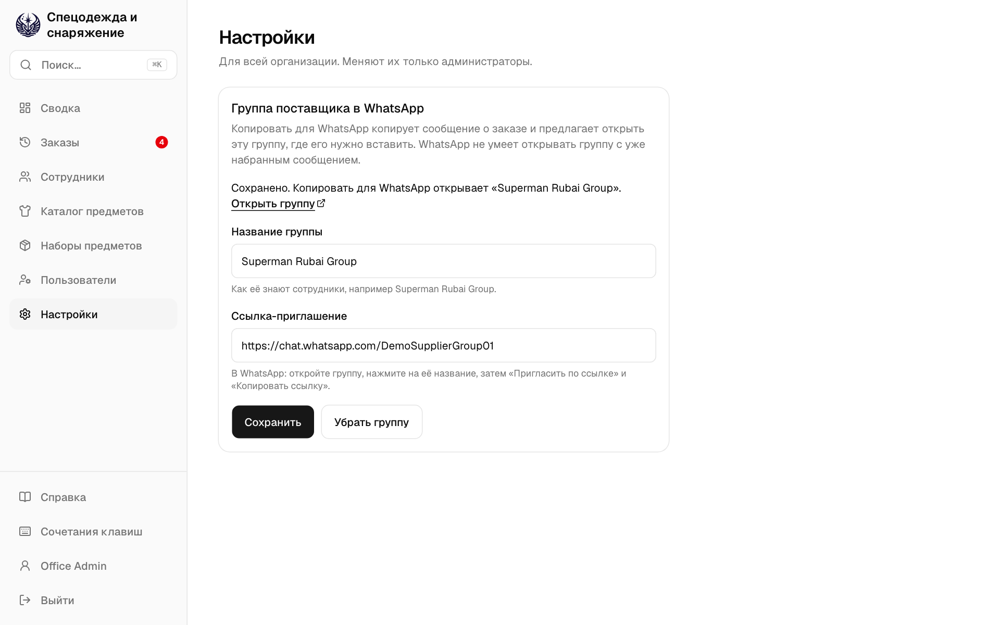

## 12. Резервные копии

*Только для администраторов.*

**Резервные копии** показывает, копируется ли база данных. Служба резервного копирования на сервере копирует всю базу данных по расписанию, если не задано иначе, каждую ночь, и удаляет старые копии по истечении срока хранения.

Строка вверху говорит, всё ли в порядке. Она становится красной, если последняя копия не удалась, если плановая копия запаздывает или если служба перестала выходить на связь. Сообщите тому, кто обслуживает сервер.

Второе предупреждение показано, пока копии хранятся только на самом сервере: они пропали бы вместе с ним.

- **Последняя копия** и **Следующая копия**: когда, размер последней и сколько она заняла.
- **Хранится** и **Общий размер**: копии, которые хранятся сейчас.
- **Последние копии**: каждая попытка, сначала новые, у неудачной — с ошибкой.
- **Настройки**: расписание, куда сохраняются копии, сколько хранятся и зашифрованы ли.

Настройки задаются на сервере, и восстанавливают копию тоже там: приложение их только показывает.

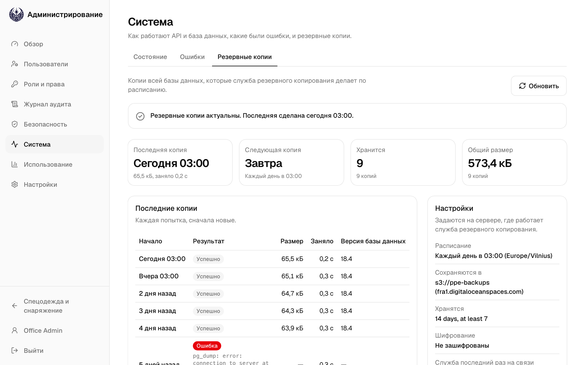

## 13. Ваша учётная запись

- **Язык**: English, Lietuvių или Русский. Выбор сохраняется в вашей учётной записи, поэтому действует на любом устройстве, где вы входите. Страница подтверждения для сотрудника и запись остаются на английском и русском.
- **Тема**: **Светлая**, **Тёмная** или **Как в системе**. Она сохраняется на этом устройстве и действует и на странице входа.
- **Сменить пароль**: на других ваших устройствах выполняется выход, а на этом вход сохраняется.
- **Устройства со входом**: все браузеры, где вы вошли, и когда они использовались последний раз. **Это устройство** — первое. Выйдите на устройстве, которым больше не пользуетесь или которого не узнаёте, или выберите **Выйти на всех других устройствах**.
- **Строки таблиц**: **Компактные** помещают больше строк на экране.

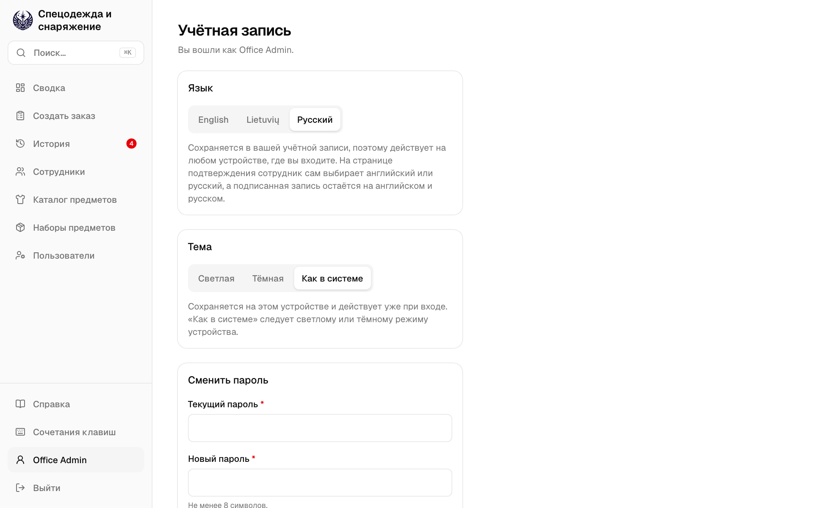
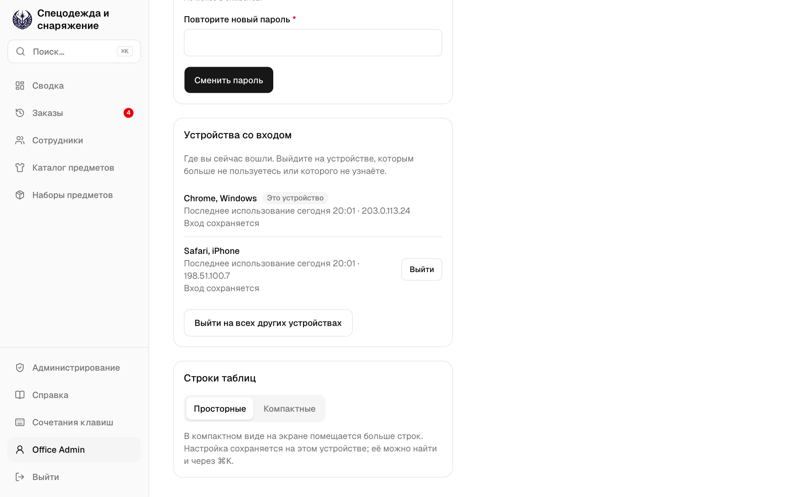

## 14. Поиск и сочетания клавиш

| Клавиша | Действие |
| --- | --- |
| `⌘K` / `Ctrl K` | Ищет номера записей, сотрудников, предметы и экраны. Например, введите имя и выберите **Новый заказ: …**. |
| `/` | Переходит в поле поиска или «Добавить предмет». |
| `G`, затем `D` `O` `H` `E` `C` `S` `U` | Переходит в Сводку, Создать заказ, Заказы, Сотрудников, Каталог, Наборы предметов или Пользователей. |
| `J` / `K`, `Esc` | Перемещается по Заказам или закрывает открытый заказ. |
| `⌘/Ctrl` `Enter` | На экране «Создать заказ» открывает проверку заказа. |
| `?` | Показывает все сочетания клавиш. |

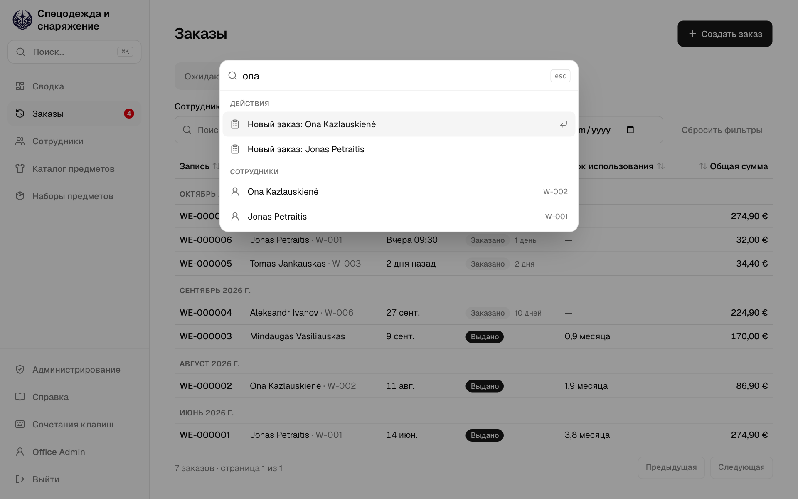

На снимках экрана — демонстрационные данные. Названия предметов — это данные, поэтому они показаны так, как введены.
